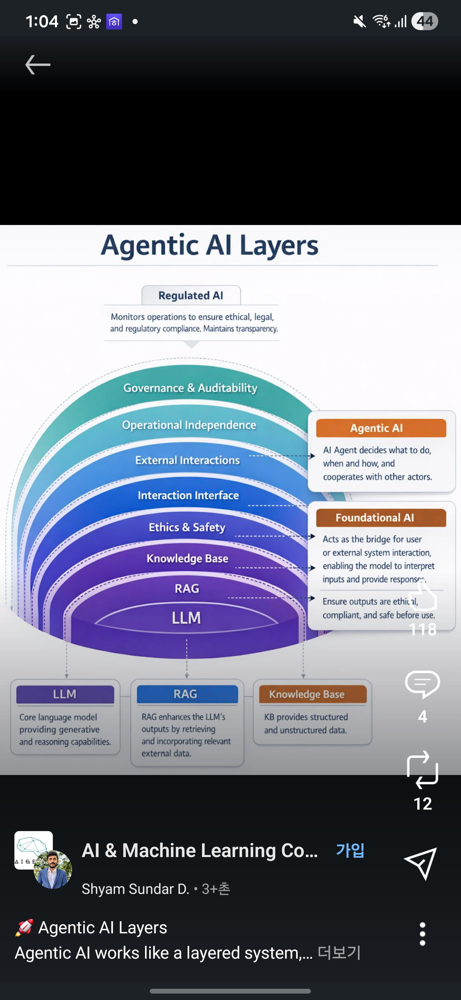
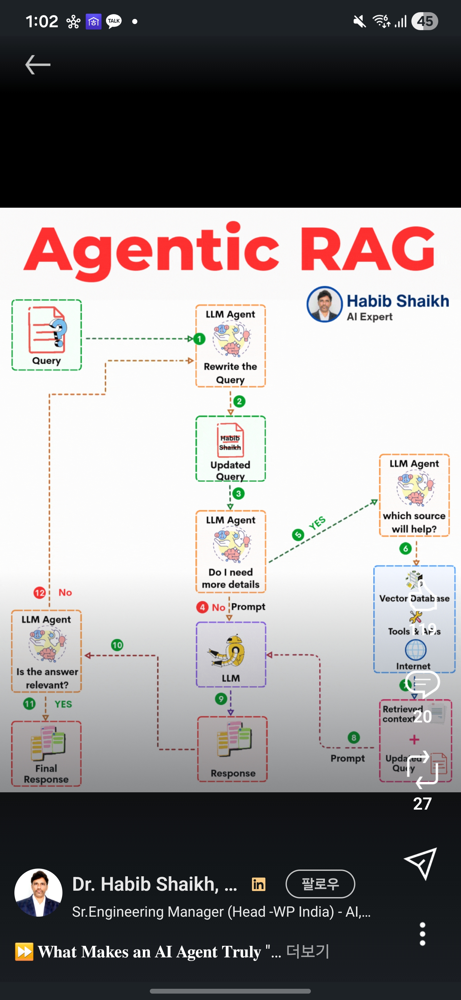
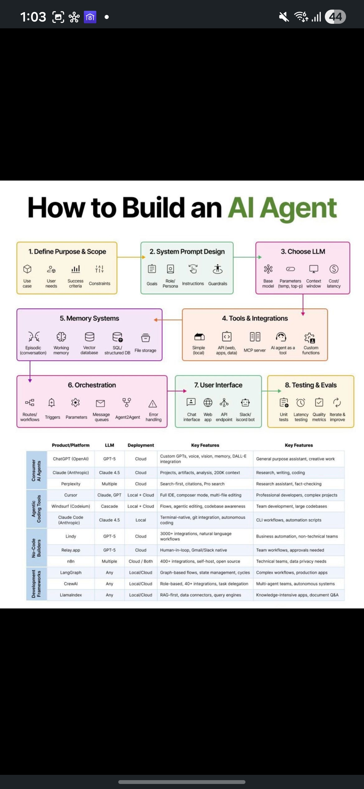
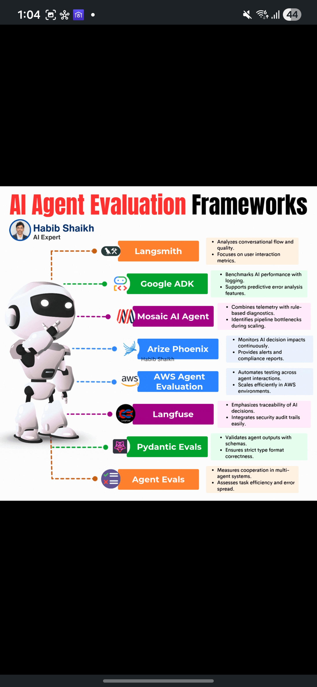

# [번외편] Agentic AI System: 설계, 구현 및 평가 가이드
> **소요 시간:** 60분 (Q&A 포함)  
> LLM의 "다음 토큰 예측" 패러다임을 넘어, **자율적으로 계획하고, 도구를 선택하며, 결과를 검증하는** 에이전트 시스템의 아키텍처와 엔지니어링 실무를 다룹니다.

---

## 0. Intro: LLM에서 Agentic System으로의 전환 (5분)

### Paradigm Shift

단순한 "Next Token Prediction"에서 **"Goal-Oriented Reasoning & Action"** 으로의 근본적인 변화가 진행 중입니다.

| 구분 | Naive LLM | Agentic AI |
|------|-----------|------------|
| 동작 방식 | 사용자 입력에 즉각 반응 (Stateless) | 계획 → 도구 선택 → 실행 → 검증 루프 |
| 상태 관리 | 없음 (매번 새로운 대화) | 단기/장기 메모리로 맥락 유지 |
| 도구 사용 | 불가능 | API, DB, 웹 검색 등 외부 도구 자율 호출 |
| 자기 검증 | 없음 | Reflection 루프로 결과 품질 재평가 |

### 강의의 핵심 질문

> **"어떻게 하면 신뢰할 수 있고 제어 가능한 자율 시스템을 구축할 것인가?"**

### 관련 논문

**📄 ReAct: Synergizing Reasoning and Acting in Language Models (Yao et al., Princeton & Google Brain, 2023)**
- LLM이 **Reasoning(추론)**과 **Acting(행동)**을 교대로 수행하는 구조를 최초 제안
- 기존 Chain-of-Thought(추론만) 또는 Act-only(행동만) 대비 HotpotQA에서 정확도 6% 향상
- **Impact**: LangChain, LlamaIndex 등 모든 에이전트 프레임워크의 기초 패러다임이 됨

---

## 1. 세션 1: Agentic AI의 다층적 아키텍처 (15분)

### 시각 자료: Agentic AI Layers



*Agentic AI Layers — LLM 기반 위에 RAG, 지식베이스, 윤리·안전, 외부 상호작용, 자율 운영, 거버넌스 계층이 겹겹이 쌓이는 동심원 구조. 에이전트의 자율성(Agentic AI)과 기초 인프라(Foundational AI), 규제 감시(Regulated AI)가 각 레이어에 매핑됩니다.*

---

### 1.1 하부 구조: The Core (LLM + RAG + Knowledge Base)

시스템의 기초를 구성하는 3대 핵심 레이어입니다. 이 위에 모든 자율적 행동이 구축됩니다.

| 레이어 | 역할 | 핵심 설계 포인트 |
|--------|------|--------------|
| **LLM** | 텍스트 생성 및 추론의 핵심 엔진 | 모델 선택(GPT-4o / Claude 3.5 / Llama 3), Temperature, Context Window |
| **RAG** | 외부 지식 검색을 통한 LLM 출력 증강 | 벡터 검색 + 키워드 검색 Hybrid, 리랭킹 파이프라인 연계 |
| **Knowledge Base** | 구조화/비구조화 데이터 저장소 | 벡터 DB + 그래프 DB + 관계형 DB 하이브리드 구성 |

이 3개 레이어는 우리가 1~7주차에서 집중적으로 다룬 RAG 파이프라인의 핵심과 정확히 일치합니다. 에이전트 시스템에서는 이 인프라가 **자율적으로 호출되는 "도구"** 로 전환됩니다.

---

### 1.2 중계 및 안전 계층: The Shield (Ethics & Interaction Interface)

에이전트의 자율적 행동이 비즈니스 로직이나 윤리 가이드라인을 벗어나지 않도록 하는 **'가드레일' 계층**입니다.

**Ethics & Safety:**
- 답변의 유해성(Toxicity) 필터
- PII(개인식별정보) 마스킹
- 편향성(Bias) 감지 및 차단
- 브랜드 톤앤매너 일관성 유지

**Interaction Interface — Human-in-the-Loop 설계:**
- 에이전트가 고위험 결정을 내릴 때 **인간 승인 게이트** 삽입
- 예: 금액이 100만 원 이상인 결제 승인, 외부 API 호출 전 사용자 확인
- 설계 핵심: "어디에 개입 지점을 둘 것인가?"는 산업 도메인과 리스크 수준에 따라 결정

---

### 1.3 자율성 및 거버넌스: The Brain & Law

| 레이어 | 역할 | 실무 고려사항 |
|--------|------|------------|
| **Operational Independence** | 에이전트의 자율 추론 루프 | 계획(Plan) → 실행(Act) → 관찰(Observe) → 반성(Reflect) 사이클 |
| **External Interactions** | 외부 시스템·API·타 에이전트와의 통신 | MCP(Model Context Protocol), Function Calling, Tool Use |
| **Governance & Auditability** | 모든 결정의 근거(Trace) 기록 및 감사 | Regulated AI 관점의 설명가능성(Explainability) 확보 |

> **Deep Dive:** 금융·의료 등 규제 산업에서는 에이전트가 내린 모든 결정에 대해 "왜 이런 판단을 했는가?"를 사후 추적할 수 있어야 합니다. 이를 위해 LangSmith, Langfuse 등의 트레이싱 도구로 **전체 사고 과정을 투명하게 기록**하는 것이 핵심입니다.

### 관련 논문

**📄 Toolformer: Language Models Can Teach Themselves to Use Tools (Schick et al., Meta AI, 2023)**
- LLM이 학습 과정에서 **스스로 어떤 도구를 언제 호출해야 하는지** 학습하는 Self-supervised 방식 제안
- Calculator, Search Engine, Calendar, Translator, QA API 5종의 도구를 자율적으로 활용
- 기존 Few-shot Prompting 대비 수학 문제에서 25% 이상 성능 향상

---

## 2. 세션 2: Agentic RAG — 지능형 정보 수집의 워크플로우 (15분)

### 시각 자료: Agentic RAG Flow



*Agentic RAG Flow — 단순한 "검색→답변" 구조가 아닌 12단계 자기검증 순환 플로우. 쿼리 재작성(①→②), 추가 정보 필요성 판단(③), 소스 자율 선택(⑤→⑥: 벡터DB / Tools & APIs / 인터넷), 검색 문맥 병합(⑦→⑧), LLM 답변 생성(⑨), 관련성 재검증(⑩→⑪→⑫)의 Closed-Loop 구조가 핵심입니다.*

---

### 2.1 쿼리 재구성 및 계획 (Planning)

기존 RAG가 사용자 질문을 그대로 벡터에 던진다면, Agentic RAG는 **에이전트가 먼저 질문을 분석하고 최적화**합니다.

**플로우(①~②): Query → Rewrite the Query → Updated Query**

```
[사용자 원본 쿼리]
"아까 그거 가격 얼만데?"

[에이전트 쿼리 재작성 결과]
→ "이전 대화에서 언급된 MacBook Pro M4 Max 14인치 모델의 현재 판매 가격은?"
```

**Decision Node (③~⑤): "이 질문을 해결하려면 도구가 필요한가?"**
- `No` → 직접 프롬프트로 응답 생성 (④)
- `Yes` → 적절한 소스를 자율 선택하여 검색 (⑤→⑥)

---

### 2.2 적응형 검색 (Adaptive Retrieval)

**플로우(⑤~⑧): 소스 선택 → 검색 → 문맥 병합 → 프롬프트 구성**

기존 RAG는 항상 동일한 벡터 DB만 조회하지만, Agentic RAG에서는 에이전트가 **질문 특성에 따라 최적 소스를 자율 결정**합니다.

| 소스 | 선택 기준 | 예시 |
|------|---------|------|
| **Vector Database** | 사내 문서 기반 팩트 QA | "사내 보안 정책에서 VPN 설정 방법은?" |
| **Tools & APIs** | 실시간 데이터, 계산, 외부 서비스 | "현재 NVIDIA 주가는?", "이 CSV 데이터 분석해줘" |
| **Internet (Web Search)** | 최신 뉴스, 트렌드, 공개 정보 | "2026년 AI 규제 동향은?" |

검색 결과는 **Retrieved Context (⑦)**로 수집되며, Original Query와 합쳐져 **Updated Query + Prompt (⑧)**로 구성됩니다.

---

### 2.3 자기 비판 및 검증 (Self-Correction)

**플로우(⑩~⑫): 답변 생성 후 품질 검증 루프**

이것이 기존 RAG와의 **가장 결정적인 차이**입니다. Agentic RAG는 답변을 바로 반환하지 않고, **LLM Agent가 "Is the answer relevant?"를 스스로 판단**합니다.

- `⑩ Relevance Check` → "이 답변이 원래 질문에 정확히 답하고 있는가?"
- `⑫ No → Loop Back` → 관련성이 부족하면 **질문을 재구성하거나 추가 소스를 검색**하는 루프 재진입
- `⑪ Yes → Final Response` → 검증을 통과한 최종 답변만 사용자에게 반환

> **핵심 인사이트:** 이 Self-Correction 루프는 2주차에서 다룬 **Chain of Verification (CoVe)** 를 에이전트 레벨에서 시스템화한 것입니다. 프롬프트 수준의 기법을 아키텍처 수준의 워크플로우로 승격시킨 것이 Agentic RAG의 본질입니다.

### 관련 논문

**📄 Self-RAG: Learning to Retrieve, Generate and Critique through Self-Reflection (Asai et al., University of Washington, 2023)**
- LLM이 스스로 **"검색이 필요한가?"**, **"검색 결과가 관련 있는가?"**, **"내 답변이 근거에 기반하는가?"** 를 판단하는 Special Token을 학습
- 기존 RAG 대비 Factuality 17% 개선, PubHealth에서 20% 이상 정확도 향상
- Retrieval 없이도 답변 가능한 질문에서는 불필요한 검색을 자동 생략 → 레이턴시 감소

**📄 Corrective RAG (CRAG): Enhancing with Retrieval Evaluator (Yan et al., 2024)**
- 검색 결과의 품질을 **Correct / Ambiguous / Incorrect** 3단계로 평가하는 경량 Retrieval Evaluator 도입
- Incorrect 판정 시 → 웹 검색으로 자동 대체, Ambiguous → 추가 검색 트리거
- PopQA 데이터셋에서 기존 RAG 대비 정확도 18% 향상

---

## 3. 세션 3: 에이전트 구축 엔지니어링 및 도구 생태계 (15분)

### 시각 자료: How to Build an AI Agent



*How to Build an AI Agent — 에이전트 구축의 8단계 파이프라인(위)과 카테고리별 주요 플랫폼/도구 비교표(아래). 각 단계별로 고려해야 할 세부 요소(아이콘)와 함께 Consumer AI Agents, Agentic Coding Tools, No-Code Builders, Development Frameworks 4개 카테고리의 제품·모델·배포 방식·특징을 한눈에 비교합니다.*

---

### 3.1 구축 8단계 파이프라인 (8-Step Pipeline)

위 이미지의 8단계를 하나씩 심층 분석합니다.

#### Step 1. Define Purpose & Scope

**가장 중요한 단계**. 에이전트가 "무엇을 하는가"보다 **"무엇을 하지 말아야 하는가"** 를 정의하는 것이 핵심입니다.

- **Use case**: 어떤 비즈니스 문제를 해결하는가?
- **User needs**: 사용자가 기대하는 결과물은?
- **Success criteria**: 성공을 어떻게 측정하는가? (정확도? 응답 시간? 비용?)
- **Constraints**: 절대 해서는 안 되는 행동 목록 (예: 외부 결제 API 호출 금지)

#### Step 2. System Prompt Design

에이전트의 성격과 행동 규칙을 규정하는 **"헌법"** 입니다.

- **Goals**: 에이전트의 최종 목표 명시
- **Role/Persona**: "당신은 10년 경력의 금융 분석가입니다"
- **Instructions**: 구체적 행동 지침 (검색 우선, 모르면 거부 등)
- **Guardrails**: 금지 행위 목록 (PII 노출 금지, 의료/법률 조언 금지 등)

#### Step 3. Choose LLM

| 고려 요소 | 설명 |
|---------|------|
| **Base model** | GPT-4o, Claude 3.5 Sonnet, Llama 3.1 405B 등 |
| **Parameters** | Temperature (0=결정적, 1=창의적), Top-p |
| **Context window** | 128K (GPT-4o), 200K (Claude), 1M (Gemini 1.5 Pro) |
| **Cost/Latency** | 입출력 토큰 단가, 첫 토큰 도착 시간(TTFT) |

#### Step 4. Tools & Integrations

에이전트가 호출할 수 있는 외부 능력 목록을 정의합니다.

| 도구 유형 | 예시 | 설명 |
|---------|------|------|
| **Simple (local)** | 계산기, 날짜 변환 | 외부 호출 없이 로컬 함수로 처리 |
| **API (web, apps, data)** | 날씨 API, 주식 API, JIRA | REST/GraphQL 기반 외부 서비스 호출 |
| **MCP Server** | DB 접속, 파일시스템 | Model Context Protocol 기반 표준화된 도구 인터페이스 |
| **AI agent as a tool** | 번역 에이전트, 코드 리뷰 에이전트 | 다른 에이전트를 도구로 호출 (Multi-Agent) |
| **Custom functions** | 사내 ERP 조회, 승인 워크플로우 | 비즈니스 로직에 특화된 커스텀 도구 |

#### Step 5. Memory Systems

| 메모리 유형 | 저장소 | 용도 |
|-----------|--------|------|
| **Episodic (conversation)** | 인메모리 | 현재 대화의 문맥 유지 |
| **Working memory** | 인메모리 / Redis | 진행 중인 태스크 상태 |
| **Vector database** | Pinecone, FAISS | 유사도 기반 장기 기억 |
| **SQL / Structured DB** | PostgreSQL | 구조화된 사용자 프로필, 설정 |
| **File storage** | S3, 로컬 파일 | 생성된 문서, 이미지 저장 |

#### Step 6. Orchestration

에이전트의 실행 흐름을 제어하는 **상태 머신** 설계입니다.

| 프레임워크 | 특징 | 최적 상황 |
|-----------|------|---------|
| **LangGraph** | DAG 기반 엄격한 상태 관리, 그래프 레벨 흐름 제어 | 복잡한 조건부 워크플로우, 프로덕션 배포 |
| **CrewAI** | 역할 기반 Multi-Agent 협업, 자율적 태스크 위임 | 팀 단위 에이전트 시뮬레이션 |
| **LlamaIndex Workflows** | 데이터 중심 에이전트, 검색·인덱싱 특화 | RAG 중심 에이전트, 문서 QA |
| **Agent2Agent (A2A)** | 에이전트 간 메시지 큐 기반 통신 프로토콜 | 대규모 Multi-Agent 시스템 |

> **Deep Dive: LangGraph vs CrewAI**  
> - **LangGraph**: 각 Agent 노드 간의 전환 조건을 개발자가 명시적으로 정의 → 예측 가능성 높음, 디버깅 용이  
> - **CrewAI**: 에이전트들에게 역할(Role)과 목표(Goal)를 부여하고 자율 협업 → 유연성 높음, 결과 예측 어려움

#### Step 7. User Interface

| 인터페이스 | 사용 환경 |
|-----------|---------|
| **Chat interface** | 일반 대화형 (웹/모바일) |
| **Web app** | 대시보드, 관리자 화면 |
| **API endpoint** | B2B 통합, 마이크로서비스 |
| **Slack/Discord bot** | 팀 커뮤니케이션 통합 |

#### Step 8. Testing & Evals

| 테스트 유형 | 측정 대상 |
|-----------|---------|
| **Unit tests** | 개별 도구 호출의 정확성 |
| **Latency testing** | 각 단계별 응답 시간 |
| **Quality metrics** | 답변 정확도, 환각 비율, 관련성 |
| **Iterate & Improve** | A/B 테스트, 프롬프트 최적화 사이클 |

---

### 3.2 도구 및 플랫폼 트렌드

이미지 하단의 비교표를 4개 카테고리로 분석합니다.

#### Consumer AI Agents (완성형 서비스)

| 제품 | LLM | 배포 | 핵심 기능 | 적합 용도 |
|------|-----|------|----------|---------|
| **ChatGPT (OpenAI)** | GPT-5 | Cloud | Custom GPTs, 음성, 비전, 메모리, DALL·E | 범용 어시스턴트 |
| **Claude (Anthropic)** | Claude 4.5 | Cloud | Projects, 아티팩트, 200K 컨텍스트 | 리서치, 글쓰기, 코딩 |
| **Perplexity** | Multiple | Cloud | 검색 우선, 인용, Pro Search | 팩트 리서치, 팩트체크 |

#### Agentic Coding Tools (코드 에이전트)

| 제품 | LLM | 배포 | 핵심 기능 | 적합 용도 |
|------|-----|------|----------|---------|
| **Cursor** | Claude, GPT | Local + Cloud | Full IDE, Composer, 멀티파일 편집 | 프로 개발자, 복잡한 프로젝트 |
| **Windsurf (Codeium)** | Cascade | Local + Cloud | Flow 기반 에이전틱 편집, 코드베이스 인식 | 팀 개발, 대규모 코드 |
| **Claude Code** | Claude 4.5 | Local | 터미널 네이티브, Git 통합, 자율 코딩 | CLI 워크플로우, 자동화 |

#### No-Code/Low-Code Builders

| 제품 | LLM | 배포 | 핵심 기능 | 적합 용도 |
|------|-----|------|----------|---------|
| **Lindy** | GPT-5 | Cloud | 3000+ 통합, 자연어 워크플로우 | 비즈니스 자동화 |
| **Relay.app** | GPT-5 | Cloud | Human-in-the-loop, Gmail/Slack 네이티브 | 팀 승인 워크플로우 |
| **n8n** | Multiple | Cloud / Both | 400+ 통합, 셀프호스팅, 오픈소스 | 기술팀, 데이터 프라이버시 |

#### Development Frameworks

| 프레임워크 | LLM | 배포 | 핵심 기능 | 적합 용도 |
|-----------|-----|------|----------|---------|
| **LangGraph** | Any | Local/Cloud | 그래프 기반 흐름, 상태 관리, 사이클 | 복잡한 워크플로우, 프로덕션 |
| **CrewAI** | Any | Local/Cloud | 역할 기반, 40+ 통합, 태스크 위임 | Multi-Agent, 자율 시스템 |
| **LlamaIndex** | Any | Local/Cloud | RAG-First, 데이터 커넥터, 쿼리 엔진 | 지식 집약형 앱, 문서 QA |

---

## 4. 세션 4: 평가, 모니터링 및 가시성 확보 (10분)

### 시각 자료: AI Agent Evaluation Frameworks



*AI Agent Evaluation Frameworks — 현재 업계에서 활용되는 8대 에이전트 평가·모니터링 도구를 한눈에 정리. 각 도구가 해결하는 고유한 문제 영역과 핵심 기능이 표기되어 있습니다.*

---

### 4.1 가시성(Observability) 도구 심층 분석

에이전트의 **사고 흐름(Trace)을 시각화**하고, 비용과 지연시간을 단계별로 추적하는 도구들입니다.

| 도구 | 핵심 역량 | 적합 시나리오 |
|------|---------|------------|
| **LangSmith** | 대화 흐름·품질 분석, 사용자 인터랙션 메트릭 | LangChain/LangGraph 기반 에이전트의 End-to-End 트레이싱 |
| **Langfuse** | AI 의사결정 추적성(Traceability) 강조, 보안 감사 추적 통합 | 규제 산업(금융/의료)에서의 감사 대비, 오픈소스 셀프호스팅 |
| **Arize Phoenix** | AI 의사결정 영향 지속 모니터링, 알림·컴플라이언스 리포트 | 임베딩 드리프트 감지, 실시간 이상 탐지 |
| **Google ADK** | AI 성능 벤치마킹, 로깅, 예측 오류 분석 | Google Cloud 기반 에이전트 개발 및 평가 |
| **Mosaic AI Agent** | 텔레메트리 + 규칙 기반 진단 결합, 스케일링 병목 식별 | Databricks 기반의 대규모 ML 파이프라인 모니터링 |
| **AWS Agent Evaluation** | 에이전트 인터랙션 자동 테스트, AWS 환경 효율적 확장 | AWS Bedrock 기반 에이전트, CI/CD 통합 테스팅 |

---

### 4.2 정량적 평가 도구

에이전트가 "올바르게" 동작하는지를 수치로 검증하는 도구들입니다.

| 도구 | 핵심 역량 | 적합 시나리오 |
|------|---------|------------|
| **Pydantic Evals** | 출력 스키마 검증, 엄격한 타입 포맷 적합성 강제 | 구조화된 JSON/데이터 출력이 필요한 에이전트, API 응답 포맷 검증 |
| **Agent Evals** | Multi-Agent 협력 측정, 태스크 효율성 및 에러 전파 평가 | 여러 에이전트가 협업하는 시스템에서의 종합 성능 측정 |

---

### 4.3 실무 평가 메트릭 체계

에이전트 평가 시 반드시 측정해야 할 핵심 지표들:

| 메트릭 카테고리 | 구체 지표 | 측정 방법 |
|-------------|---------|---------|
| **정확성** | Task Success Rate | 목표 달성 여부 (Pass/Fail) |
| **효율성** | Step Count, API Call Count | 목표 달성까지 소요된 단계 수 |
| **비용** | Total Token Cost | 전체 파이프라인 API 비용 합산 |
| **안정성** | Error Rate, Recovery Rate | 오류 발생 빈도 및 자동 복구 성공률 |
| **속도** | End-to-End Latency, TTFT | 최종 응답까지 소요 시간 |
| **안전성** | Guardrail Violation Rate | 가드레일을 우회한 비율 |

### 관련 논문

**📄 AgentBench: Evaluating LLMs as Agents (Liu et al., Tsinghua University, 2023)**
- 8개의 독립적 환경(OS, DB, 게임, 웹 등)에서 LLM 에이전트 성능 평가 프레임워크
- GPT-4가 오픈소스 모델 대비 압도적 성능이지만, 여전히 전체 태스크의 약 60%만 완료
- **실무 시사점**: 에이전트의 Task Success Rate를 도메인별로 분리하여 측정하는 것이 핵심

---

## 5. Wrap-up 및 Q&A (5분)

### 결론: 에이전트는 코드가 아니라 "생태계"

```
Agentic AI = 아키텍처(Layer) + 동적 흐름(Agentic RAG) + 지속적 개선(Eval)
```

이 세 가지가 삼박자를 이루어야 비로소 **신뢰 가능한 자율 시스템**이 완성됩니다.

### 미래 전망

1. **모델 성능의 상향 평준화**: GPT-4o, Claude 3.5, Gemini 1.5 → 모델 자체의 차별화 감소
2. **경쟁력의 이동**: 모델 선택보다 **도구 활용 능력(Tool Use)**과 **제어 가능성(Controllability)**이 기업 경쟁력의 핵심
3. **MCP 표준화**: Model Context Protocol이 도구 통합의 사실상 표준으로 부상 → 에이전트 간 상호운용성 확대
4. **규제 대응**: EU AI Act 등 글로벌 AI 규제 강화 → Governance & Auditability 레이어의 중요성 급증

### 강의자를 위한 추가 팁

1. **비교 분석**: 세션 3에서 LangGraph(DAG 기반의 엄격한 상태 관리) vs CrewAI(자율적 역할 기반 협업)의 차이점을 기술적으로 비교해주면 전문가들의 만족도가 높습니다.
2. **보안 강조**: 에이전트가 외부 API를 호출할 때 발생할 수 있는 'Prompt Injection'이나 'Data Exfiltration' 이슈를 세션 1의 Governance 레이어와 연결해 설명하세요.
3. **실제 사례**: 본인의 RAG 고도화 경험을 에이전틱 RAG의 '검증 단계' 사례로 인용하면 훨씬 생동감 있는 강의가 됩니다.

---

← [메인 페이지로 돌아가기](index.md)
