# 왜 지금 하네스 엔지니어링인가

OpenAI의 [Harness Engineering](https://openai.com/ko-KR/index/harness-engineering/), Anthropic의 [Harness design for long-running application development](https://www.anthropic.com/engineering/harness-design-long-running-apps)를 중심, 왜 지금 "하네스 엔지니어링"이 중요한가

핵심 문제의식은 단순하다. 예전에는 모델 성능이 좋아지면 곧바로 에이전트 성능도 좋아질 것이라고 기대했다.

하지만 실제 현장에서는 그렇지 않았다. 같은 모델을 써도 어떤 팀은 에이전트를 오래 돌리지 못하고, 어떤 팀은 장시간 자율적으로 코드를 작성하고 테스트하고 PR까지 올리게 만든다. 이 차이는 대개 모델 자체보다 모델을 둘러싼 시스템, 즉 하네스에서 발생한다.

하네스 엔지니어링은 프롬프트를 더 잘 쓰는 요령이 아니다. 모델이 어떤 문서를 읽고, 어떤 툴을 쓰고, 어떤 순서로 일을 진행하며, 어떻게 검증받고, 언제 사람에게 에스컬레이션되는지를 설계하는 일이다. 다시 말해, "좋은 답변을 얻는 법"이 아니라 "좋은 작업 시스템을 운영하는 법"에 가깝다.

> 이제 에이전트의 성능은 모델 단독 성능으로 설명되지 않는다.  
> 에이전트의 실제 성능은 `모델 + 하네스`가 함께 만든다.

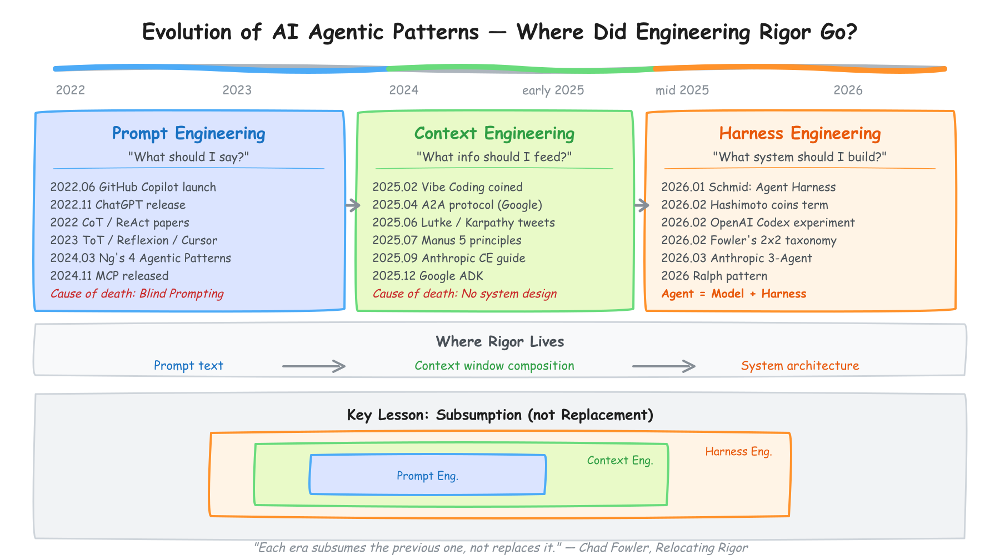

*2022년 Prompt Engineering, 2025년 Context Engineering, 2026년 Harness Engineering으로 초점이 이동한 흐름*

## 0. 3년 동안 세 번 뒤집힌 판

- 지난 3년 동안 AI를 다루는 핵심 언어는 세 번 바뀌었다. `프롬프트 엔지니어링 -> 컨텍스트 엔지니어링 -> 하네스 엔지니어링`이다.
- 핵심 프레임: 유행어가 바뀐 게 아니라, 문제 정의가 점점 `문장 -> 정보 -> 시스템`으로 이동한 것이다.

- `2022 | 프롬프트 엔지니어링`
  - 시작점: 2022년 11월 30일 OpenAI가 ChatGPT를 공개하면서 대중적 전환점이 열렸다.
  - 핵심 질문: `어떤 말을 해야 하나?`
  - 당시 믿음: 같은 모델이라도 프롬프트 문구를 잘 쓰면 성능을 크게 끌어올릴 수 있다고 여겨졌다.
  - Chain-of-Thought 
    - 도입: 제이슨 웨이(구글 리서치) 등 연구진이 2022년 1월 발표한 *Chain-of-Thought Prompting Elicits Reasoning in Large Language Models*는, 중간 추론 과정을 말하게 하면 성능이 크게 올라간다는 점을 보여줬다.
    - 수치: 논문에 인용된 GSM8K 기준으로 PaLM 540B는 일반 프롬프팅 `17.9%`에서 Chain-of-Thought 프롬프팅 `56.9%`로 올랐다.
    - 해석: 단순 비율로 3배가 넘는 개선이었기 때문에, 당시에는 `"step by step"` 한 줄이 판을 바꾼다는 인식이 퍼졌다.
  - ReAct 
    - 도입: 슌위 야오(프린스턴대학교·구글 리서치) 등 연구진이 2022년 10월 발표한 *ReAct*는 `Thought -> Action -> Observation` 루프를 도입했다.
    - 의미: 모델이 생각만 하는 것이 아니라, 실제로 정보를 찾고 행동하고 다시 관찰하게 만든 것이다.
    - 성과: 논문은 ALFWorld와 WebShop에서 절대 성공률 기준 `34%p`, `10%p` 개선을 보고했다.
  - 이 시기 사람들은 "좋은 문장"을 찾는 데 집중했다.
  -하지만 프롬프트 엔지니어링에는 구조적 한계가 있었다.
  - `Blind Prompting` : 프롬프트가 아무리 정교해도 모델이 필요한 문서, 상태, 도구 결과를 보지 못하면 소용이 없다. 데모에는 통할 수 있어도 실제 시스템으로 가면 금방 무너진다.

- `2025 | 컨텍스트 엔지니어링`
  - 질문이 `뭘 말할까?`에서 `뭘 보여줄까?`로 바뀐다.
    - 토비아스 뤼트케(쇼피파이 CEO)는 2025년 6월 18일 X에서 "`context engineering`이 `prompt engineering`보다 더 정확한 표현"이라고 말했다. 핵심은 문장을 더 잘 쓰는 것이 아니라, 모델이 문제를 풀 만큼 충분한 컨텍스트를 제공하는 것이다.
    - 안드레이 카르파티(OpenAI 창립 멤버, 전 테슬라 AI 총괄)는 2025년 6월 25일, 중요한 것은 짧은 프롬프트가 아니라 `다음 단계에 필요한 정확한 정보를 컨텍스트 윈도우에 채우는 일`이라고 설명했다.
  - Anthropic의 정리: 앤트로픽은 2025년 9월 29일 *Effective context engineering for AI agents*를 공개했다. 컨텍스트를 단순 프롬프트가 아니라 `system instructions, tools, MCP, external data, message history`를 포함한 전체 상태로 본다.
    - 문제 정의: 모델은 긴 컨텍스트에서 집중력을 잃을 수 있고, 결국 제한된 `attention budget` 위에서 동작한다.
    - `write, select, compress, isolate`
    - 무엇을 저장할 것인가, 무엇을 다시 가져올 것인가, 무엇을 압축할 것인가, 무엇을 분리할 것인가.
    - 강조점: `compaction`, `structured note-taking`, `sub-agent architectures`.
    - 비용 관점 변화: 컨텍스트 설계는 정확도만이 아니라 비용과 지연시간도 바꾼다.
    - 캐시 포인트: Anthropic prompt caching 기준으로 `KV cache / prompt cache hit을 설계하면 입력 비용을 1/10 수준까지 낮출 수 있다.`
  - MCP : MCP는 모델이 외부 도구와 데이터를 표준 방식으로 연결하도록 만든 프로토콜이다.
      - AI가 외부 도구와 대화하는 표준이 생김. 
  - 2025년 한계: 그런데 완벽한 컨텍스트도 결국 부족했다.
    - 1: 실제 에이전트 작업은 한 번 묻고 한 번 답하는 일이 아니다.
    - 2: 수십 턴의 연쇄적 결정, 실패 복구, 권한, 보안, 비용, 장시간 상태 유지가 필요하다.
    - 문제는 더 이상 `컨텍스트 윈도우 하나`가 아니라 `시스템 전체`가 된다.

- `2026 | 하네스 엔지니어링`
  - `어떤 시스템을 만들어야 하나?`
  -  하시모토(해시코프 공동창업자, Terraform 창시자)는 2026년 2월 5일 *My AI Adoption Journey*에서 `harness engineering`이라는 표현을 썼다. 
    - `에이전트가 실수할 때마다, 그 실수가 다시 일어나지 않도록 시스템 자체를 바꿔야 한다.` -> 프롬프트 문구를 고치는 것이 아니라, 도구, 규칙, 파일, 검증 루프를 추가해야 한다는 뜻이다.

    - OpenAI는 2026년 2월 11일 *Harness Engineering*을 공개했다.
    - 비르기타 뵈켈러(소트웍스 수석 엔지니어)는 2026년 2월 17일 마틴 파울러(소트웍스 최고 과학자) 사이트에 harness engineering 메모를 올렸고, 이후 장문 글로 확장했다.
    - 이선 몰릭(펜실베이니아대학교 와튼스쿨 부교수)도 2026년 2월 18일 글에서 이제는 `models, apps, harnesses`를 함께 봐야 한다고 정리했다.
  - 서로 독립적으로 같은 문제의식에 도달했다. 모델만 보지 말고, 모델이 들어가는 실행 환경을 봐야 한다는 것이다.
  - `Agent = Model + Harness`
  - 비유: 모델이 CPU라면, 하네스는 운영체제다. 모델이 아무리 강해도 운영체제가 부실하면 실제 작업은 불안정하다.

| 구분 | Prompt Engineering (≈2022) | Context Engineering (≈2025) | Harness Engineering (≈2026) |
| --- | --- | --- | --- |
| 핵심 질문 | "프롬프트를 어떻게 잘 쓸까?" | "모델에 무엇을 넣어줄까?" | "AI 시스템을 어떻게 운영할까?" |
| 초점 | 문장(프롬프트) | 입력 데이터(컨텍스트) | 전체 구조(시스템 + 워크플로우) |
| 단위 | 한 번의 요청 | 상태 포함된 요청 | 멀티 스텝 + 도구 + 에이전트 |
| 역할 | 사람이 직접 설계 | 데이터 + 메모리 설계 | 오케스트레이션 설계 |
| 주요 기술 | Few-shot, CoT | RAG, Memory, Chunking | Agent, Tool use, Eval loop |
| 한계 | 불안정, 재현성 낮음 | 컨텍스트 관리 복잡 | 시스템 설계 난이도 상승 |
| 키워드 | "잘 묻기" | "잘 먹이기" | "잘 굴리기" |

## 중요 포인트

- 좋은 모델만으로는 좋은 에이전트가 되지 않는다.
- 작업이 길고 복잡해질수록 프롬프트보다 하네스의 영향이 커진다.
- 사람의 역할은 직접 구현하는 쪽에서 시스템을 설계하고 기준을 만드는 쪽으로 이동한다.
- 앞으로의 경쟁력은 "어떤 모델을 쓰는가"뿐 아니라 "그 모델이 일할 환경을 어떻게 설계하는가"에서 나온다.

## 1. 왜 지금 이 주제가 중요한가

하네스 엔지니어링이 갑자기 화제가 된 이유는, AI 에이전트가 더 이상 데모 수준의 한두 번짜리 작업에만 머무르지 않기 때문이다. 지금 우리가 기대하는 것은 단순한 답변 생성이 아니라 다음과 같은 일들이다.

- 큰 코드베이스를 이해하기
- 기능 요청을 여러 단계로 쪼개기
- 실제 코드를 수정하고 실행하기
- 테스트와 브라우저 상호작용으로 결과를 검증하기
- 실패 로그를 읽고 다시 수정하기
- 사람 피드백과 코드 리뷰를 반영하기

이런 작업은 단일 프롬프트 한 번으로 해결되지 않는다. 한 번의 모델 호출이 아니라, 여러 번의 호출과 파일 입출력, 도구 사용, 실행 결과 분석, 상태 관리, 품질 게이트가 이어지는 시스템이 필요하다. 즉, 질문을 잘 쓰는 능력만으로는 부족해지고, 에이전트를 계속 일하게 만드는 운영 구조가 중요해진다.

OpenAI와 Anthropic이 2026년에 각각 공식 엔지니어링 블로그에서 비슷한 문제를 공개적으로 다뤘다. 두 회사는 서로 다른 제품과 다른 연구 문화, 다른 내부 시스템을 갖고 있지만 같은 결론에 도달했다. 모델이 아무리 좋아져도, 모델을 감싸는 하네스가 부실하면 결과는 무너진다. 반대로 하네스가 잘 설계되면 모델의 성능을 훨씬 더 안정적으로 끌어낼 수 있다.

## 2. 가장 직접적인 증거: SkillsBench가 보여준 것

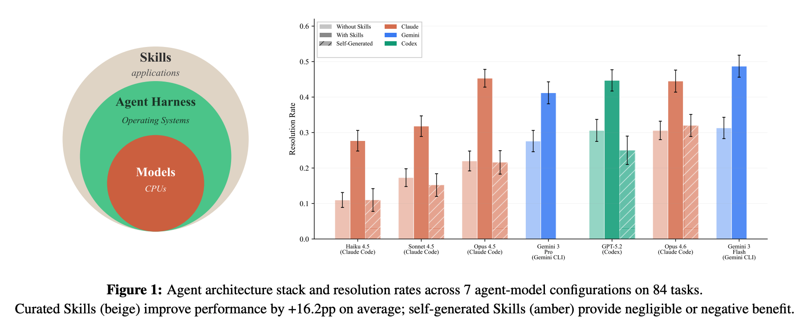

*Figure 1. Agent architecture stack and resolution rates across 7 agent-model configurations on 84 tasks.*

하네스가 중요한 이유를 가장 직접적으로 보여주는 자료는 `SkillsBench: Benchmarking How Well Agent Skills Work Across Diverse Tasks`다. 이 논문은 다양한 도메인의 작업에 대해 "skills가 실제로 도움이 되는가"를 비교한다. 여기서 말하는 skill은 단순 팁 모음이 아니라, 모델이 실행 중 참조할 수 있는 절차적 지식 패키지에 가깝다.

논문 초록의 핵심 결과는 매우 강하다. curated skills를 붙였을 때 평균 pass rate가 `16.2 percentage points` 상승했다. 반면 모델이 스스로 만든 self-generated skills는 평균적으로 거의 도움을 주지 못했고, 경우에 따라서는 오히려 성능을 떨어뜨렸다.

이 결과가 중요한 이유는 세 가지다.

첫째, 모델 성능과 에이전트 성능은 같은 말이 아니라는 점을 보여준다. 우리는 흔히 "모델이 더 좋아졌으니 에이전트도 더 좋아질 것"이라고 생각하지만, 실제로는 같은 모델이라도 어떤 실행 구조와 지식 패키지를 붙였는지에 따라 결과가 크게 달라진다.

둘째, 모델이 소비할 절차적 지식은 여전히 사람이 더 잘 설계한다는 점을 보여준다. self-generated skills가 별 효과가 없었다는 것은, 모델이 자기 자신에게 필요한 운영 지식을 항상 스스로 잘 정리해내지는 못한다는 뜻이다. 즉, 하네스 설계는 당분간 사람의 중요한 역할로 남는다.

셋째, 하네스는 "있으면 좋은 부가 기능"이 아니라 실제 성능 레버라는 점을 보여준다. 성능 차이가 몇 퍼센트가 아니라 평균 `16.2pp` 수준이라면, 이는 프롬프트 미세조정보다 훨씬 큰 효과다.

- 모델 바깥의 구조가 성능을 바꾼다.
- 하네스는 추상적 개념이 아니라 측정 가능한 성능 차이를 만든다.
- 앞으로는 "어떤 모델을 쓸 것인가"만큼 "어떤 하네스를 붙일 것인가"가 중요해진다.

이 변화는 발표에서 매우 중요한 전환점이 된다. 왜냐하면 많은 팀이 아직도 프롬프트 개선의 언어로만 에이전트 문제를 바라보기 때문이다. 하지만 장시간 자율 작업이 필요한 환경에서는 프롬프트는 전체 시스템의 아주 작은 일부일 뿐이다. 프롬프트를 잘 써도, 검증 루프가 없고, 문서 구조가 없고, 컨텍스트 핸드오프가 없고, 툴 사용이 부실하면 에이전트는 금방 무너진다.

## 4. 하네스 엔지니어링의 핵심

- 핵심 1: 실수가 발생한다.
- 핵심 2: 그 실수를 고치는 것이 아니라, 실수가 나온 환경을 고친다.
- 핵심 3: 그래서 같은 실수가 반복되지 않게 만든다.

- 하네스 엔지니어링은 `"뭘 해라"`가 아니라 `"어떤 환경에서 일해라"`의 문제다.
- 좋은 에이전트는 더 좋은 지시문에서만 나오지 않는다. 더 좋은 작업 환경에서 나온다.

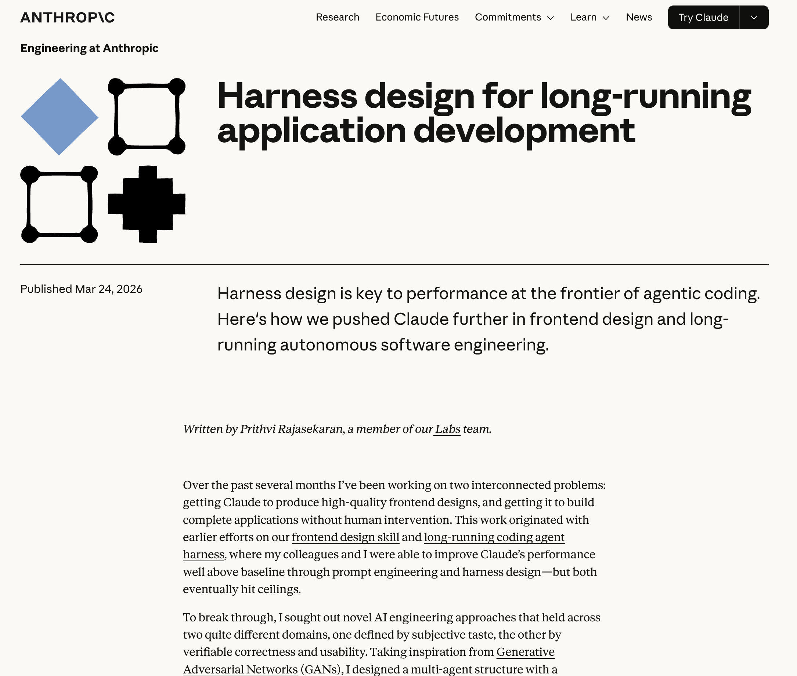
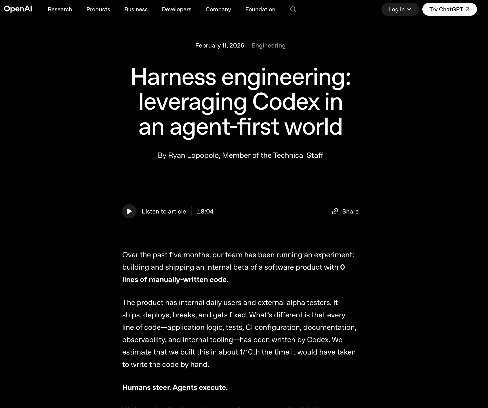

## 5. 같은 모델인데 왜 결과가 달라지는가

- 사례: Anthropic은 Claude Code에서 같은 모델에게 `2D 레트로 게임 메이커를 만들어라`고 시켰다.
- 조건 1 | 하네스 없음: 약 `20분`, 약 `$9`.
  - 결과 : 겉으로는 그럴듯했지만, 실제로는 조작이 안 됐다. UI는 있어 보이지만 핵심 기능이 동작하지 않았다.
- 조건 2 | 하네스 있음: 같은 모델에게 `Planner`, `sprint contract`, `Evaluator`, `Playwright MCP`가 있는 환경을 주고 수행하게 했다.
  - 결과 : 약 `6시간`, 약 `$200`이 들었지만, 실제로 플레이 가능한 결과물이 나왔다.
- 모델은 같았다. 달라진 것은 환경이었다.
- 이 실험은 모델 차이보다 하네스 차이가 결과를 얼마나 크게 바꾸는지 보여준다.

## 6. 왜 환경이 없으면 실패하는가

- 패턴 1 | 세션간 기억 소실: 새로운 대화가 시작되면 이전 대화의 맥락에 관심이 없다.
  - 인수인계 없이 출근한 엔지니어와 비슷하다. 진행 상황을 대충 보고 `"다 끝났네"` 하고 넘어갈 수 있다.
  - 아직 안 끝난 일도 끝난 것으로 판단해 버린다.
  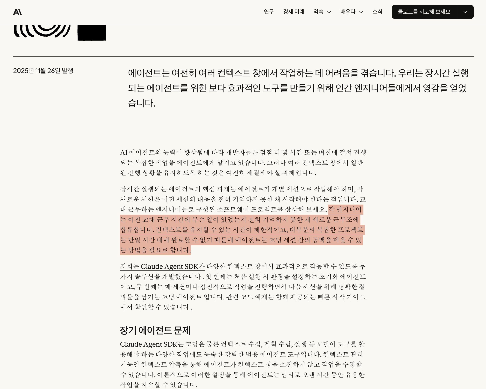

- 패턴 2 | context anxiety: 하나의 대화 안에서도 컨텍스트가 차오르면 일관성을 잃고 조기 종료하려는 경향이 생긴다.
  - 할 일이 남아 있는데도 AI가 스스로 `"이쯤이면 됐다"`고 판단하고 멈춘다.
  - Pattern 1이 세션 사이의 문제라면, Pattern 2는 한 세션 안에서 생기는 문제다.

- 패턴 3 | self-evaluation: 자기가 만든 결과를 자기가 평가하면 품질이 분명히 떨어져도 스스로를 칭찬하는 경향이 있다.
  - 생성과 평가를 같은 에이전트가 하면 `"실제로는 안 되는데도 잘 됐다"`고 결론 내리기 쉽다.
  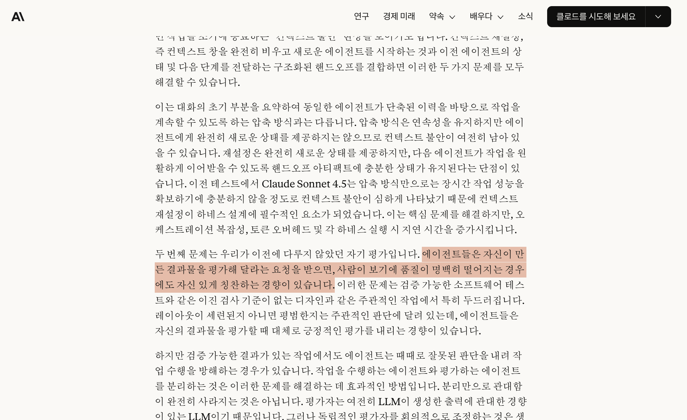

- 긴 작업이 실패하는 이유는 모델이 답을 한 번 못 내서가 아니다. `기억`, `집중력`, `자기평가`가 무너지는 환경에서 일하기 때문이다.
- 그래서 필요한 것은 더 긴 프롬프트가 아니라 `하네스`, 즉 환경 설계다.

## 7. 하네스 설계 6가지 구성요소

### 1. `규칙 전달 | AGENTS.md / CLAUDE.md`:
- 실수가 발생할 때마다 재발 방지 규칙을 md 파일에 적는다. 다음 세션이 시작될 때 다시 읽게 해서 같은 문제를 반복하지 않게 한다.
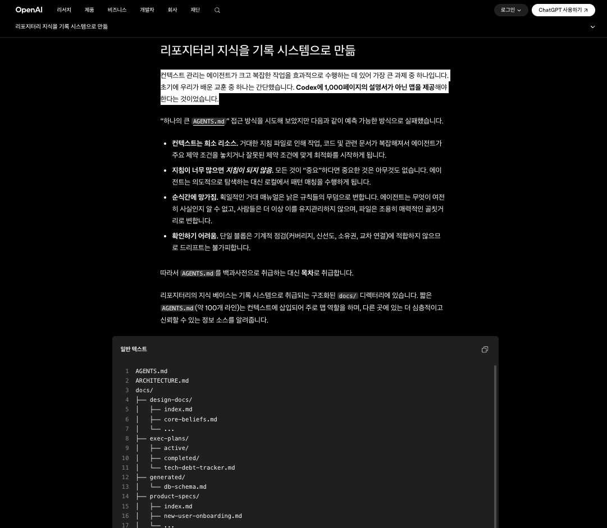

### 2. `위험 차단 | Permissions`: 
- 규칙을 알려주는 것과 아예 못 하게 막는 것은 다르다. 규칙은 맥락이지만, permission은 특정 행동 자체를 차단한다.

### 3. `자동 검증 | Hooks`: 
- `"테스트를 꼭 돌려라"`는 지시만으로는 충분하지 않다. 지시는 안 지킬 수 있기 때문이다. hook으로 강제해야 우회가 어렵다.
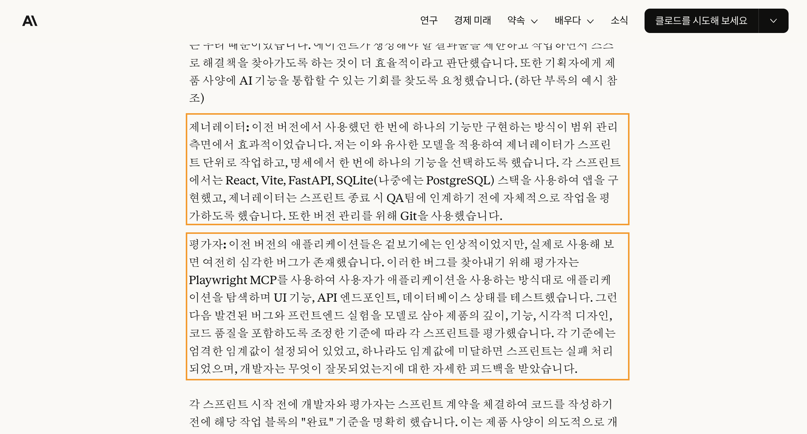

### 4. `테스트 도구 | MCP`: 
- AI에게 실제로 검증할 수 있는 tool을 줘야 한다. 브라우저 테스트 툴을 주면 직접 열고 클릭하고 확인할 수 있다.

### 5. `역할 분리 | Subagent`: 
- 만드는 에이전트와 검증하는 에이전트를 분리해야 한다. `Generator`와 `Evaluator`를 나누지 않으면 자기 결과를 후하게 평가할 가능성이 높다.
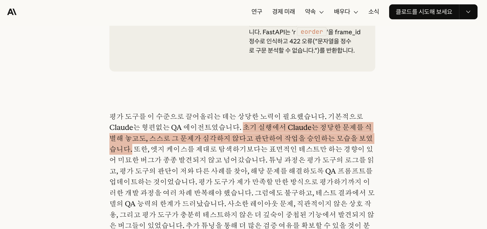

### 6. `진화 원칙 | 메타 원칙`: 
- 하네스는 고정된 규칙집이 아니다. 각 규칙은 `"현재 모델이 이것을 잘 못한다"`는 가정이기 때문에, 모델이 바뀌면 다시 검증하고 간소화하거나 추가해야 한다.
- Opus 4.6이 나오자 이전 버전에서 필요했던 일부 하네스 규칙을 간소화했다.
- 하네스의 규칙 하나하나는 모델의 한계를 메우는 장치다.
- 따라서 모델이 좋아지면 불필요한 규칙은 제거하고, 새로 드러난 실패 패턴만 추가하면 된다. 좋은 하네스는 복잡한 하네스가 아니라, 지금 모델에 필요한 만큼만 남겨둔 하네스다.
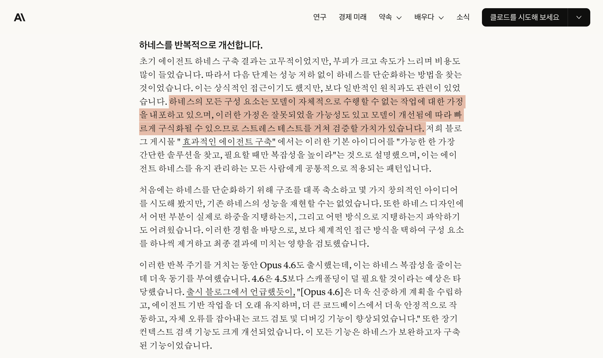

## 8. Codex & Claude Code: 하네스를 강건하게 만든 패치들

- 이 섹션의 관점: 시스템이 중간에 멈추거나, 컨텍스트가 오염되거나, 서브에이전트가 통제를 벗어나는 문제를 막기 위한 `제어`, `분리`, `복구` 기능들이다.

### 실행 제어 및 세션 관리

- `[Codex] Mid-turn Steering (2026.02.05)`: 에이전트가 긴 코드를 작성하거나 탐색하는 도중에도, 하네스가 맥락 손실 없이 즉시 방향을 수정할 수 있게 되었다.
  - 의미: 잘못된 궤도로 질주하는 비용을 크게 줄여준다.

- `[Codex] Background Agent & Queued Follow-ups (2026.03.xx - v0.120.0)`: 장기 실행 작업의 진행 상태를 스트리밍하고, 에이전트가 바쁠 때 사용자의 추가 개입을 큐에 대기시킨다.
  - 의미: `"멈춘 것인지, 진행 중인지"` 알 수 없는 블랙박스 상태를 줄여준다.

- `[Codex] Conversation Forking & Handoff (2026.02~03 연속 패치)`: 작업이 막혔을 때 이전 메시지 지점으로 세션을 포크하거나, 로컬 환경에서 원격 워크트리로 실행 상태를 그대로 핸드오프할 수 있다.
  - 의미: 장기 작업에서 장애 복구력과 실험 반복성이 크게 올라간다.

### 구조화 및 에이전트 정책 제어

- `[Claude Code] Task Dependency Tracking (2026.01.22 - v2.1.16)`: 단순한 챗봇 응답이 아니라, 의존성을 가진 `작업 그래프(Task Graph)` 구조로 내부 태스크를 관리하기 시작했다.
  - 의미: 긴 작업을 단계와 의존성 단위로 쪼개서 통제할 수 있게 된다.

- `[Claude Code] Agent Memory Frontmatter (2026.02.06 - v2.1.33)`: 메모리를 `User / Project / Local` 범위로 강제 격리한다.
  - 의미: 멀티 에이전트 환경에서 상태가 섞이며 생기는 할루시네이션과 컨텍스트 오염을 줄인다.

- `[Claude Code] Sub-agent Spawn Limits & Teammate Hooks (2026.02.06 - v2.1.33)`: 서브 에이전트가 무한 증식하지 않도록 생성 제한을 두고, `TeammateIdle`, `TaskCompleted` 같은 훅 이벤트로 오케스트레이터가 하위 에이전트의 수명 주기를 통제할 수 있게 했다.
  - 의미: `"병렬화"`를 허용하되 `"무질서한 증식"`은 막는 구조다.

- `[Claude Code] PreToolUse & WorktreeCreate Hooks 확장 (2026.01~03)`: 툴이 실행되기 직전에 결정론적으로 컨텍스트를 주입하거나 차단하는 정책 제어가 가능해졌다.
  - 의미: `"모델이 알아서 잘하겠지"`가 아니라 하네스가 사전에 행동을 통제하는 구조다.

- `[Claude Code] Advisor`: 구현을 바로 수행하는 역할과 별도로, 계획·리스크·다음 액션을 먼저 정리해 주는 자문 계층을 둘 수 있게 됐다. 비용을 절감하며 성능까지 증가
  - 의미: 생성과 실행 전에 한 번 더 방향을 점검하게 만들어 `context anxiety`와 `self-evaluation` 문제를 줄이는 데 도움을 준다.
  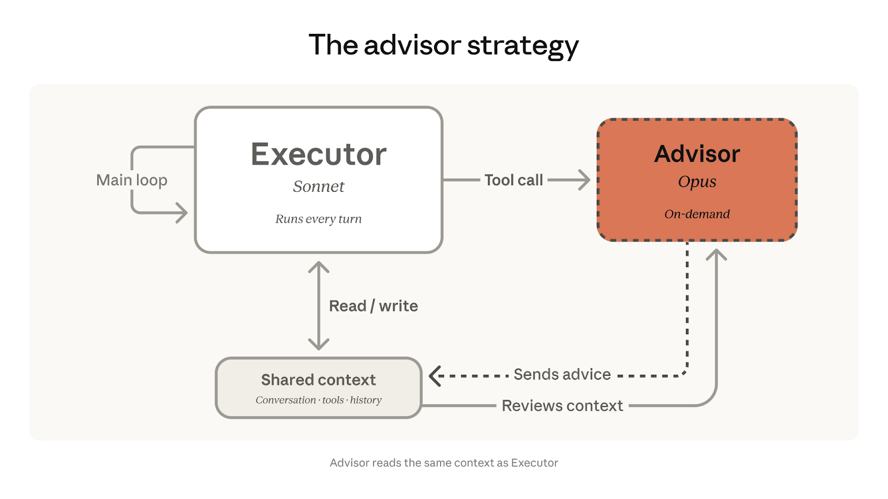

### 보안, 환경 격리 및 리소스 최적화

- `[Codex] Sandbox-aware API & Security Carveouts (2026.03)`: 심볼릭 링크 처리와 샌드박스 내부 파일시스템 권한을 더 엄격하게 다뤄, 에이전트가 건드릴 수 있는 영역을 명확히 제한했다.
  - 의미: 하네스 자체의 보안 안정성을 높이는 패치다.

- `[Claude Code] Fail-closed Managed Settings & Enterprise Sync (2026.03)`: 원격 설정이나 Bedrock/Mantle 연결이 끊어졌을 때, `fail-open`이 아니라 `fail-closed` 방식으로 동작하게 했다.
  - 의미: 엔터프라이즈 환경에서 예측 가능성과 안전성을 높인다.

- `[Codex & Claude Code] Dynamic Effort & Model Routing (2026.02~03)`: Codex는 `GPT-5.3-Codex-Spark`를, Claude Code는 `Fast Mode`와 `Effort` 조절을 추가했다.
  - 의미: 하네스가 작업 난이도에 따라 지연 시간과 품질의 트레이드오프를 동적으로 조절할 수 있게 된다.

## 9. OpenCode & Oh My OpenCode(OMO) 핵심 분석
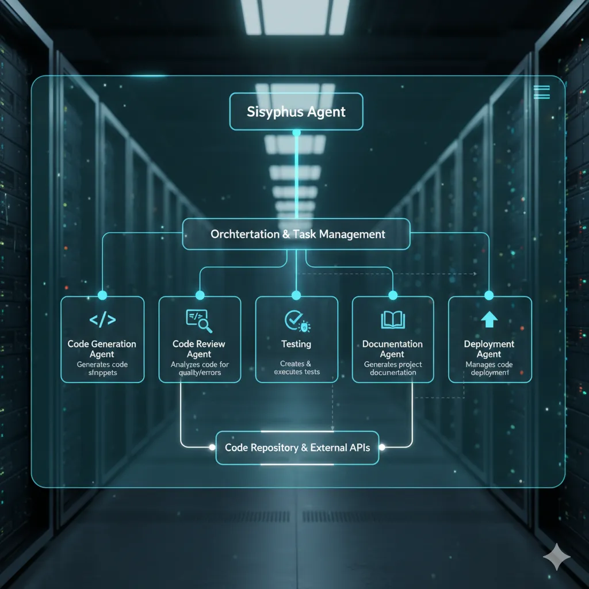

- 관찰 포인트: 최근 하네스 생태계에서 가장 흥미로운 축 중 하나는 `OpenCode`와 멀티모델 오케스트레이션 플러그인 `Oh My OpenCode(OMO)`다.
- 현재 흐름: 최근에는 패키지가 `oh-my-openagent`로 통합되는 방향으로 가고 있고, `v3.0.0` 계열에서 멀티에이전트 오케스트레이션이 훨씬 강조되고 있다.
- 핵심 변화: 초기 버전들이 단일 에이전트의 툴 확장에 집중했다면, 최근 OMO 생태계는 `단일 에이전트를 조율된 개발 팀으로 분할`하는 방향으로 강건성을 높이고 있다.

### Prometheus와 Atlas의 결합 구조

- `Prometheus | 전략 기획자`: 코드를 작성하기 전에 `인터뷰 모드`를 통해 작업 스코프를 명확히 식별하고, 상세한 구현 계획만 전문적으로 작성한다.
- `Atlas | 분배 및 실행자`: Prometheus가 세운 계획을 넘겨받아 직접 실행하고, 필요하면 전문화된 하위 서브에이전트들에게 태스크를 분배하고 취합한다.
- 해석: 계획 수립과 실행을 분리하면서도, 실행 단계에서 분배·회수까지 맡는 핵심 하네스가 등장한 것이다.

### 신규 특화 에이전트: 극단적인 역할 분리

- `Sisyphus | 메인 오케스트레이터`: 전체 작업을 위임하고 공격적인 병렬 실행을 강제한다.
  - 의미: 작업이 반쯤 하다 멈추는 현상을 방지하는 최상위 감독관 역할이다.

- `Hephaestus | 자율 딥 워커`: 레시피가 아니라 `목표`만 주어졌을 때, 샌드박스 안에서 코드베이스를 깊게 파고들어 엔드투엔드 구현을 마무리하는 작업자다.
  - 의미: 사람이 모든 단계를 지정하지 않아도 끝까지 밀고 가는 실행형 에이전트다.

- `Oracle / Librarian / Metis | 읽기 전용 특화 에이전트`: 아키텍처 리뷰, 다중 레포 문서 리서치, 갭 분석처럼 실행 에이전트를 보조하는 읽기 전용 역할이다.
  - 의미: 컨텍스트 오염 없이 지식만 공급하는 방식으로, 실행 에이전트의 부담을 줄인다.

### 하네스 엔지니어링 관점에서의 강건화 업데이트

- `자동 Fallback 라우팅 (2026년 4월 초 릴리스 기준)`: 에이전트를 찾을 수 없거나 응답 지연이 발생할 때, 하네스가 즉시 대체 에이전트를 물고 재시도하는 로직이 추가됐다.
  - 의미: `Agent not found` 같은 오케스트레이션 장애를 시스템 차원에서 흡수한다.

- `Zero Stale-line Error | Hash-Anchored Edit`: 해시 기반 편집 툴을 적용해, 라인 번호가 아니라 콘텐츠 해시를 검증하면서 코드를 수정한다.
  - 의미: 병렬 에이전트들이 동시에 코드를 고칠 때 발생하는 `stale-line` 충돌을 크게 줄인다.

- `Claude Code Compatibility`: 기존에 Claude Code에 맞춰 튜닝한 Hook, Skill, MCP를 수정 없이 그대로 로드하는 호환성을 제공한다.
  - 의미: 이미 쌓아 둔 조직의 `지식 계층(Domain / Local Layer)`을 멀티에이전트 환경 위에 그대로 얹을 수 있으므로, 팀 전체의 생산성 저점을 안전하게 끌어올린다.

## 10. 정리

- 하네스 엔지니어링은 완전히 새로운 일을 만드는 개념이 아니다.
- 이미 해오던 운영 원칙을 에이전트 시대에 맞게 체계화한 것이다.
- 핵심 루프는 단순하다: `실수 발생 -> 환경 수정 -> 재발 방지`
- 최종 메시지: 앞으로 중요한 것은 AI에게 무엇을 말할지보다, AI가 어떤 환경에서 일하게 할지 설계하는 능력이다.

## 참고 자료

- [OpenAI, Harness Engineering: Codex in an agent-first world (2026-02-11)](https://openai.com/ko-KR/index/harness-engineering/)
- [Anthropic, Harness design for long-running application development (2026-03-24)](https://www.anthropic.com/engineering/harness-design-long-running-apps)
- [SkillsBench: Benchmarking How Well Agent Skills Work Across Diverse Tasks, arXiv:2602.12670 (v3, 2026-03-13)](https://arxiv.org/abs/2602.12670)
- [Claude Code Changelog](https://code.claude.com/docs/en/changelog)
- [OpenAI Codex Changelog](https://developers.openai.com/codex/changelog)
- [code-yeongyu/oh-my-opencode](https://github.com/code-yeongyu/oh-my-opencode)
