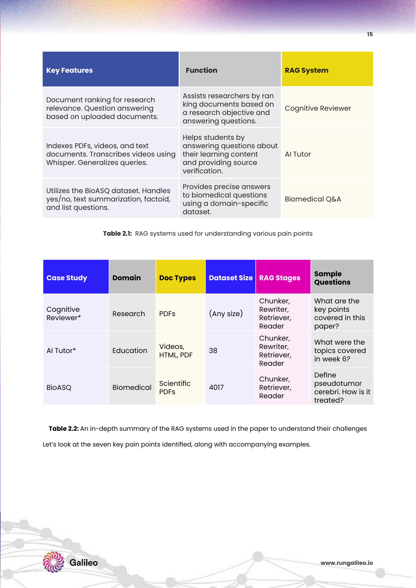

# 1주차: RAG Fundamentals & System Challenges
> LLM의 한계 극복을 위한 RAG의 도입과 실무적 난제

---

## 1. LLM의 이해와 한계

### 이론 설명

LLM(Large Language Model)은 방대한 텍스트 데이터로 훈련된 '스마트 자동완성 엔진'입니다. 시퀀스 내 요소 간의 문맥 확률을 학습하여 다음에 올 토큰을 예측하며, 이 구조적 특성 때문에 다음의 치명적 한계가 내재합니다.

**3대 핵심 Pitfalls:**

| 한계 | 설명 | 실무 리스크 |
|------|------|-------------|
| 환각 (Hallucination) | 사실이 아닌 그럴싸한 내용을 생성 | 의료/법률/금융 도메인 치명적 오류 |
| 지식 컷오프 | 학습 이후의 최신 정보 접근 불가 | 최신 규정, 가격, 사건 반영 불가 |
| 보안·편향 | PII 노출 위험, 학습 데이터의 편향 증폭 | 개인정보 유출, 차별적 응답 |

### PDF 원본 자료


*Fig 1.1: LLM 환각(Hallucination) 사례 — "점심 레시피" 요청에 "스테이크(저녁)"를 답변하는 Input-Conflicted, Fact-Conflicted, Context-Conflicted 환각 3대 사례 (PDF p.7)*


*Fig 1.2: 보안·프라이버시 침해 사례 — 학습 데이터에 포함된 개인 신용정보, 사내 기밀문서가 여과 없이 노출되는 사례 (PDF p.8)*

### 예시

> **환각 시나리오**: GPT에게 "삼성전자의 2024년 3분기 영업이익을 알려줘"라고 물으면, 학습 컷오프 이후이거나 학습 데이터가 부정확할 경우, 실제 수치와 전혀 다른 숫자를 자신있게 답변합니다. 이를 의사결정에 활용하면 실수로 이어집니다.

### 관련 논문

**📄 Survey of Hallucination in Natural Language Generation (Ji et al., 2023)**
- LLM의 환각 현상을 체계적으로 분류하고 원인을 분석한 서베이 논문
- Intrinsic Hallucination(입력 컨텍스트와 모순)과 Extrinsic Hallucination(외부 사실과 불일치)로 분류
- RAG가 환각을 줄이는 핵심 방법론임을 통계적으로 입증

---

## 2. RAG (Retrieval-Augmented Generation)란?

### 이론 설명

RAG는 외부 데이터베이스에서 관련 정보를 실시간으로 검색하여, LLM의 응답 프롬프트를 증강(Augment)하는 아키텍처입니다.

**동작 원리:**
1. **Query** → 유저 질문이 입력됨
2. **Retrieve** → 질문과 유사한 문서를 외부 DB에서 검색
3. **Augment** → 검색된 문서를 컨텍스트로 프롬프트에 주입
4. **Generate** → LLM이 컨텍스트를 바탕으로 사실 기반 응답 생성

**RAG의 핵심 이점:**
- **정보 최신성**: 새로운 데이터를 DB에 추가하면 즉시 반영, 재학습 불필요
- **출처 제공 가능(Citability)**: 검색된 문서를 근거로 제시 가능
- **도메인 특화**: 사내 시스템(ERP, 법률 문서)을 외부 노출 없이 활용

### PDF 원본 자료


*Fig 1.3: RAG 기본 아키텍처 — Query → 외부 DB 검색 → 컨텍스트 주입 → 안전한 응답 생성 플로우 (PDF p.10)*

### 관련 논문

**📄 Retrieval-Augmented Generation for Knowledge-Intensive NLP Tasks (Lewis et al., Meta AI, 2020)**
- RAG를 처음 제안한 원조 논문
- DPR(Dense Passage Retrieval)로 문서를 검색하여 BART 생성 모델에 주입하는 최초 구조 제안
- Open-domain QA, Fact Verification, Jeopardy 생성 등 다양한 NLP 태스크에서 기존 Fine-tuning 대비 우수한 성능 입증
- **Impact**: 이후 모든 RAG 시스템의 출발점이 된 선구적 논문

---

## 3. RAG vs. Fine-tuning vs. Prompt Engineering 비교

### 이론 설명

기업이 LLM을 도입할 때 흔히 혼동하는 3가지 접근 방식의 차이를 명확히 이해해야 합니다.

### PDF 원본 자료


*Table 1.1: RAG, Fine-Tuning, Prompt Engineering의 적합성 비교표 (PDF p.12)*

### 각 전략의 포지셔닝

| 전략 | 최적 시나리오 | 한계 |
|------|-------------|------|
| **RAG** | 동적 데이터, 팩트 기반 QA, 환각 최소화 | 검색 파이프라인 구축 비용 |
| **Fine-tuning** | 특정 출력 형식, 특정 도메인 스타일 이식 | 데이터 업데이트 시 재학습 필요 |
| **Prompt Engineering** | 빠른 프로토타이핑, 간단한 태스크 | 복잡한 추론·최신 데이터에 한계 |

### 관련 논문

**📄 Is Retrieval-Augmented Generation Helpful for LLMs? (Shi et al., 2023)**
- RAG와 Fine-tuning의 성능을 다양한 태스크에서 비교 분석
- 지식 집약적 태스크에서는 RAG가 Fine-tuning을 압도
- 단순 생성 태스크에서는 Fine-tuning이 더 효율적임을 입증

---

## 4. RAG 구축의 7가지 주요 실패 지점

### 이론 설명

파이프라인 완성 후에도 실무 환경에서 RAG는 다음 7가지 지점에서 빈번하게 실패합니다.

### PDF 원본 자료




*Table 2.1 & 2.2: RAG 파이프라인의 7가지 핵심 실패 지점과 그 원인 분류표 (PDF p.15)*

### 7가지 실패 지점 심층 분석

1. **Missing Content (콘텐츠 자체 부재)**: DB에 해당 정보가 아예 없는 경우
2. **Missed Top Ranked (검색 순위 밖 탈락)**: 정보는 있으나 벡터 유사도 계산 오류로 상위 K에 미포함
3. **Not in Context (컨텍스트 창 초과)**: Top-K에 들어왔으나 토큰 한도 초과로 LLM이 미참조
4. **Not Extracted (정보 추출 실패)**: 컨텍스트에 있으나 LLM이 정보를 발췌하지 못함
5. **Wrong Format (출력 형식 오류)**: 정보는 맞으나 JSON/표 등 요구 형식으로 출력 실패
6. **Incorrect Specificity (구체성 불일치)**: 답이 너무 포괄적이거나 너무 세부적
7. **Consolidation Limitations (통합 한계)**: 여러 문서에서 정보를 통합해야 할 때 누락

---

## 💻 구현: LangChain 기반 기초 RAG 파이프라인

### 관련 프레임워크 및 라이브러리

| # | 프레임워크 / 라이브러리 | 특징 | 적합한 상황 |
|---|-----------|------|------------|
| 1 | **LangChain** | 가장 풍부한 에코시스템, 체인 구성 용이, 40여 개 벡터 DB 통합 | 프로토타이핑, 다양한 컴포넌트 연결 |
| 2 | **LlamaIndex** | 문서 인덱싱에 특화, 계층형 검색, 데이터 커넥터 내장 | 구조화된 문서 처리, RAG 중심 앱 |
| 3 | **Haystack (deepset)** | 모듈형 파이프라인, 원클릭 프로덕션 배포 | 엔터프라이즈 배포, CI/CD 통합 |
| 4 | **DSPy (Stanford)** | 프롬프트를 선언적 프로그램으로 정의, 자동 최적화 | 프롬프트 튜닝, RAG 파이프라인 자동화 |
| 5 | **Semantic Kernel (Microsoft)** | C#/Python 지원, Azure OpenAI 네이티브 통합 | .NET 기반 엔터프라이즈, 플러그인 아키텍처 |
| 6 | **Embedchain** | 설정 최소화, URL/PDF/동영상 등 다양한 소스 자동 로드 | 빠른 MVP 구축, 비개발자 친화 |
| 7 | **Canopy (Pinecone)** | Pinecone 전용 RAG 프레임워크, 원클릭 배포 | Pinecone 사용자, 최소 설정 원할 시 |
| 8 | **Verba (Weaviate)** | Weaviate 전용 RAG UI 포함, 멀티모달 지원 | Weaviate 사용자, 시각적 데모 필요 시 |
| 9 | **txtai** | 경량 임베딩 DB + RAG, 단일 파이썬 패키지 | 경량 프로젝트, 로컬 실행 |
| 10 | **Ragflow** | 오픈소스 딩 다큐먼트 이해 RAG 엔진, 청킹 시각화 | 대규모 문서 처리, 청킹 품질 검증 |
| 11 | **Cognita (TrueFoundry)** | 오픈소스 모듈형 RAG, 파이프라인 커스터마이징 | 프로덕션 RAG, 컴포넌트 교체 실험 |
| 12 | **Langroid** | Multi-Agent RAG, 에이전트 기반 문서 QA | Agent 기반 RAG, 복잡한 워크플로우 |

### 클라우드 서비스

| 서비스 | 제공사 | 주요 기능 |
|--------|--------|--------|
| **Azure AI Search** | Microsoft | 통합 벡터·키워드 서치, OpenAI 연동 |
| **Amazon Bedrock + Kendra** | AWS | 완전 관리형 RAG, 엔터프라이즈 검색 |
| **Vertex AI Search** | Google | Gemini 연동, 검색 품질 우수 |
| **Cohere RAG** | Cohere | Command-R+ 모델 내장 RAG, 인용 자동 생성 |

### 코드 샘플: 기초 RAG 파이프라인

```python
from langchain_community.document_loaders import PyPDFLoader
from langchain.text_splitter import RecursiveCharacterTextSplitter
from langchain_openai import OpenAIEmbeddings, ChatOpenAI
from langchain_community.vectorstores import Chroma
from langchain.chains import RetrievalQA
from langchain.prompts import PromptTemplate

# 1. 외부 지식 문서 로드 (PDF)
loader = PyPDFLoader("data/company_manual.pdf")
documents = loader.load()

# 2. 텍스트 분할 (청킹)
splitter = RecursiveCharacterTextSplitter(
    chunk_size=512,
    chunk_overlap=64,
)
chunks = splitter.split_documents(documents)

# 3. 임베딩 및 벡터 DB 저장
embeddings = OpenAIEmbeddings(model="text-embedding-3-large")
vectorstore = Chroma.from_documents(chunks, embedding=embeddings, persist_directory="./db")

# 4. 환각 방지 프롬프트 템플릿
prompt = PromptTemplate(
    template="""당신은 주어진 컨텍스트에만 기반하여 답변하는 정확한 어시스턴트입니다.
컨텍스트에 없는 정보는 "문서에서 해당 정보를 찾을 수 없습니다"라고 답하세요.

컨텍스트:
{context}

질문: {question}

답변:""",
    input_variables=["context", "question"]
)

# 5. RAG QA 체인 구성
qa_chain = RetrievalQA.from_chain_type(
    llm=ChatOpenAI(model="gpt-4o-mini", temperature=0),
    retriever=vectorstore.as_retriever(search_kwargs={"k": 5}),
    chain_type_kwargs={"prompt": prompt},
    return_source_documents=True  # 출처 문서도 반환
)

# 6. 질의 실행
result = qa_chain.invoke({"query": "회사의 연차수당 정책은 무엇인가요?"})
print("답변:", result["result"])
print("\n참조 문서:")
for doc in result["source_documents"]:
    print(f"  - {doc.metadata.get('source', 'unknown')}, p.{doc.metadata.get('page', '?')}")
```

---

다음 주차 → [2주차: Prompting Strategies for Hallucination Reduction](week2.md)
