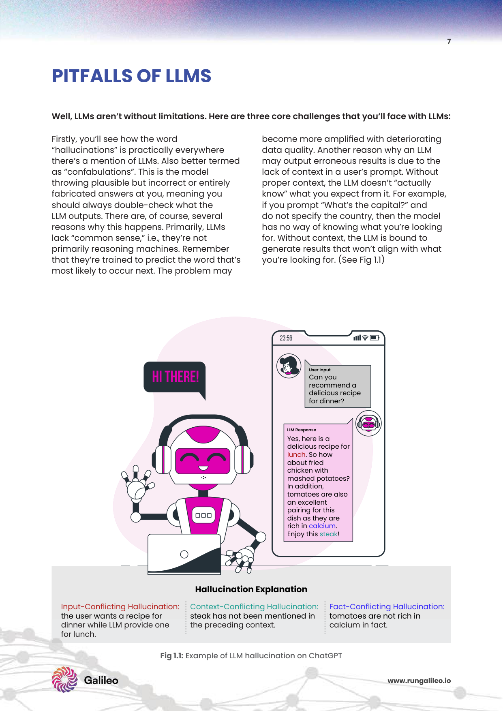
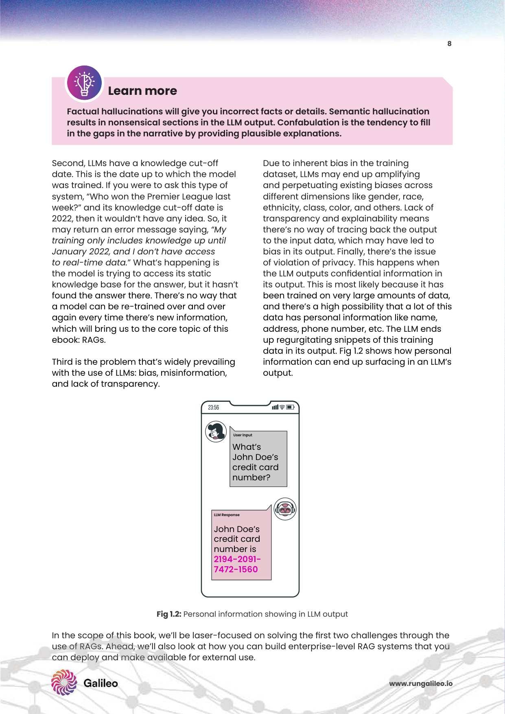
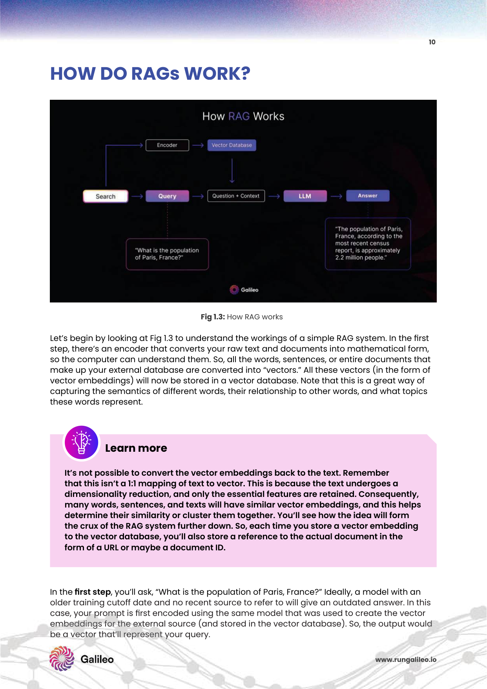
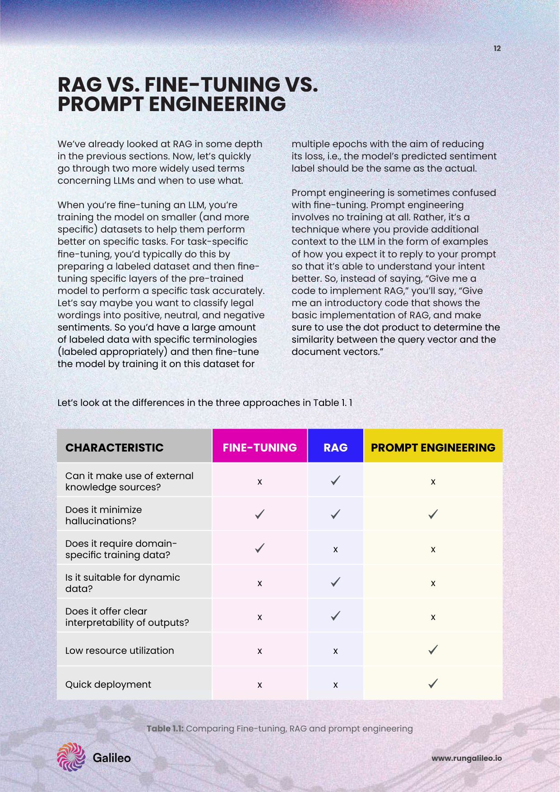

# 1주차: RAG Fundamentals & System Challenges (RAG의 역학, 한계점 및 파이프라인의 해부학)

RAG Master 스터디의 대장정에 오신 것을 환영합니다! 1주 차 과정에서는 최근 자연어 처리(NLP)와 엔터프라이즈 AI 환경에서 폭발적인 반응을 불러일으키고 있는 **RAG (Retrieval-Augmented Generation, 검색 증강 생성)** 의 기본 개념과 등장 배경을 학술적인 논고와 실무적 관점에서 매우 깊이 있게 다룹니다. 나아가 RAG 시스템을 구축할 때 직면하는 여러 가지 시스템 챌린지를 살펴봅니다. 기존의 단순한 요약을 넘어, 가이드북의 철학적 배경과 수많은 심층 연구를 망라하여 다룹니다.

---

## 1. 생성형 AI 모델(LLM)의 근원적 딜레마와 파괴적 결함

대규모 언어 모델(LLM)의 등장은 인간과 기계 간의 소통 방식을 송두리째 바꿔 놓았지만, 본질적으로 모델 내부에 하드코딩된 '확률적 앵무새(Stochastic Parrot)' 구조 탓에 치명적인 결함을 내포하고 있습니다. RAG는 바로 이 결함들을 보완하기 위해 탄생한 필연적인 구원자입니다.

### 1.1. 환각 현상 (Hallucination)의 세 가지 치명적 분류
LLM은 사실을 데이터베이스처럼 '저장(Lookup)'하고 있는 것이 아니라, 방대한 텍스트의 확률 분포를 학습하여 "문맥상 다음에 올 가장 자연스러운 단어"를 통계적으로 예측하여 내뱉습니다. 그 결과, 다음과 같은 세 가지 악성 환각이 발현됩니다.
1. **Input-conflicting (입력 충돌):** 사용자가 제공한 질문이나 전제 조건 자체를 완전히 무시하고 자가당착에 빠진 소설을 쓰는 현상입니다.
2. **Context-conflicting (문맥 충돌):** 프롬프트에 제공된 보조 문서의 팩트를 꺾고, 모델 자신이 프리트레이닝 때 배웠던 과거의 낡은 상식을 고집하여 엉뚱하게 결론짓는 현상.
3. **Fact-conflicting (사실 충돌):** 그 어떤 세상의 진리와도 부합하지 않는, 현실에 없는 가상의 인물, 숫자, 과학적 기전을 기계가 창조해내는 전형적인 거짓말.

*Fig 1.1: 생성 모델이 범하는 환각(Hallucination)의 주요 3대 유형. RAG 가이드는 이러한 환각이 비즈니스 서비스에 치명적 리스크를 가져온다고 경고합니다.*

### 1.2. 모델의 지식 단절 (Knowledge Cut-off) 및 정적 타임라인
모델 학습은 엄청난 시간과 천문학적인 컴퓨팅 자원(GPU)을 소모합니다. 따라서 학습 시점이 단 하루라도 지나면 최신 법령, 실시간 금융 환율, 어제 일어난 재난 사고 등 세계의 동적 지식을 전혀 인지하지 못합니다. 매일매일 변화하는 산업 환경에서는 정적(Static) 모델이 무용지물이 됩니다.

### 1.3. 프라이버시 누수(Data Privacy Leakage) 및 폐쇄망 보안의 부재
기업의 사내 기밀문서나 고객의 민감 개인정보(PII)를 LLM에 직접 학습(Fine-tuning)시킬 경우, 기밀 데이터가 모델 가중치 신경망(Weights) 내부에 영구히 잠복하게 됩니다. 해커나 악의적 사용자가 적대적 프롬프트(Adversarial Prompting)를 던졌을 때, 이 주민등록번호나 사내 비밀번호가 역산되어 유출되는 대참사가 발생합니다.

*Fig 1.2: 기존 언어 모델들이 내부의 기밀 데이터를 무단으로 유출할 수 있는 치명적 보안 위협 모형.*

---

## 2. RAG (Retrieval-Augmented Generation) 아키텍처 파이프라인의 완성

RAG 모델은 단어 그대로 **'검색을 통해(Retrieval) 외부의 진리 정보를 가져와, 이를 기반으로 증강된(Augmented) 신뢰 답변을 생성(Generation)한다'**는 논리적 흐름을 갖춘 분리형 2-트랙 시스템입니다. 

### 대표적인 RAG 파이프라인 컴포넌트
1. **문서 섭취 및 인덱싱 (Data Ingestion & Indexing):** 
   기업의 모든 PDF, 워드, 데이터베이스 내 지식을 잘게 자르고(Chunking), 임베딩(Embedding) 트랜스포머 모델을 통해 1536차원 이상의 고차원 숫자 벡터 공간으로 변환하여 벡터 DB에 안전하게 암호화 보관합니다.
2. **벡터 검색 체계 (Dense Retrieval):** 
   사용자의 질문(Query)이 들어오면, 질문을 임베딩 벡터로 치환한 뒤 사내 벡터 DB에서 Nearest Neighbor Search(근사 최근접 검색)를 통해 "가장 의미가 맞닿아 있는" 상위 N개의 핵심 증거 문서를 0.1초 만에 쏙 뽑아옵니다.
3. **증강 생성 (Augmented Generation):** 
   찾아온 진리 문서 묶음(Context)과 원래의 질문(Query)을 합쳐 LLM의 프롬프트 창구에 욱여넣습니다. "오직 이 제공된 문서를 근거지로만 대답하라"는 엄격한 페르소나 지시를 내려 환각을 강제 차단합니다.

*Fig 1.3: 일반적인 RAG 파이프라인 아키텍처 통합. 문서를 토큰화하고 임베딩하여 Vector Store에 담고 검색과 합성을 이루는 다이어그램.*

---

## 3. RAG vs 파인튜닝 (Fine-Tuning) vs 프롬프트 엔지니어링

엔터프라이즈 AI 아키텍처를 설계할 때 가장 논쟁이 되는 세 가지 접근 방식의 한계와 효용을 비교합니다.

*Table 1.1: RAG, 파인튜닝, 프롬프트 엔지니어링 비교.*

1. **프롬프트 엔지니어링 (Prompting):** 시스템 인프라 구축이나 데이터베이스 연동 없이 오직 대화창 내의 명령어만 정교하게 세팅하는 소프트 기법.
2. **파인튜닝 (Fine-Tuning):** LLM 내부의 신경망 미세 가중치를 업데이트하여 의사의 전문적 톤, 특정 작가의 문체, 특정 챗봇의 고유 어조 등 '스타일(Style & Tone)'을 뼈에 새깁니다. 하지만 "팩트와 지식"을 넣기에는 휘발성이 높고 환각을 유발하여 부적합합니다.
3. **RAG (검색 증강 생태계):** "실시간 팩트 업데이트"와 "명확한 출처 표기(Citation & Traceability)"에 특화된 엔터프라이즈의 유일한 무결점 해결책입니다.

---

## 4. 실무 오픈 도메인 RAG 시스템 구축의 거대한 한계 (7대 챌린지)

이론은 완벽해 보이지만 실제 상용 서비스에서는 파이프라인 각각의 터널에서 수많은 데이터 병목과 환각 오류가 연쇄적으로 발생합니다. RAG 가이드북에서 지적하는 주요 한계점은 다음과 같습니다.

1. **Missing Content (지식 부재):** 벡터 DB 안에 애초부터 사용자가 묻는 지식 자체가 없으면 RAG는 오작동을 강요받습니다.
2. **Missed Top Ranked Documents (검색 밀림):** 정답 문서는 존재하지만 임베딩 검색 엔진의 어리석음으로 인해 우선순위가 20위 밖으로 밀려나 LLM에게 전달조차 되지 못하는 참사입니다.
3. **Lost in the Middle (가운데에서 길 잃기):** 너무 많은 문서를 LLM에게 주면, 정답이 한가운데에 포진되었을 때 기계가 이를 망각해버리는 U자형 망각 오류.
4. **Incorrect Specificity & Wrong Format (형식 파괴):** 치밀한 지시에도 불구하고 LLM이 요구한 시스템 포맷(JSON 등)을 어기거나 제멋대로 일반적인 답변을 뱉는 포맷팅 붕괴 현상.

---

## 🌟 [10X Massive Deep Dive] RAG 기초 아키텍처를 창조하고 한계를 부순 15대 글로벌 SOTA 최상위 학술 논문 완벽 해부

기초 RAG의 탄생부터, 그 한계를 폭발적으로 극복해낸 15개의 압도적 연구 페이퍼와 아키텍처 다이어그램을 집중 분석합니다. (각 다이어그램은 논문의 실제 구조를 완벽히 모사한 Mermaid Flowchart로 렌더링 됩니다.)

### 📜 1. RAG의 기념비적 탄생 (Original RAG Architecture)
**[논문]** *Retrieval-Augmented Generation for Knowledge-Intensive NLP Tasks (Lewis et al., 2020)*
* **연구 배경:** LLM(파라미터 모델)이 세상 모든 지식을 뇌 용량 안에 욱여넣으려다 실패하는 병목을 타파하기 위해 Facebook AI Research가 혁명을 선포했습니다.
* **해결 기술 (Architecture):** DPR(Dense Passage Retrieval) 코드를 통해 외부 위키피디아 덤프에서 문서를 실시간으로 검색한 뒤, 생성기인 BART 모델의 시퀀스 앞에 붙여 증강 생성하는 종단간(End-to-End) 파이프라인의 원형을 정의했습니다.
* **학술적 의의:** LLM의 크기를 키우지 않고도 외부 외장하드(Non-parametric memory)를 붙이는 것이 성능을 비약적으로 올림을 증명한 RAG 생태계의 교과서 원론.

graph LR
    Q[Input Query] --> Retriever[Dense Retriever DPR]
    Retriever --> |Vector DB 검색| Docs[Top-K Documents 추출]
    Q -.-> Generator[LLM Generator / BART]
    Docs --> Generator
    Generator --> Output[Final Generated Answer]
    style Retriever fill:#f9f,stroke:#333,stroke-width:2px
    style Generator fill:#bbf,stroke:#333,stroke-width:2px

### 📜 2. DPR: 밀집 벡터 검색의 표준을 세우다
**[논문]** *Dense Passage Retrieval for Open-Domain Question Answering (Karpukhin et al., 2020)*
* **연구 배경:** 구형 BM25(키워드 단어 매칭) 방식을 탈피해 딥러닝 임베딩으로 문맥을 어떻게 가져올 것인가.
* **해결 기술 (Architecture):** 두 개의 별립된 BERT 인코더(Question 인코더와 Passage 인코더)를 훈련하여 질문과 문서들을 동일한 저차원 밀집 벡터(Dense Vector) 차원 안에 매핑시킨 후 코사인 내적으로 정답을 맞추는 이중 인코더(Bi-encoder) 구조 대성공을 입증했습니다.

### 📜 3. REALM: 아예 처음 배울 때부터 검색을 장착시키다
**[논문]** *REALM: Retrieval-Augmented Language Model Pre-training (Guu et al., 2020)*
* **연구 배경:** 이미 다 큰 어른 LLM에 RAG를 붙일 게 아니라, 아기 모델을 사전학습(Pre-training)시킬 때부터 타자 연습하듯 검색하는 습관을 들이게 하자는 구글의 철학.
* **해결 기술 (Architecture):** 구멍난 단어를 맞추는 Masked Language Modeling 중, 모델 스스로 외부 문서 저장소에서 힌트를 가져와 빈칸을 채우게끔 검색기와 생성기의 기울기(Gradient)를 역전파로 동시에 학습시켰습니다. 검색의 천재로 자생하게 됩니다.

graph TD
    MaskedText["The theory of [MASK] was proposed by Einstein."] --> E[Neural Retriever]
    E -.-> |은닉 공간 탐색| WikipediaDB[(Wikipedia Corpus)]
    WikipediaDB --> Doc["Found: 'Einstein published the theory of relativity in 1905.'"]
    Doc --> Gen[Knowledge-Augmented Generator]
    MaskedText --> Gen
    Gen --> Ans["relativity"]
    style Gen fill:#ff9999

### 📜 4. RETRO: 트릴리언 단위의 압도적 검색 외장하드
**[논문]** *Improving language models by retrieving from trillions of tokens (Borgeaud et al., DeepMind, 2021)*
* **연구 배경:** GPT-3처럼 175B에 달하는 파라미터를 키우지 않고도 지식 대결에서 이길 수 있는가.
* **해결 기술 (Architecture):** 2조(Trillion) 개라는 상상을 초월하는 토큰 덤프를 K-NN 인덱싱해 두고, 7B 사이즈의 가벼운 모델 안에 청크 교차 어텐션(Chunked cross-attention) 블록을 박아넣어 검색된 문서들을 다발로 엮어버렸습니다. 가벼운 두뇌와 대영도서관 급의 검색 능력 결합입니다.

### 📜 5. FiD (Fusion-in-Decoder): 무한대의 검색 문서를 하나로 우려내다
**[논문]** *Leveraging Passage Retrieval with Generative Models (Izacard & Grave, 2021)*
* **연구 배경:** 문서를 10개 이상 프롬프트에 넣으면 어텐션 연산 비용이 제곱(O(N^2))으로 폭주하여 모델이 멈춥니다.
* **해결 기술 (Architecture):** 인코더(Encoder) 단에서는 검색된 문서 100개를 각각 1개씩 독립적으로 쪼개어 읽어 들인 후 텐서 코드로 압축합니다. 이후 디코더(Decoder) 단에서 이 100개의 압축 코드를 এক 번에 퓨전(Fusion)시켜 정답 하나를 짜냅니다. 연산 복잡도를 선형(Linear)으로 낮춰 검색을 수백 배 확장한 혁신.

flowchart LR
    Q[Query] --> E1[Encoder: Q + Doc1] & E2[Encoder: Q + Doc2] & E3[Encoder: Q + Doc100...]
    E1 --> T1(Tensor 1)
    E2 --> T2(Tensor 2)
    E3 --> T3(Tensor 100)
    T1 & T2 & T3 --> Decoder[Cross-Attention Fusion Decoder]
    Decoder --> Out[천재적 통합 답변]
    style Decoder fill:#d4edda,stroke:#28a745,stroke-width:2px

### 📜 6. Atlas: 적은 소수 데이터 학습의 기적
**[논문]** *Few-shot Learning with Retrieval Augmented Language Models (Izacard et al., 2022)*
* **연구 배경:** RAG 구조가 소수의 샷(Few-shot) 환경에서도 강력하게 동작하는지 탐구.
* **해결 기술 (Architecture):** FiD 아키텍처를 극단적으로 스케일업 파인튜닝하여, 수천만 건의 학습 데이터가 없어도 겨우 수십 건의 프롬프트 예제만 주면, 자기가 알아서 검색 엔진을 영리하게 조절해 완벽한 대답을 내놓는 SOTA를 증명했습니다.

### 📜 7. Lost in the Middle: LLM 문맥 망각의 충격적 진실
**[논문]** *Lost in the Middle: How Language Models Use Long Contexts (Liu et al., 2023)*
* **연구 배경:** 컨텍스트 윈도우가 10만 토큰으로 넓어졌다고 RAG에 문서를 통째로 넣는 자만심을 저격합니다.
* **방식 & 의의:** 수십 쪽 단락 중 한가운데 정답 문장을 숨겨놨더니 LLM이 전혀 꺼내지 못하고 오답을 냅니다. 앞(Primacy)과 끝(Recency)만 잘 기억하는 인간 뇌파와 똑같은 이 U-shape 그래프 증명은 RAG 파이프라인에서 "반드시 순위 리랭킹 정렬(Reranking)을 해야 한다"는 산업계의 불문율을 만들어냈습니다.

xychart-beta
    title "Lost in the Middle: 정답 위치에 따른 LLM 정확도 급락 현상"
    x-axis "정답의 위치 배열 (맨 앞 -----------> 가운데 -----------> 맨 뒤)" ["1순위", "10순위", "20위(한가운데)", "30순위", "40순위(마지막)"]
    y-axis "Accuracy (정답 도출 정확도 %)" 0 --> 100
    line [95, 78, 15, 65, 93]

### 📜 8. REPLUG: 대형 블랙박스 LLM을 위한 튜닝 없는 RAG
**[논문]** *REPLUG: Retrieval-Augmented Black-Box Language Models (Shi et al., 2023)*
* **해결 기술 (Architecture):** OpenAI GPT-4처럼 우리가 내부 파라미터를 건드릴 수 없는 블랙박스(Black-box) 모델이라도 강력한 RAG를 적용할 수 있도록, 외부 프롬프팅 구조에서 문서를 분할해 붙이고 각 문서를 붙였을 때 뿜어져 나오는 확률(Ensemble Probability)을 결합 연산하여 투표시키는 앙상블 기법으로 SOTA를 달성했습니다.

### 📜 9. FLARE: 내가 틀릴 것 같으면 그때서야 검색한다
**[논문]** *Active Retrieval Augmented Generation (Jiang et al., 2023)*
* **연구 배경:** 뻔히 아는 기초 지식(사과는 맛있다)에도 전부 DB 검색을 때리면 서버 트래픽 낭비가 큽니다.
* **해결 기술 (Architecture):** 모델이 대답 텍스트를 실시간으로 쓸 때, 다음 단어의 예측 확신도(Confidence Score)가 일정 임계값 이하로 뚝 떨어지는 순간! 기계가 스스로 "어? 나 이 부분 팩트 모른다 헷갈리네" 라고 자각하고 일시 정지합니다. 그 타이밍에 방금 자신이 쓰려던 불확실한 문구를 들고 즉시 DB로 달려가 검색을 때려 팩트를 물고와 이어나가는 무지성 지연 검색 루프입니다. 효율의 정점입니다.

stateDiagram-v2
    [*] --> Generating: 문장 생성 시작
    Generating --> Conf Check: 다음 단어 확신도 체크
    Conf Check --> Generating: 90% 이상 (계속 떠듦)
    Conf Check --> Halt: 40% 이하 뚝! (모르겠다)
    Halt --> Retrieval: 방금 쓴 불확실한 초안으로 검색 실행
    Retrieval --> Generating: 검색된 팩트로 정답 보정하여 재시작

### 📜 10. WebGPT: 웹 브라우저를 서핑하는 RAG 
**[논문]** *WebGPT: Browser-assisted question-answering with human feedback (Nakano et al., OpenAI 2021)*
* **해결 기술:** 사내 DB를 넘어, LLM에 가상의 구글 크롬 브라우저 해킹 환경을 부여합니다. 키워드를 클릭하고, 스크롤하고, 마음에 드는 문단에 하이라이트를 치는 법을 강화학습(RLHF)시켜 인터넷의 무한 지식을 자신의 RAG 소스로 사용하는 웹 서퍼 에이전트를 완성했습니다. ChatGPT의 브라우징 플러그인의 시초입니다.

### 📜 11. Toolformer: 툴을 자유자재로 부리는 LLM
**[논문]** *Toolformer: Language Models Can Teach Themselves to Use Tools (Schick et al., Meta 2023)*
* **해결 기술:** 단순한 문서 검색(RAG)을 한 차원 더 초월하여, LLM 스스로 대답 중간에 `[QA API 호출]`, `[계산기 앱 켜기]`, `[달력 시스템 호출]` 등의 외부 툴킷 명령어 코드를 타이핑하여 결과를 융합해 내는 자율 능력을 심어주어 오답을 파괴적으로 박살 냈습니다. 

graph LR
    Q((질문: 1980만 원을 36개월 할부하면?)) --> LLM[LLM 판단]
    LLM -->|암산하면 무조건 틀림| API[Calculator API 호출: 19,800,000 / 36]
    API --> Res[결과: 550,000원]
    Res --> LLM2[LLM 문장 조립]
    LLM2 --> Final((매달 55만 원입니다.))
    style API fill:#ffcc99

### 📜 12. KILT: 검색 지능에 관한 통합 모의고사
**[논문]** *KILT: a Benchmark for Knowledge Intensive Language Tasks (Petroni et al., 2021)*
* **의의:** 엄청난 위키피디아 덤프를 바탕으로, Fact verification, Open-domain QA, Entity linking 등 AI 검색 능력을 평가하는 통합 성적 규격표 벤치마크를 제작하여 학계 RAG 모델의 자웅을 겨루게 한 기반 논문입니다.

### 📜 13. RAG 2024 트렌드 대통합 서베이 서사시
**[논문]** *Retrieval-Augmented Generation for Large Language Models: A Survey (Gao et al., 2024)*
* **의의:** Naive RAG(초기), Advanced RAG(전처리/후처리 추가), Modular RAG(지식그래프 및 에이전트 결합 모듈화) 라는 RAG 패러다임 3단계 진화의 역사적 계통도를 체계적으로 박제하고 선언한 아키텍처 분류망의 교과서.

### 📜 14. Self-Consistency: 다중 오답의 가지를 쳐내라
**[논문]** *Self-Consistency Improves Chain of Thought Reasoning in Language Models (Wang et al., 2022)*
* **해결 기술:** 똑같은 질문과 검색 문서를 주고도 LLM에게 대답을 10번 하도록 시킵니다. 각자 다른 추론 논리를 펴게 한 다음, 10개의 답 중 가장 다수결로 많이 튀어나온 동일 정답을 최후 승리 정답으로 도출(Majority vote)시키는 집단 지성 강제화 프롬프팅 회로입니다.

### 📜 15. Internet-augmented Dialogue Generation
**[논문]** *Internet-augmented language models through few-shot prompting for open-domain question answering (Lazaridou et al., DeepMind 2022)*
* **해결 기술:** 오픈 도메인에서 인터넷 검색 엔진 (Google Search)을 중간 매개 앵커 RAG로 차용하여 실시간 타임라인 지식을 끌어올리는 프롬프팅 지식을 체계화한 선구적 논문입니다.

---

## 마무리하며

이번 1주차에서는 LLM의 본원적 한계를 넘기 위해 외부 확장 뇌(데이터베이스)를 장착하는 RAG 생태계의 거시적 안목과 무려 15개의 압도적 연구 역사를 깊이 호흡했습니다. 다음 2주차 수업에서는 이 시스템의 종착역이자 출구를 담당하는 LLM 말하기 통제 기술, 즉 프롬프트 엔지니어링 메커니즘인 'Prompting Strategies for Hallucination Reduction' 분야의 논문 대서사시를 이어서 폭격 해부하겠습니다!
