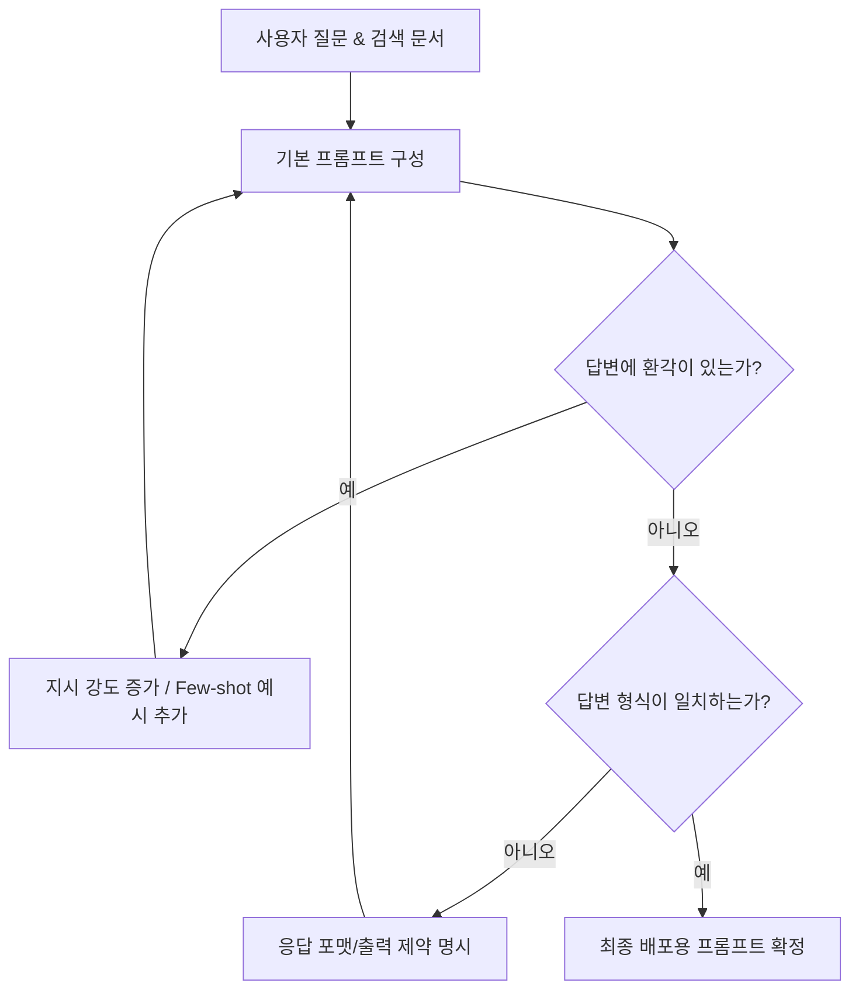

# 2주차: Prompting Strategies for Hallucination Reduction (환각을 줄이기 위한 프롬프팅 전략)

지난 1주차에서는 RAG 시스템의 기초와 RAG가 직면할 수 있는 한계(데이터 누락, 형식 오류 등)를 알아보았습니다. 외부 검색 기술(Retrieval)이 아무리 훌륭하게 작동해 정답이 포함된 문서를 찾아오더라도, LLM이 이것을 읽고 엉뚱한 답변이나 잘못된 정보를 만들어 낸다면 완벽한 RAG라고 부를 수 없습니다.

2주차에서는 **환각 현상(Hallucination)** 을 최소화하고, LLM이 찾아온 문서를 충실히 반영하도록 지시하는 다양한 **프롬프트 엔지니어링 전략**들을 다룹니다.

---

## 1. 프롬프팅, 어떻게 접근해야 할까?

프롬프트 엔지니어링(Prompt Engineering)이란 LLM과 대화하는 "규칙과 지시문"을 가장 효과적으로 설계하는 기술입니다. LLM은 본질적으로 자유롭게 글을 쓰는 '소설가'의 기질을 띄고 있습니다. 우리는 RAG를 통해 그 소설가를 '꼼꼼한 연구원'처럼 행동하게끔 프롬프트로 억제해주어야 합니다.

### 문맥 강제(Context Constraining) 전략의 필수 법칙
RAG의 최종 질문 프롬프트에는 다음 핵심 내용들이 반드시 포함되어야 환각을 사전에 차단할 수 있습니다.

1. **역할(Role) 부여:** "당신은 제공된 문서를 바탕으로 사용자에게 답변하는 전문 CS 상담원입니다."
2. **엄격한 행동 강령 (Strict Constraint):** "반드시 아래에 제공된 [문맥] 정보만을 기반으로 대답하세요. 기존에 알고 있는 지식에 의존하지 마세요."
3. **거절의 중요성 (Graceful Fallback):** "만약 제공된 문맥에서 질문에 대한 답을 찾을 수 없다면 억지로 지어내지 말고, '주어진 문서에서 해당 정보를 찾을 수 없습니다.'라고 솔직하게 답변하세요."

---

## 2. 효과적인 고급 프롬프팅 기법들

LLM은 프롬프트를 어떻게 작성하느냐에 따라 추론력 범위가 비약적으로 증가합니다. 대표적인 기법 몇 가지를 소개합니다.

### 2.1 Zero-shot vs. Few-shot Prompting
* **제로샷(Zero-shot) 프롬프팅:**
  어떤 예시도 주지 않고 곧바로 지시만 내리는 방법입니다. "이 문서를 요약해줘." 라고만 요구합니다. 복잡한 추론이나 일관된 형식을 요구할 때는 LLM이 실수할 확률이 생깁니다.
* **퓨샷(Few-shot) 프롬프팅:**
  LLM에게 질문을 던지기 전에 질문과 모범 답안의 **'예시(Examples)'를 2~3개 정도 먼저 보여주는 기법**입니다. 
  "이런 식으로 답해: [예시1], [예시2] ... 이제 다음 문서를 가지고 똑같이 대답해: [질문문서]"
  이 기법은 LLM이 답변의 길이, 어투, 판단 방식을 모방하게 하여 환각 확률을 극적으로 낮춰줍니다.

### 2.2 Chain-of-Thought (CoT, 생각의 사슬)
질문이 복잡해질 때 인간이 생각하는 방식처럼 중간 사고 과정을 명시하도록 지시하는 방식입니다.

단순히 "답이 뭐야?" 묻지 않고, **"단계별로 차근차근 생각해 보자(Let's think step by step)."** 라는 마법의 문장을 추가합니다. 이렇게 하면 LLM이 단어들을 생성하면서 스스로 사고의 단계를 밟기 때문에 복잡한 연산이나 논리적 추론에서 환각을 일으킬 확률이 엄청나게 줄어듭니다.

### 2.3 Tree of Thoughts (ToT) / 자기 일관성 (Self-Consistency)
CoT에서 한 걸음 더 나아간 기법입니다. 
경로를 하나만 생각하지 않고 여러 가지 사고 경로를 생성해본 다음, 스스로 그 중 무엇이 가장 타당한지 투표하거나 평가하여 답을 확정 짓는 방식입니다. RAG에서 매우 어려운 복합 추론 질문(예: 3개의 다른 문서들 간의 모순점 찾기)을 해결할 때 이 기법을 이용하면 정확도를 비약적으로 높일 수 있습니다.

---

## 3. 구조화된 출력(Structured Output) 유도

RAG 시스템은 종종 LLM의 답변을 받아서 다른 시스템(예: 프론트엔드 웹페이지, API 등)에서 써야 할 때가 많습니다. LLM이 대답을 서술형 문장으로 장황하게 늘어놓으면 컴퓨터가 파싱(Parsing)하기 매우 어려워집니다.

이를 방지하기 위해 프롬프트 마지막에 **포맷팅 제약**을 거는 것이 중요합니다.
> "반드시 JSON 형태로만 응답해주세요. 답변의 내용은 'answer' 키 값 안에 넣고, 참고한 문서의 출처 제목을 'source_title' 안에 넣으세요."

이런 특정 출력 강제 기법을 쓰면 환각뿐만 아니라, 예상치 못한 불필요한 사족(예: "네! 제가 찾아온 답변은 다음과 같습니다." 같은 문장)을 줄이는 데 큰 도움이 됩니다.

---

## 4. 프롬프트 개선 프로세스 요약

프롬프트를 구축할 때는 보통 아래와 같은 사이클을 돕니다.

## 마무리하며

이번 2주차에서는 검색되어 들어온 문서가 LLM에 의해 왜곡되지 않도록 제어하는 **'프롬프팅 전략'**에 대해 알아보았습니다. 프롬프트는 코딩이라기보다는 LLM과 협상하는 언어의 기술입니다. 어투, 제약, 예시를 정교하게 짤 수록 RAG 시스템 전체의 퀄리티가 높아집니다.

하지만 이 모든 것도 애초에 **'잘 검색된 문서'** 가 주어져야 성립합니다. 3주차에는 RAG의 근간이자 검색 성능을 좌우하는 **Advanced Document Chunking (고급 문서 청킹) 및 Context Engineering** 에 대해 본격적으로 다뤄보겠습니다!
