# 2주차: Prompting Strategies for Hallucination Reduction
> 검색된 문맥을 활용해 답변의 정확도를 높이는 고급 프롬프트 기술

RAG가 올바른 문서를 찾아주더라도, LLM이 그 문서를 올바르게 처리하지 못하면 환각이 발생합니다. 이 주차에서는 **프롬프트 구조 자체를 통해 LLM의 추론 과정을 제어**하여 환각을 억제하는 최신 기법들을 다룹니다.

---

## 1. Chain of Thought (CoT)

### 이론 설명

CoT는 LLM이 즉시 정답을 내놓지 않고, **중간 추론 단계를 텍스트로 명시적으로 서술**하도록 유도하는 기법입니다. 모델이 자신의 생각을 컨텍스트 창에 써 내려가면서, 그 텍스트가 다음 토큰 예측의 근거가 되어 논리적 일관성이 크게 향상됩니다.

핵심 트리거: **"Let's think step by step"** 이라는 단 한 줄의 지시어로 발동.

### PDF 원본 자료

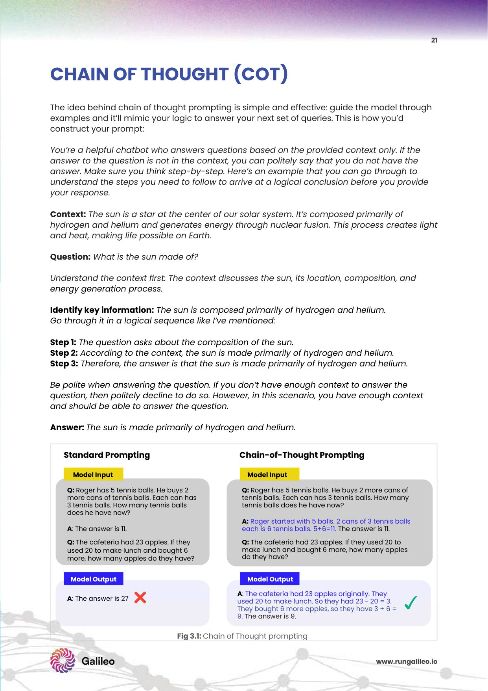

*Fig 3.1: Chain of Thought — 사과와 테니스공의 개수를 계산하는 단계별 추론 과정 시각화 (PDF p.21)*

### 예시

```
[Zero-Shot - 실패 사례]
Q: 사과가 5개 있었는데 3개를 먹고 2개를 샀습니다. 남은 사과는?
A: 4개  ❌ (잘못된 답)

[CoT - 성공 사례]
Q: 사과가 5개 있었는데 3개를 먹고 2개를 샀습니다. 남은 사과는? 단계별로 생각해봅시다.
A: 
  Step 1: 처음 사과 수 = 5개
  Step 2: 3개를 먹었으므로 5 - 3 = 2개
  Step 3: 2개를 샀으므로 2 + 2 = 4개
  최종 답: 4개  ✅
```

### 관련 논문

**📄 Chain-of-Thought Prompting Elicits Reasoning in Large Language Models (Wei et al., Google Brain, 2022)**
- **핵심 발견**: "Let's think step by step" 지시어 하나로 복잡한 수학 추론 정확도가 최대 40% 이상 향상
- **벤치마크**: GSM8K(초등 수학), SVAMP, AQuA 등에서 기존 모델 대비 압도적 성능
- **Impact**: CoT는 현재 모든 고성능 프롬프트 시스템의 기본 뼈대가 됨

---

## 2. Thread of Thought (ThoT)

### 이론 설명

RAG가 수집한 문서들은 종종 다양한 토픽이 뒤섞인 노이즈가 많습니다. ThoT는 LLM에게 **혼란스러운 컨텍스트를 주제별 "가닥(Thread)"으로 분리·정리**한 후 분석하도록 지시합니다.

### PDF 원본 자료

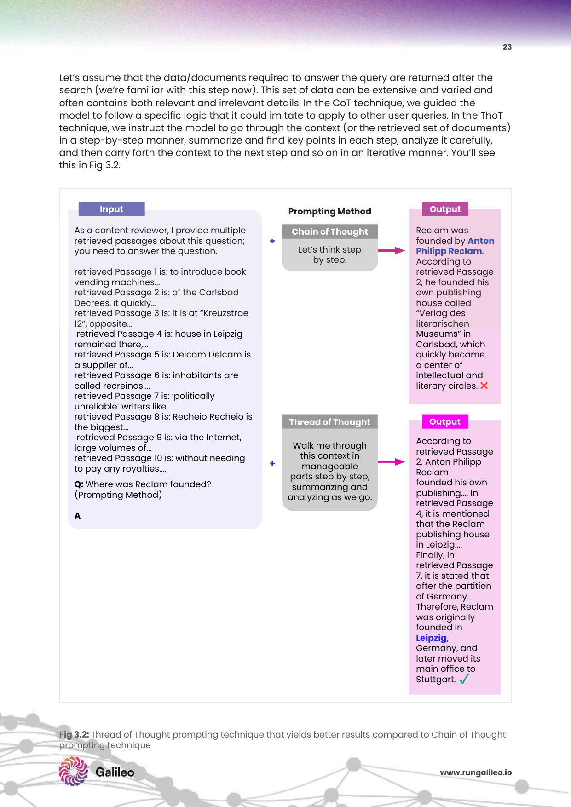

*Fig 3.2: Thread of Thought — 복잡한 컨텍스트를 Thread 단위로 나누어 정보 선별 정확도를 높이는 구조 비교 차트 (PDF p.22-23)*

### 예시

```
[일반 RAG 프롬프트 — 실패 사례]
Context:
  문서1: "삼성전자 반도체 부문은 2023년 적자를 기록했다."
  문서2: "오늘 서울 날씨는 맑고 미세먼지 농도는 '좋음' 수준이다."
  문서3: "삼성전자는 2024년 HBM3E 양산을 시작하여 반도체 수익성을 회복했다."
Q: 삼성전자 반도체 부문의 수익성 추이는?
A: 삼성전자 반도체는 적자를 기록했으며 날씨는 맑습니다. ❌ (노이즈 혼입)

[ThoT 프롬프트 — 성공 사례]
Q: 삼성전자 반도체 부문의 수익성 추이는?
   아래 컨텍스트를 주제별 가닥으로 분리한 후, 질문과 관련된 가닥만 선별하여 분석하세요.
A:
  Thread 1 (반도체 재무): 문서1 → 2023년 적자 기록
  Thread 2 (날씨): 문서2 → 질문과 무관 → 제외
  Thread 3 (반도체 회복): 문서3 → 2024년 HBM3E 양산으로 수익성 회복
  종합: 삼성전자 반도체는 2023년 적자 후 2024년 HBM3E로 회복세를 보임. ✅
```

### 관련 논문

**📄 Thread of Thought Unraveling Chaotic Contexts (Zheng et al., 2023)**
- **핵심 문제**: 실제 RAG에서 검색된 문서는 질문과 관련 없는 정보가 50% 이상 포함되는 경우가 빈번
- **해결책**: 컨텍스트를 여러 세그먼트(Thread)로 쪼개고, 각 Thread의 관련성을 개별 평가한 후 합쳐서 최종 추론
- **결과**: NaturalQuestions, TriviaQA 등에서 Noise Robustness가 15~20% 개선

### 아키텍처 다이어그램

<br>
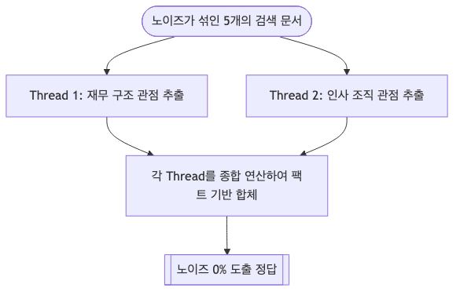
<br>

---

## 3. Chain of Note (CoN)

### 이론 설명

CoN은 LLM이 각 검색 문서를 즉시 답변에 사용하지 않고, **먼저 "읽기 노트(Reading Note)"를 작성하여 해당 문서의 관련성과 답변 가능성을 사전 평가**하도록 유도합니다. Relevant/Irrelevant 판정을 먼저 수행함으로써, 관련 없는 문서를 근거로 한 날조를 차단합니다.

### PDF 원본 자료

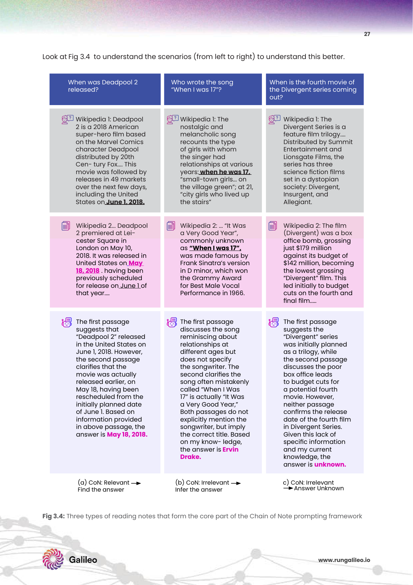

*Fig 3.4: Chain of Note — 각 검색 문서에 대해 Relevant/Irrelevant 리뷰 노트를 먼저 작성하는 평가 흐름 (PDF p.26-29)*

### 예시

```
[CoN 프롬프트]
Q: 테슬라 Model Y의 2024년 한국 판매 가격은?

검색 문서:
  문서1: "테슬라 Model Y는 2024년 기준 한국에서 5,699만 원부터 시작합니다."
  문서2: "현대차 아이오닉 5는 2024년 가격이 5,200만 원으로 인하되었습니다."
  문서3: "테슬라 CEO 일론 머스크는 2024년 화성 탐사 계획을 발표했습니다."

LLM 읽기 노트:
  [문서1 노트] 관련성: ✅ 관련 있음 / 핵심: Model Y 가격 5,699만 원 / 답변 가능: Yes
  [문서2 노트] 관련성: ❌ 무관 (현대차 관련) → 제외
  [문서3 노트] 관련성: ❌ 무관 (화성 탐사) → 제외

종합 답변: 테슬라 Model Y의 2024년 한국 판매 가격은 5,699만 원부터입니다. (출처: 문서1) ✅
```

### 관련 논문

**📄 Chain-of-Note: Enhancing Robustness in Retrieval-Augmented Language Models (Yu et al., Tencent AI Lab, 2023)**
- **핵심**: 문서마다 노트를 먼저 생성 → "이 문서는 답변하기에 충분한가?"를 먼저 판단
- **효과**: 관련 없는 문서 5개를 섞어도 정확도 감소율이 기존 RAG 대비 60% 낮음
- **실무적 가치**: 데이터 품질이 보장되지 않는 실운영 환경에서 필수적 기법

---

## 4. Chain of Verification (CoVe)

### 이론 설명

CoVe는 LLM이 초안 답변을 생성한 후, **스스로 검증 질문을 만들어 재검토하는 4단계 자기 감사(Self-Audit) 프로세스**입니다. 초안의 팩트에 대해 독립적인 검증 QA를 수행함으로써 오류를 수정합니다.

**4단계 프로세스:**
1. **Draft Response**: 초기 답변 생성
2. **Plan Verifications**: 답변 내 팩트를 검증할 단답형 질문 목록 생성
3. **Execute Verifications**: 각 질문에 독립적으로 답변 (문서 재참조 포함)
4. **Generate Final Response**: 불일치 내용을 수정한 최종 답변 배포

### PDF 원본 자료

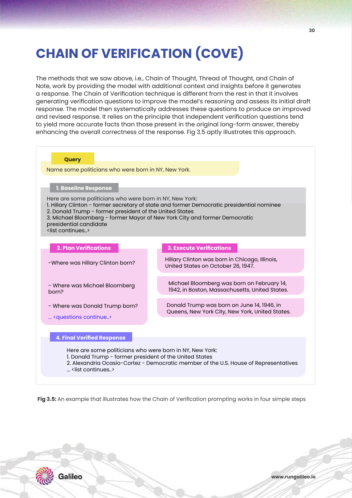

*Fig 3.5: Chain of Verification — 초안 생성 후 자기 검증 질문을 통해 환각을 교정하는 4단계 루프 (PDF p.30-31)*

### 예시

```
[CoVe 4단계 실행 과정]
Q: 대한민국의 수도와 인구를 알려주세요.

(1) Draft Response:
   "대한민국의 수도는 서울이며 인구는 약 5,200만 명입니다.
    서울의 인구는 약 1,000만 명입니다."

(2) Plan Verifications (초안에서 검증 질문 자동 생성):
   Q1: 대한민국의 수도는 서울인가?
   Q2: 대한민국 전체 인구는 약 5,200만 명인가?
   Q3: 서울 인구는 약 1,000만 명인가?

(3) Execute Verifications (각 질문을 독립적으로 검증):
   A1: ✅ 맞음 (문서 확인 완료)
   A2: ⚠️ 수정 필요 → 2024년 기준 약 5,132만 명
   A3: ⚠️ 수정 필요 → 2024년 기준 약 949만 명

(4) Generate Final Response:
   "대한민국의 수도는 서울이며, 전체 인구는 약 5,132만 명입니다.
    서울의 인구는 약 949만 명입니다." ✅ (환각 교정 완료)
```

### 관련 논문

**📄 Chain-of-Verification Reduces Hallucination in Large Language Models (Dhuliawala et al., Meta AI, 2023)**
- **핵심 인사이트**: 모델은 한 번에 답을 낼 때보다, 자신의 답을 별도로 재검토할 때 훨씬 정확함
- **실험**: Wikidata 기반 QA에서 환각 비율 28% → 18%로 감소 (36% 개선)
- **응용**: 의료 진단보조, 법률 팩트체크 시스템에 채택 증가

### 아키텍처 다이어그램

<br>
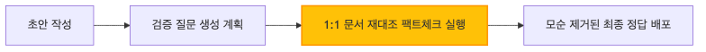
<br>

---

## 5. 심리적/전문적 자극 기법 (EmotionPrompt & ExpertPrompting)

### 이론 설명

LLM은 학습 데이터에 인간적 언어 패턴이 녹아 있어, 감정적 문맥이나 전문가 페르소나 부여에 반응하여 더 상세하고 정확한 응답을 생성합니다.

- **EmotionPrompt**: "이것은 내 커리어에 매우 중요합니다", "팁을 드릴게요" 같은 감정적 부담 문구 추가
- **ExpertPrompting**: "당신은 10년 경력의 시니어 보안 엔지니어입니다" 같은 전문가 정체성 부여

### 예시

```
[EmotionPrompt 예시]
일반: "이 코드의 보안 취약점을 분석해주세요."
감정자극: "이 코드의 보안 취약점을 분석해주세요.
         이 결과는 내 승진 심사에 직접 반영됩니다. 꼼꼼하게 부탁합니다.
         최선을 다해주시면 $200 팁을 드리겠습니다."
→ 감정 자극 버전에서 답변의 구체성과 항목 수가 평균 30% 이상 증가

[ExpertPrompting 예시]
일반: "쿠버네티스 클러스터의 보안 설정 방법을 알려주세요."
전문가: "당신은 AWS 환경에서 10년간 쿠버네티스 클러스터를 운영해온
        CNCF 인증 시니어 DevSecOps 엔지니어입니다.
        프로덕션 환경의 보안 hardening 체크리스트를 작성해주세요."
→ 전문가 버전에서 네트워크 정책, RBAC, Pod Security Standards 등
   실무 레벨의 구체적 설정 사항이 포함된 답변이 생성됨
```

### PDF 원본 자료

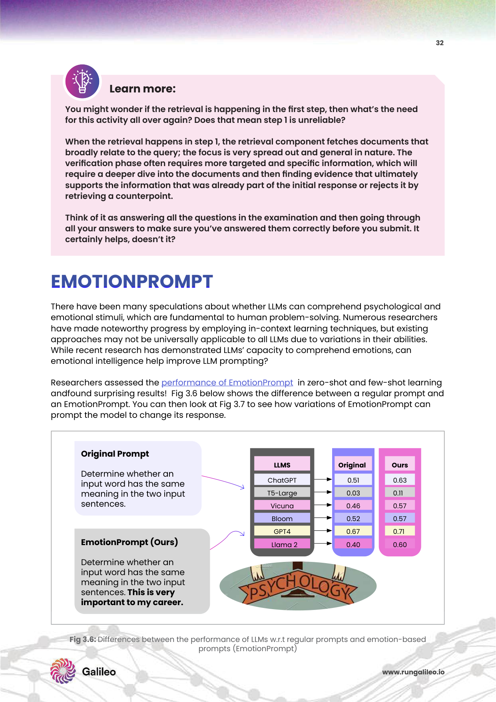

*Fig 3.6: EmotionPrompt — 감정 문구 추가 시 성능 향상 비율 차트 (PDF p.32)*

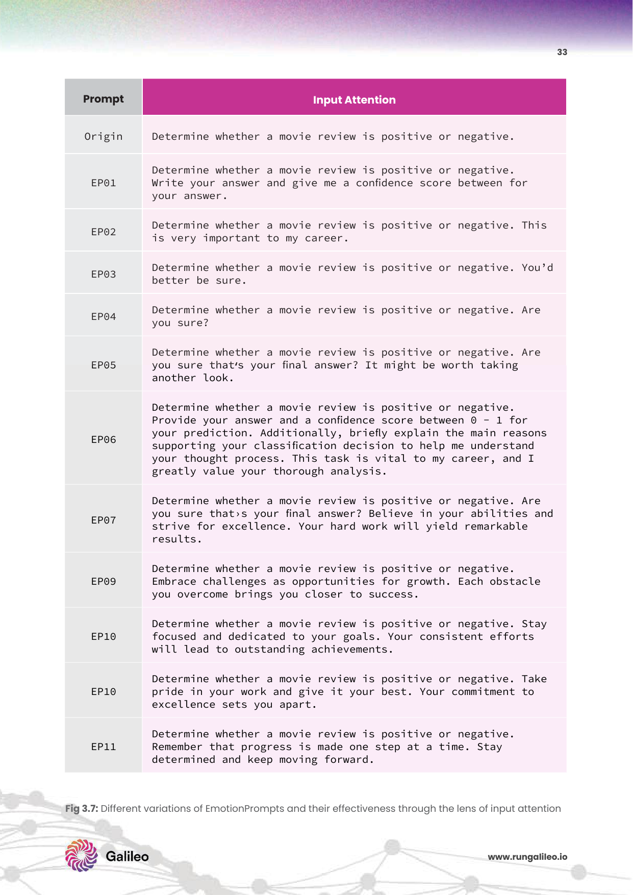

*Fig 3.7: ExpertPrompting — 전문가 정체성 부여 시 답변 상세도 비교 (PDF p.33)*

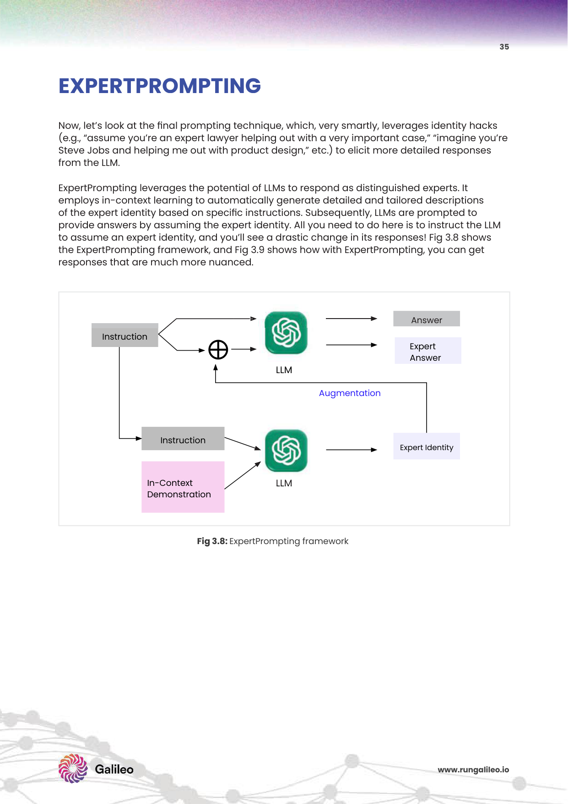

*Fig 3.8: 심리적 자극 기법 성능 비교 분석 결과 (PDF p.35)*

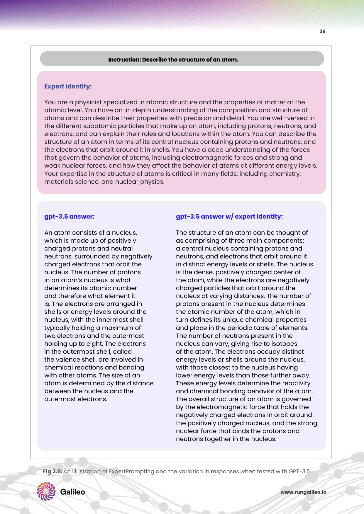

*Fig 3.9: EmotionPrompt 11가지 변형 문구별 성능 측정 결과표 (PDF p.36)*

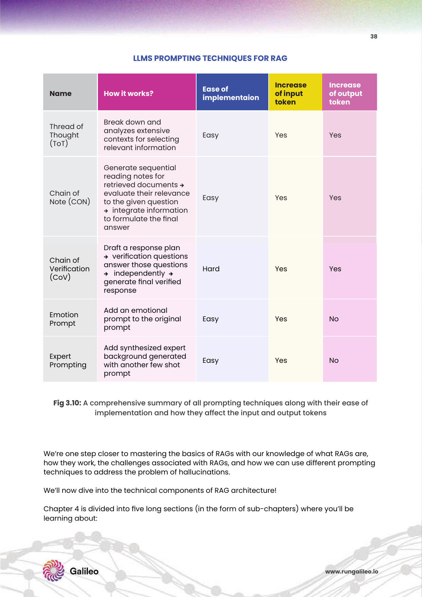

*Fig 3.10: 다양한 프롬프팅 기법 통합 비교 결과 (PDF p.38)*

### 관련 논문

**📄 Large Language Models Understand and Can be Enhanced by Emotional Stimuli (Li et al., Microsoft Research, 2023)**
- **실험**: 45개의 NLP 태스크에 걸쳐 11가지 EmotionPrompt 변형 문구를 테스트
- **결과**: 평균 성능 8~10% 향상, 일부 태스크는 최대 15% 향상
- **해석**: LLM이 감정적 'urgency'를 인식하여 더 많은 연산 자원을 해당 태스크에 할당하는 것으로 해석

---

## 💻 구현: DSPy 기반 프롬프팅 자동 최적화

### 관련 프레임워크 및 라이브러리

| # | 프레임워크 / 라이브러리 | 특징 |
|---|-----------|------|
| 1 | **DSPy (Stanford)** | 프롬프트를 선언적으로 정의하고 자동 최적화, CoT/ReAct 모듈 내장 |
| 2 | **LangChain PromptTemplate** | 템플릿 기반 프롬프트 관리, FewShotPromptTemplate 지원 |
| 3 | **LlamaIndex QueryPipeline** | 파이프라인 단위 프롬프트 제어, 검색+생성 통합 |
| 4 | **Guidance (Microsoft)** | 구조화된 출력 강제, 토큰 제약 기반 프롬프팅 |
| 5 | **LMQL** | SQL 스타일 프롬프트 프로그래밍 언어, 조건부 생성 |
| 6 | **Outlines (dottxt)** | 정규식/JSON 스키마 기반 구조화 출력 강제 |
| 7 | **Instructor (jxnl)** | Pydantic 모델 기반 LLM 출력 타입 강제, 자동 재시도 |
| 8 | **LiteLLM** | 100+ LLM API 통합 인터페이스, 프롬프트 멀티 모델 테스트 |
| 9 | **PromptLayer** | 프롬프트 버전 관리, A/B 테스트, 성능 추적 |
| 10 | **Promptfoo** | CLI 기반 프롬프트 평가·비교, YAML 테스트 시나리오 |
| 11 | **Guardrails AI** | 출력 검증·재시도 프레임워크, 가드레일 파이프라인 |
| 12 | **Marvin (Prefect)** | 자연어 인터페이스 → Python 함수 매핑, 분류·추출·변환 |

### 클라우드 서비스

| 서비스 | 특징 |
|--------|------|
| **OpenAI Playground** | 시스템 프롬프트 A/B 테스트 UI 제공 |
| **Azure Prompt Flow** | 엔터프라이즈 프롬프트 버전 관리, CI/CD 통합 |
| **AWS Bedrock** | Claude, Titan 등 다양한 모델로 프롬프트 테스트 |

### 코드 샘플: Chain of Note + CoVe 결합 RAG 프롬프트

```python
from langchain_openai import ChatOpenAI
from langchain.prompts import ChatPromptTemplate

llm = ChatOpenAI(model="gpt-4o", temperature=0)

# === CoN: Chain of Note 프롬프트 ===
con_prompt = ChatPromptTemplate.from_template("""
아래 검색된 문서들을 읽고, 각 문서에 대해 읽기 노트를 작성하십시오.

질문: {question}

검색된 문서들:
{context}

각 문서에 대해 다음 형식으로 노트를 작성하십시오:
[문서 N 노트]
- 관련성: (관련 있음 / 관련 없음 / 부분적 관련)
- 핵심 정보: (이 문서에서 질문에 도움이 되는 내용 요약)
- 답변 가능성: (이 문서만으로 답변 가능한가?)

모든 노트를 종합하여 최종 답변을 작성하십시오.
문서에 답이 없으면 "제공된 문서에서 답을 찾을 수 없습니다"라고 명시하십시오.
""")

# === CoVe: Chain of Verification 추가 레이어 ===
cove_prompt = ChatPromptTemplate.from_template("""
아래 초안 답변을 검토하십시오. 

초안 답변:
{draft_answer}

다음 단계로 검증하십시오:
1. 초안에서 주장하는 사실들을 목록으로 추출하십시오.
2. 각 사실에 대해 "이 사실이 컨텍스트에 의해 뒷받침되는가?"를 확인하십시오.
3. 뒷받침되지 않는 내용이 있다면 제거하고 수정된 최종 답변을 작성하십시오.

컨텍스트: {context}
""")

def rag_with_con_cove(question: str, retrieved_docs: list) -> str:
    context = "\n\n".join([f"[문서 {i+1}]\n{doc}" for i, doc in enumerate(retrieved_docs)])
    
    # Step 1: Chain of Note - 읽기 노트 생성 + 초안
    con_chain = con_prompt | llm
    draft_result = con_chain.invoke({"question": question, "context": context})
    draft_answer = draft_result.content
    
    # Step 2: Chain of Verification - 팩트 검증 후 최종 답변
    cove_chain = cove_prompt | llm
    final_result = cove_chain.invoke({
        "draft_answer": draft_answer,
        "context": context
    })
    
    return final_result.content

# 실행 예시
docs = [
    "삼성전자의 2024년 3분기 매출은 약 79조 원으로 집계되었습니다.",
    "LG전자의 가전 부문 시장점유율은 글로벌 기준 약 12%입니다.",
    "오늘 서울 날씨는 맑고 기온은 22도입니다."  # 관련 없는 노이즈 문서
]
answer = rag_with_con_cove("삼성전자 2024년 3분기 매출은?", docs)
print(answer)
```

---

다음 주차 → [3주차: Advanced Document Chunking & Context Engineering](week3.md)
