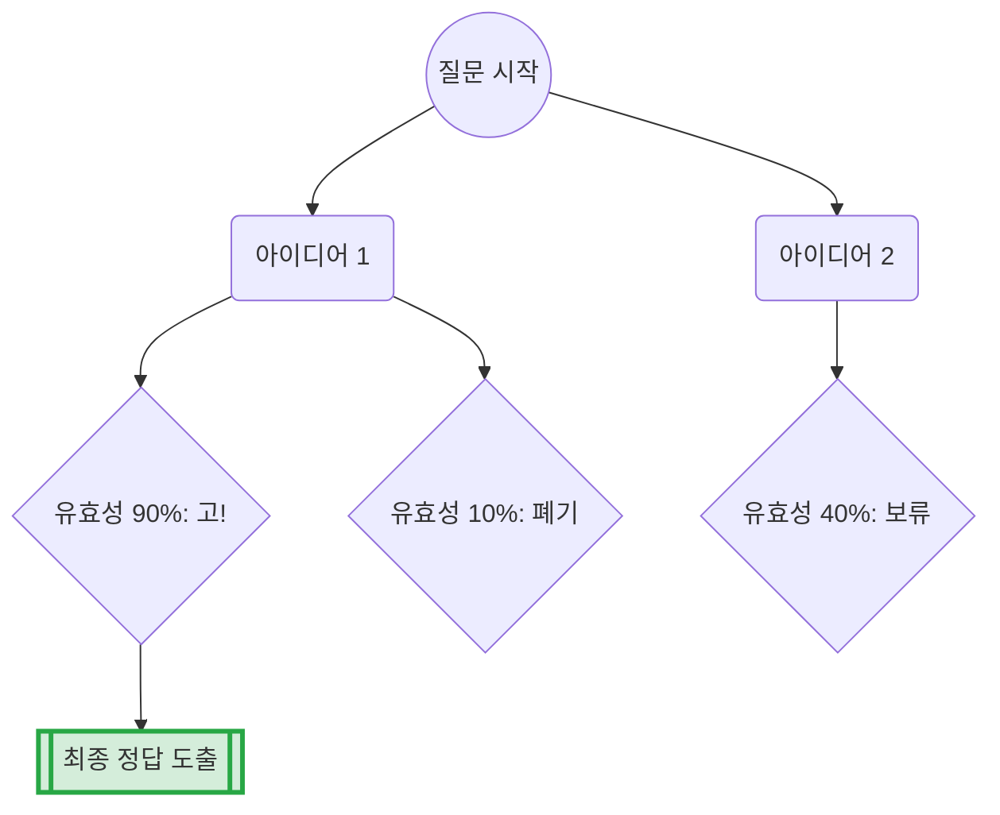
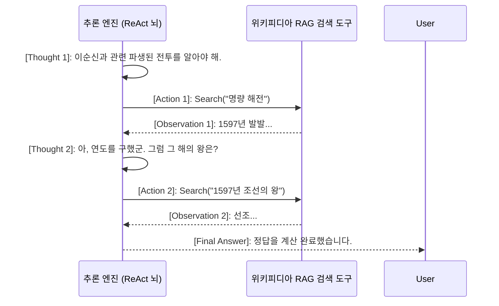

# 2주차: Prompting Strategies for Hallucination Reduction (환각 극복을 위한 프롬프팅 아키텍처 및 심화 추론 기법)

LLM의 고질적 질병인 '환각(Hallucination)'을 영원히 종식시키기 위해, 데이터베이스를 연결하는 RAG 이전 단계에서 반드시 선행되어야 할 작업이 있습니다. 바로 LLM의 뇌 구조에 올바른 사고 논리의 틀(Mental Model)을 강제로 이식하는 **프롬프트 엔지니어링(Prompt Engineering) 패러다임**입니다.

과거의 단순한 "이거 찾아줘" 식의 1차원 질의응답을 아득히 초월하여, 기계 모델이 스스로 인간처럼 가지를 치며 추론(Reasoning)하고, 자신의 오류를 스스로 검열(Reflexion)하며 다시 수정하도록 멱살을 잡고 통제하는 최첨단 프롬프팅 패러다임의 역사를 깊이 해부합니다. 

단순 가이드 문서를 넘어, 인공지능 학계의 추론율을 2배, 3배 폭등시킨 **Chain of Thought**, **Tree of Thoughts**, **Thread of Thoughts**, 그리고 **ReAct** 와 같은 거대한 메커니즘을 뼛속까지 파고듭니다.

---

## 1. 프롬프팅 추론 기법의 대폭발 (단순 지시를 넘어선 추론 연산)

### 1차원적 프롬프팅의 한계 (Zero-Shot & Few-Shot)
가장 원시적인 형태의 프롬프트는 "태양은 무엇으로 이루어져 있나?" 라고 단도직입적으로 묻는 형태(Zero-Shot)입니다. 모델은 훈련된 텍스트 중 가장 확률이 높은 단어 조합을 앵무새처럼 뱉어냅니다.
조금 더 진화한 Few-Shot 프롬프팅은 2~3개의 예시 텍스트를 주어 "이런 패턴으로 대답해"라고 예시를 모방하게 만듭니다. 하지만 복잡한 수학 연산이나 다단 논리가 필요한 추리 문제 앞에서는 결국 중간 계산을 건너뛰고 결론을 무리하게 유추하려다 거대한 환각 에러를 발생시킵니다.

### 무기에서 엔진으로: 체인, 트리, 쓰레드, 그래프의 진화
이 병목을 박살 내기 위해 딥마인드와 구글, 학계의 천재들은 모델에게 바로 "정답을 내놔"라고 강요하지 않고, "정답에 이르는 **서술형 징검다리**를 하나씩 텍스트로 적어 나가면서 답을 찾아가라"는 지시문을 삽입하기 시작했습니다. 


*Fig 3.1: [Chain of Thought Prompting] 테니스 공과 사과 계산 과정을 통해 산술 단계(Step 1, 2, 3)를 하나씩 명시하게 하여 논리 결함을 방어하는 CoT 파이프라인.*


*Fig 3.4: [Chain of Note Framework] 문서를 그냥 읽지 않고, 이 문서가 내 질문을 대답하는 데에 Relevant(관련 유)인지 Irrelevant(관련 무)인지 스스로 리뷰 노트를 작성하게 하여 무판단 거짓말 생성(환각)을 봉쇄하는 필터링 아키텍처.*

---

## 🌟 환각 억제를 위한 거대 추론 프롬프팅 논문 완전 해부

단순히 지식을 꺼내는 RAG를 넘어, 그 지식을 "어떻게 씹고 소화할 것인가?"를 통제하는 세계 최상위 SOTA(State-of-the-Art) 추론 논문들을 살펴봅니다. 각 논문이 제시하는 프롬프트 구조와 팩트 인프라에 대한 인사이트를 깊숙이 다룹니다.

### 📜 1. Chain of Thought (CoT): 모델에게 생각을 소리 내어 말하게 하라
**[논문]** *Chain-of-Thought Prompting Elicits Reasoning in Large Language Models (Wei et al., Google Brain, 2022)*
* **해설:** "Let's think step by step"이라는 단 5단어의 주문만으로 인공지능의 수학적 추론 능력을 극비 비약시킨 전설의 논문입니다. 모델은 중간 도출 과정을 텍스트로 뱉어내면서 자신의 컨텍스트에 스스로 힌트를 얻어 다음 연산을 이어나가는 자가 확장(Self-Extension)의 효과를 누립니다.
* 💡 **핵심 산업계 Insight:** 아무리 고성능의 RAG로 훌륭한 문서를 찾아주어도, 그 문서를 엮어내는 결론이 5단계를 거쳐야 한다면 CoT 없이는 LLM이 환각을 일으킵니다. RAG의 최종 프롬프트 템플릿에는 반드시 검색된 문서 기반으로 '단계별 사고'를 강제하는 헤더가 필수입니다.

### 📜 2. Self-Consistency: 다수결 민주주의 채택 
**[논문]** *Self-Consistency Improves Chain of Thought Reasoning (Wang et al., Google, 2022)*
* **해설:** CoT를 이용해 모델에게 10번을 다르게 답을 생성하게 합니다. 그리고 10개의 생성된 논리 도출 경로 중 '가장 많이 도출된 동일한 최종 결론'을 투표를 통해 최종 답으로 채택합니다. 
* 💡 **핵심 산업계 Insight:** 환각은 무작위적이고 일관성이 없는 헛소리입니다. 모델이 헛소리를 할 때마다 그 내용이 달라지므로, 동일한 결론이 5번 이상 나타났다면 그것은 팩트일 확률이 기하급수적으로 올라가는 통계적 방어망입니다. B2B 의료/금융 시스템 RAG에 극히 자주 도입됩니다.

### 📜 3. Tree of Thoughts (ToT): 바둑 기사처럼 수 싸움을 계산하는 트리 구조
**[논문]** *Tree of Thoughts: Deliberate Problem Solving with Large Language Models (Yao et al., Princeton & DeepMind, 2023)*
* **해설:** 하나의 줄기로만 생각을 진행하는 CoT의 선형성을 박살 냅니다. 해결책 A, B, C를 후보지로 산출한 뒤, 분기점(Branch)마다 각각의 미래 가능성과 오류 확률을 AI가 스스로 평가(State Evaluator)합니다. 가망이 없으면 탐색을 중지하고 뒤로 돌아가(Backtracking) 다른 길을 탐색합니다.
* 💡 **핵심 산업계 Insight:** 복잡한 기획이나 전략 보고서를 생성하는 Enterprise RAG 환경에서, 거짓 내용으로 스토리가 전개되는 것을 초반 분기에서 차단하여 연산 낭비와 환각 뇌절을 극적으로 막습니다.



### 📜 4. Graph of Thoughts (GoT): 인간 두뇌와 시냅스의 모방
**[논문]** *Graph of Thoughts: Solving Elaborate Problems with LLMs (Besta et al., 2023)*
* **해설:** 트리는 뒤로 돌아갈 수만 있지만, 복잡한 문제에서는 '아이디어 A의 절반'과 '아이디어 B의 절반'을 섞어 새로운 '아이디어 C'를 창조해야 할 때가 있습니다. 개별 생각(Thought)들을 노드(Node)로 삼고, 언제든지 노드끼리 다대다 병합 연결, 변형시킬 수 있는 궁극의 그래프 추론망입니다.
* 💡 **핵심 산업계 Insight:** RAG가 찾아온 수십 장의 각기 다른 도메인 문서 내용을 요약 융합해야 할 때, 선형적 CoT로는 앞선 문서 내용을 100% 잃어버리는 'Lost in the middle'을 겪습니다. GoT 아키텍처는 컨텍스트 파괴를 막고 입체적 인사이트 결합을 보장합니다.

### 📜 5. Thread of Thought (ThoT): 무질서한 혼돈의 덩어리 줄기 풀기
**[논문]** *Thread of Thought Unraveling Chaotic Contexts (Zheng et al., 2023)*
* **해설:** RAG가 무작위로 여러 데이터를 퍼올려 프롬프트 창에 집어넣어, 질문과 무관하거나 뒤죽박죽 섞인 막대한 노이즈 컨텍스트 덩어리를 마주했을 때 모델의 지능이 추락하는 것을 막는 기법입니다. 모델에게 문서 전체를 당장 요약하라고 지시하는 대신, **"이 복잡한 컨텍스트 덩어리를 여러 개의 가닥(Thread 세그먼트)으로 직접 조각내서 하나씩 천천히 분석해 봐"** 라고 지시하여 혼돈을 자체 통제합니다.
* 💡 **핵심 산업계 Insight:** 하이브리드 서치나 웹 크롤러 RAG 데이터들은 포맷이 엉망진창입니다. Thread of Thought 프롬프트를 덧붙이는 것만으로도 노이즈 저항성(Noise Robustness)과 정답 도출률이 폭등하며 컨텍스트 오염 체증을 극적으로 해소합니다.

### 📜 6. ReAct (Reasoning and Acting): 사고와 행동의 무한 피드백 루프
**[논문]** *ReAct: Synergizing Reasoning and Acting in Language Models (Yao et al., 2022)*
* **해설:** 기존 LLM은 생각만 하고 끝났습니다. ReAct는 생각(Thought)을 바탕으로 외부 도구를 사용하는 행동(Action)을 지시하고, 그 외부 장치의 결과(Observation)를 받아 다시 다음 생각을 이어나가는 Agentic AI의 알파이자 오메가입니다. 
* 💡 **핵심 산업계 Insight:** RAG의 아킬레스건을 치료합니다. 검색(Retrieval) 자체를 ReAct의 Action 도구로 쥐여주어, "음 1차 검색 문서가 부족하군, B 키워드로 다시 Action(Search) 해보자" 라며 AI 스스로 추가 검색 루프를 돌게 하는 모던 Auto-RAG 체계의 본진 메커니즘입니다.



### 📜 7. Step-Back Prompting: 뒤로 물러서서 우주의 큰 그림을 보라
**[논문]** *Take a Step Back: Evoking Reasoning via Abstraction (Zheng et al., Google DeepMind, 2023)*
* **해설:** "1905년에 아인슈타인이 발표한 상대성 이론 제2법칙에서 C값이 의미하는 것은?"이라는 초지엽적인 세부 디테일(Detail) 문제에 LLM이 함몰되어 허우적댈 때, "잠깐, 한 걸음 물러나서 이 질문의 거시적인 고차원 기초 원리(초급 물리학 원리)가 무엇인지부터 먼저 설명해 봐" 라며 추상화(Abstraction) 단계로 강제 퇴각시킵니다. 근본 기본기를 먼저 깔아두면 지엽적 오류를 비껴갈 확률이 치솟습니다.
* 💡 **핵심 산업계 Insight:** 프ром프트 내에 `[Step-Back 추상화 로직]`을 추가해 두면, 초보자 유저가 엉망진창으로 질문을 던져도 모델이 근원적 도메인 지식을 Base로 먼저 복기한 후 구체적 답변으로 하강하므로 환각 저지가 극강으로 이루어집니다.

---

## 💻 [Implementation Frameworks] DSPy를 활용한 프롬프트 자동 컴파일링
단순히 프롬프트를 텍스트로 치는 낡은 시대는 끝났습니다. 스탠포드의 **DSPy**는 프롬프트 자체를 파이토치 신경망 텐서처럼 선언하여 무한 튜닝합니다.
```python
import dspy

# 1. 언어 모델 설정 
turbo = dspy.OpenAI(model="gpt-3.5-turbo")
dspy.settings.configure(lm=turbo)

# 2. 추론 모듈 (Signature) 선언
class StructuredQA(dspy.Signature):
    """주어진 질문에 대해 단계별 고차원 구조를 통해 사실에 입각하여 답변합니다."""
    question = dspy.InputField(desc="유저가 입력한 노이즈가 강한 질문")
    # DSPy가 내부적으로 Thought, Action, Thread 등을 스스로 튜닝하도록 유도
    answer = dspy.OutputField(desc="치명적 정밀도의 엄격한 답변 도출")

# 3. ChainOfThought & ReAct 융합 빌드 적용
# 단순 호출이 아닌 CoT 메커니즘을 파이프라인에 주입
cot_qa = dspy.ChainOfThought(StructuredQA)

# 4. 추론 질의 실행
response = cot_qa(question="현재 글로벌 AI 트렌드에서 환각을 잡는 최고의 논리 전개는 무엇입니까?")

# 중간 추론 과정(Reasoning 스레드 체인)이 객체로 자동 저장되어 디버깅에 환상적
print("--- [AI의 은밀한 꼬리표 추론 과정] ---")
print(response.reasoning) 

print("\\n--- [최종 도출 정답] ---")
print(response.answer)
```

---

## 마무리하며

이번 2주 차에서는 단순한 멍청이 언어 모델의 직감을, 명석한 셜록 홈스급 연쇄 추리관으로 개조 탈바꿈시키는 **초격차 프롬프팅 아키텍처망 (CoT, ToT, GoT, ThoT, ReAct)** 들을 통달했습니다.
아무리 미친 스펙의 지식 DB를 갖다 붙여도 "이해하고 엮어내는" 논리 필터 보정기가 없다면 RAG는 환각의 노예일 뿐입니다. 하지만 우리는 이제 AI의 사고 회로망을 컴파일하고 통제하는 지배력을 가졌습니다.
다음 3주 차에서는, 우리가 그토록 먹여주고 싶은 엄청난 양의 장문 텍스트 데이터 서류들을 통째로 쑤셔 넣지 않고 가장 예리하고 수학적으로 잘게 도려내는 기술, **Advanced Document Chunking & Context Engineering (토막 내기 파서 분절 기술의 정점)** 파이프라인을 부숴보겠습니다! 돌격!
