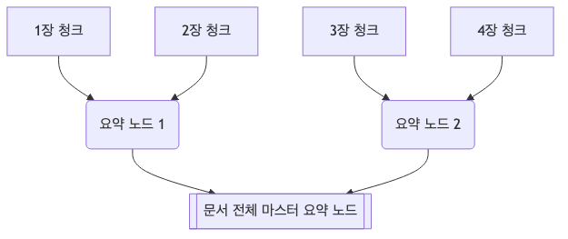
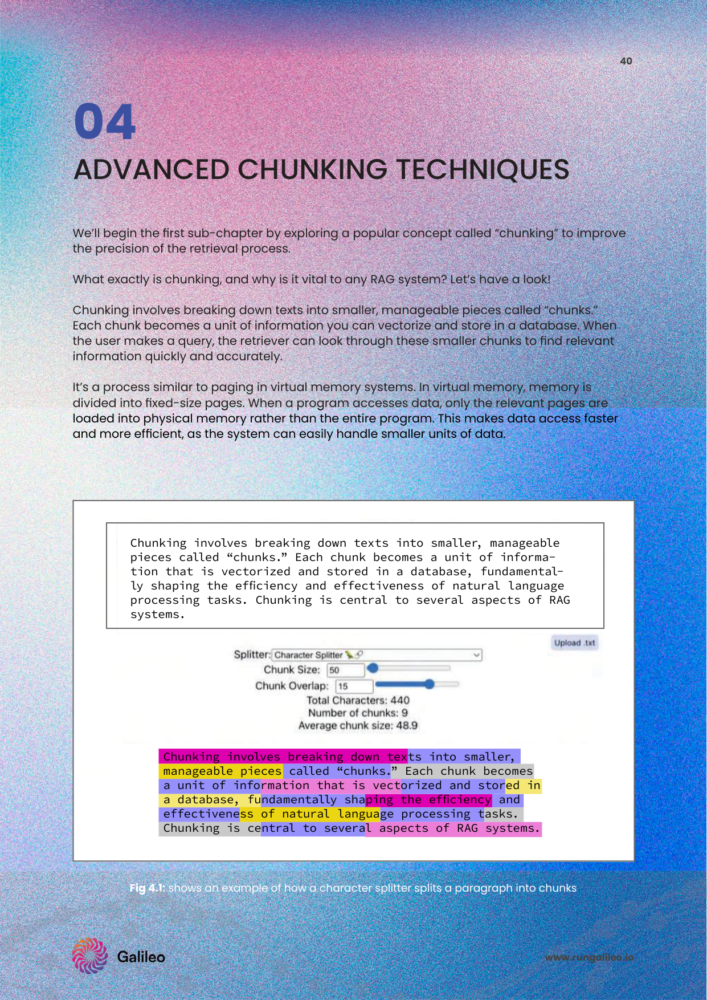

# 3주차: Advanced Document Chunking & Context Engineering (검색 성능의 기초가 되는 텍스트 분할 최적화 전략)

RAG의 '입구'단에서 문서가 기계적으로 난도질 되면 LLM은 결코 원래 문서의 숲을 이해하지 못합니다. 
검색 정밀도 품질, 벡터 스토리지 저장 비용, 쿼리 지연 시간 및 환각 발생 여부에 직접적 영향을 미치는 [cite: 316-322] 극초고도화 청킹 아키텍처 세계와 그 기반 논문론을 전면 흡수합니다.

---

## 1. 고급 청킹(Chunking)의 파괴적 진화 기법 (PDF p.46-54)

멍청하게 글자 수로 100자씩 자르는 Fixed-size 방식은 죽었습니다. 현대 지식 베이스의 지배적 전략입니다.

* **Recursive Character Splitter:** 문단을 함부로 찢지 않도록 `\n\n`(문단) -> `\n`(줄) -> `.`(마침표) 우선순위로 계층적 구분자를 통한 문맥을 보존합니다 [cite: 366].
* **Semantic Splitting:** 의미론 분할! 임베딩을 이용해 문장 간 유사도를 측정하여 텐서 각도가 급변할 때만 주제별로 잘라 절단합니다 [cite: 423-425].
* **Document Specific Splitting:** 표(Table) 구조 형식을 보존하거나 Markdown 등 비정형 데이터 파싱 구조를 인식합니다 [cite: 457, 474].

* 🔬 **[SOTA 아키텍트 패러다임]:** *RAPTOR: Recursive Abstractive Processing for Tree-Organized Retrieval (Sarthi et al., Stanford 2024)*
* **논문 인사이트:** 청킹된 문서 조각들이 계층 트리를 만듭니다. 하위 문단들 몇 개를 LLM으로 요약(Abstract)시켜 상위 가지 노드로 묶어 올리고, 최종적으론 문서 전체를 요약하는 루트(Root)를 완성합니다. "이 소설 전체 분량에 걸친 주인공의 감정선 변화는?" 같은 초거시적 질문(Global Query)에 대답할 수 없는 깡통 청킹의 맹점을 돌파합니다.

 

 

---

## 2. 혁명의 태동: LLM 기반 청킹: Propositions (원자적 분해)

텍스트를 독립적이고 원자적인 사실 단위(Atomic expressions)로 나누어 검색 정밀도 극대화 [cite: 480-481].

* 🔬 **[Paper Reference]:** *Dense X Retrieval: What Retrieval Granularity Should We Use? (Chen et al., 2023)*
* **논문 인사이트:** "지구는 둥글고 태양을 돈다"를 글자나 쉼표로 쪼개는 게 아니라, LLM 파서에게 명제(Proposition) 기반으로 산산조각 내라 시킵니다. `[지구는 둥글다]`, `[지구는 태양을 돈다]`. 이렇게 원자 단위로 쪼개진 팩트 하나하나만 임베딩하면 검색엔진이 혼동할 확률이 수학적으로 급감하고 극단적 스나이핑 명중률을 터뜨립니다.

---

## 3. 내 칼날의 성적표: 청킹 효과 측정과 지표 검열 (PDF p.57-58)

청크를 어떻게 자르냐에 따라 내일 RAG 시스템은 천재가 될 수도, 바보가 될 수도 있습니다.
* **Chunk Attribution (기여도):** 실제 응답 답변 텍스트 생성에 해당 검색 청크 내용 팩트가 기여했는가 [cite: 502].
* **Chunk Utilization (효율성):** 1024 글자짜리 청크 내 텍스트 중 실제 정답으로 발췌 사용된 비율 [cite: 510]. (나머지는 다 RAM 메모리와 토큰 요금만 잡아먹힌 노이즈 쓰레기임)

 

