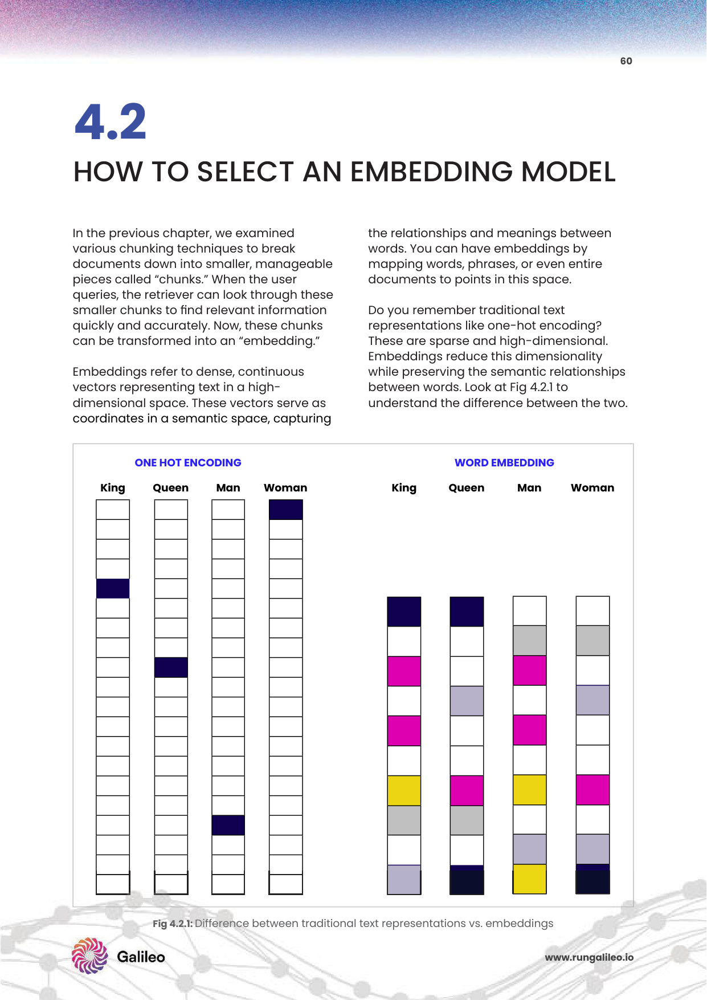

# 4주차: Embedding Models & Representation Learning (데이터를 벡터로 통역하는 딥 임베딩 진화론)

3주 차까지 우리는 거대한 문서 자원을 아주 교묘한 생체 세포 단위로 조각내고 자율 분절(Chunking)하는 외과 마취 수술기를 연마했습니다. 그러나 기계의 CPU 연산망 뇌는 여전히 "이순신", "Apple", "이차전지 배터리" 같은 한글/영문 텍스트라는 사실 자체를 본질적으로 인지할 능력이 0%입니다.
이 장벽을 허물기 위해 탄생한 궁극의 심층 신경 트랜스포머 번역기 **'임베딩 모델(Embedding Model)'** 을 해부합니다. 이 모델들은 세상의 모든 개념과 문맥 뉘앙스를, 끝없는 정수와 미세한 소수점으로 뒤덮인 고차원의 수학적 암호 텐서(Dense Vector 공간망) 속으로 투사하여 밀어 박아 넣어 영원히 봉인시켜 버립니다.

단어의 '뜻'이 물리적 '각도와 거리 좌표'가 되는 지배적인 Representation 세상의 속을 파헤쳐보겠습니다.

---

## 1. 텍스트의 해체, 벡터 임베딩의 개념 (PDF p.60-61)


*Fig 4.2: [텍스트 대량 임베딩의 직관적 시상 공간 투사화 모델 (PDF p.60)] 무수한 단어 문장 조각들이 각기 다른 밀집(Dense) 배열 공간의 점(Dot)으로 변환되어 군집을 이루는 원리.*

* **핵심 본질:** 텍스트 문서들 간의 내재된 함의, 관계, 뉘앙스를 **고차원 시맨틱 공간(High-Dimensional Semantic Space)** 에 캡처하여 밀집된 숫자 계열인 **밀집 벡터(Dense vectors)** 로 치환해내는 딥러닝 인코더 엔진 작동과 궤적입니다.
* 이를 통해 컴퓨터는 "사과"와 "사과폰"의 스펠링이 똑같더라도, 한 놈은 농수산물 벡터 군집합 각도로 던지고 하나는 삼성전자와 같은 IT 섹터 군집합 허공 우주 각도로 분리 사출해 배치는 능력을 얻습니다.

---

## 2. 임베딩 모델의 아키텍처 유형과 진화 (PDF p.65-68)

### ① Sparse vs Dense (키워드 깡통 vs 뜻 단위 밀집)
과거 BM25로 대표되는 Sparse(희소) 메커니즘은 단순히 단어 사전을 5만 개 만들어 놓고 출현한 단어 칸에만 1을 찍는 0투성이의 바코드였습니다(키워드 기반).
현재의 신계 Dense(밀집) 모델들은 어휘 상관없이 수백 차원의 모든 칸을 빼곡히 실수 소수점으로 꽉 채우며(예: `[0.134, -0.988, 0.551 ...]`) 의미 중심 매칭망을 구사합니다.

### ② Multi-Vector 구조 (ColBERT 후기 상호작용)
기본 밀집 벡터는 거대한 문서 덩어리 전체를 압축기에 밀어 넣어 억지로 단 1개의 '점 하나' 싱글 벡터 배열로 만듭니다(정보 유실 참사 발생). 하지만 ColBERT 등은 텍스트 속 각 단어 낱개마다 벡터 나침반 짐벌을 모조리 하나하나 몽땅 박아 묶음 다발 스웜(Swarm) 모델을 생성, 질문과 답변 후보끼리 나중에(Late Interaction) 촘촘히 엮여 연산되게 끔찍한 타격 정확도를 거머쥡니다.

### ③ Matryoshka Representation Learning (MRL 가변 차원)
러시아 인형 '마트료시카' 처럼 1536차원의 벡터 배열 중, 앞부분 256개 선두 차원만 가위로 잘라서 무식하게 짧게 돌려 써도 기적처럼 큰 정확도 손실이 발생하지 않는 초효율 프레임워크 폼팩터 기술.

---

## 3. 리더보드에서의 생존: 모델 선택과 평가 기준 

세상에 차고 넘치는 오픈소스/유료 임베딩 리더보드 모델들 중 기업 인프라에 무엇을 꽂을 것인가? (PDF p.62-64)
* **주요 선택 4대 팩터:** 
  1. 벡터 출력 차원수(Dimension 768 vs 1536. 클수록 메모리를 악랄하게 잡아먹으나 정교함), 
  2. 허깅페이스 **MTEB(Massive Text Embedding Benchmark)** 순위 점수 지표,
  3. 자사 문서가 아랍어/한국계를 지원요망하는 언어 종속성(Language Support), 
  4. 인프라 운영 한계 비용 런타임(Cost).

### 🎯 NVIDIA 10-K 사업보고서 성능 평가 워크플로우 실습 (PDF p.69-77)
어떤 임베딩 모델이 진짜 승자인지 판가름하기 위해 NVIDIA 사의 재무보고서(10-K) 분기 데이터를 넣고 워크플로우 테스트를 던집니다.
LLM-as-a-Judge 로 모의 채점을 돌렸을 때, 답변을 채워낼 원시 데이터 문서 펌핑 점수 속도, 그리고 실제 LLM 도출 답안이 원시 문서 내용에 오차 없이 일치했는가(Adherence) 어트리뷰션 기여 지표를 스캐닝 비교해 베스트 모델(예: BAAI/BGE 혹은 OpenAI-3-large)을 사출해 내는 과정입니다.

---

## 💻 [Implementation Frameworks] Sentence-Transformers 기반 MTEB 리더 임베딩
API 비용 송금 낭비 없이, MTEB 상위 랭커 최상단에 군림하는 BAAI 고도 한국어/다국어 모델을 폐쇄 로컬 사내망 서버에서 다운받아 스웜 압박 인코딩 텐서로 출력하는 코드 (PDF 워크플로우 분석 실습 75p 연계).

```python
from sentence_transformers import SentenceTransformer
import torch
from sentence_transformers.util import cos_sim

# 1. BAAI BGE-M3 (Multilingual, Multi-granularity, Multi-Vector) 끝판왕 모델 적재 로드
# 메모리가 부족하다면 bge-m3 대신 bge-small-korean 사용 가능
device = "cuda" if torch.cuda.is_available() else "cpu"
model = SentenceTransformer("BAAI/bge-m3", device=device)

# 2. 기업 재무제표 10-K 시퀀스 텍스트 데이터 덩어리 
doc_sentences = [
    "엔비디아의 데이터센터 분기 매출이 작년 대비 급증하며 호실적 달성 발판.", 
    "아마존 웹 서비스는 클라우드 컴퓨팅 최강자로 점유율 포탈을 장악 중."
]
query_sentence = "최근 NVIDIA의 실적 상승을 견인한 핵심 핵심 인프라 파트는?"

# 3. 고차원 1024차원 밀집(Dense) 연속 벡터 배열로 인코딩 압착 변환
# normalize_embeddings=True를 통해 무중력 우주각 Cosine 스케일 표준 튜닝
doc_embeddings = model.encode(doc_sentences, normalize_embeddings=True)
query_embedding = model.encode([query_sentence], normalize_embeddings=True)

# 4. 코사인 유사도 유클리디안 각도 어텐션을 타격 계산하여 매칭 거미줄 스코어 반환
sim_scores = cos_sim(query_embedding, doc_embeddings)[0]

print(f"압축된 텐서 차원 배열수: {doc_embeddings.shape}") # (2, 1024)
for doc, score in zip(doc_sentences, sim_scores):
    print(f"문서매칭 팩트 유사도 점수: {score.item():.4f} | 타겟 텍스트: {doc}")
```

## 마무리하며 벡터망 은하계 투사 완료
이번 4주 차 과정에서는 스펠링이라는 바보 같은 평면 표면을 가차 없이 도려내 파쇄하고, 텍스트 글 단어들 속 고유의 문맥, 지성, 뉘앙스의 철학적 무게를 전우주의 다차원 우주 좌표 텐서망(Dense Vector)으로 이식해버리는 인공지능 번역 뇌 모형, **임베딩 딥 공간 압박망 (Sparse vs Dense, MRL 가변축 인형, NVIDIA 실습 비교 워크플로우)** 의 실체를 부수었습니다! 
이제 우주 은하계 허공 속에 수백억 개의 점을 띄워 날려 보냈으니, 다음 5주 차 **"Vector Databases & Retrieval Architecture Design"** 에서는 이 광활 무중력 배열 속에서 도대체 어떤 빌딩 클러스터 인덱스 타워 검색 엔진 스캐너(HNSW, Pinecone)를 런칭해야 1초 만에 억만 개의 별빛 중에서 5개의 정답 별만 레이더망으로 정조준 채취할 수 있을지 엄청난 스피드 사냥 무결 인프라를 전 방위로 박살 내보겠습니다! 무적 진격!
