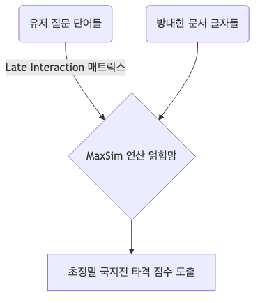
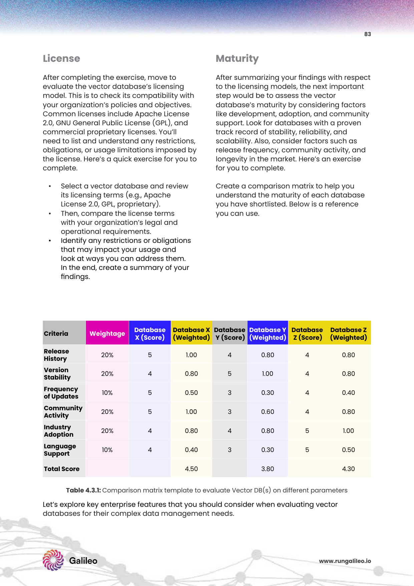
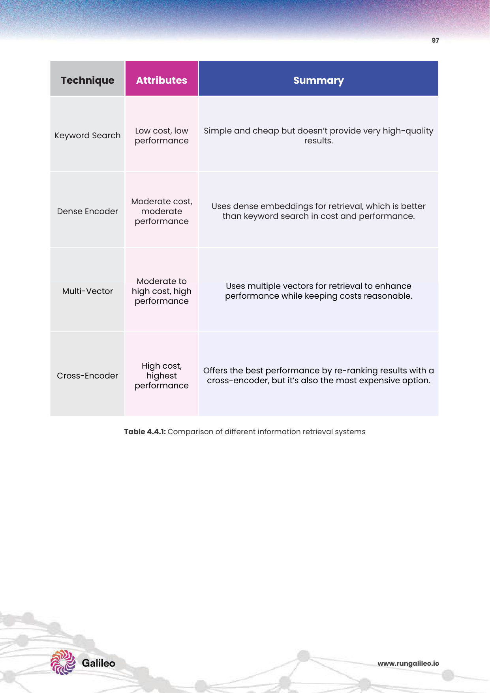

# 4주차: Embedding Models & Representation Learning (데이터를 벡터로 변환하는 임베딩 모델의 선택과 평가)

임베딩(Embedding)은 고차원 시맨틱 공간에서 텍스트 간의 관계(뉘앙스와 의미)를 캡처하는 밀집 벡터(Dense vectors) 변환 연산입니다 [cite: 530]. 
기계는 언어를 모릅니다. 이번 4주 차에서는 문자열 찌꺼기를 광활한 우주 허공 공간의 X-Y-Z 행렬 자성 텐서(숫자 나침반)로 치환 변형해버리는 마법의 통역 신경망, **임베딩 파이프라인의 진수와 SOTA 논문 지식망**으로 잠수 격파합니다!

---

## 1. 혁신 모델 유형: 모델 선택의 나침반 기준 (PDF p.62-68)

실무에서 어떤 모델을 고를지에 대한 기준은 벡터 차원 크기, MTEB(Massive Text Embedding Benchmark) 순위 점수표, 다국어 처리 여부(언어 지원) 및 하드웨어 유지 결제 비용 분석에 따라 무자비하게 결정됩니다 [cite: 548-561].

* **Sparse vs Dense 군집:** 구시대 유물 키워드 발췌 스펠링 매칭 빈도 깡통 배열(Sparse)과 심층적 의미 중심 코사인 매칭을 유도하는 밀집 배열 텐서장(Dense)의 진영 대결 및 혼합 구조 [cite: 568, 571].

* 🔬 **[SOTA 아키텍트 패러다임 1]:** *ColBERT: Contextualized Late Interaction over BERT (Khattab et al., Stanford 2020)*
* **Multi-Vector (ColBERT):** 기존엔 거대한 문서 전체를 무식하게 단 "1개"의 점 벡터 숫자로 쥐어짜 압축(정보 손실 폭발)했습니다. 하지만 ColBERT는 각 단어(Token) 낱개마다 독립 벡터 스웜 무리를 만들고, 추후 유저의 검색 쿼리 질문망 단어들과 각개전투로 후기 상호작용(Late Interaction) 맵핑 어텐션을 지독하게 얽어내 정밀 팩트 수색 타격력을 역대급으로 끌어올립니다 [cite: 575].

 

 

* 🔬 **[SOTA 아키텍트 패러다임 2]:** *Matryoshka Representation Learning (Kusupati et al., 2022)*
* **Matryoshka Representation Learning (MRL):** 러시아 인형 마트료시카처럼 까도 까도 알이 나오는 방식. OpenAI의 최신 임베딩 3세대 모델에 채택된 기법으로, 1536 고차원으로 생성된 벡터 행렬 배열에서 앞에서부터 256개 차원만 가위로 잘라서 무식하게 짧게 돌려 써도 기적처럼 팩트 보존 정확도 손실률이 극소화되는 가변 차원 임베딩 효율의 제왕입니다 [cite: 582].

---

## 2. 실전 평가 워크플로우 맵핑 구축 (PDF p.69-77)

내 엔터프라이즈 환경에 BAAI-M3가 나은가, OpenAI가 나은가? 단순히 리더보드 점수만 믿으면 큰코다칩니다. 특정 도메인에서는 무참히 무너질 수 있습니다.

* **NVIDIA 10-K 사례 연구 (워크플로우 평가 실습):** 기업 10-K 재무 제표 데이터를 문서로 넣고 모의 LLM 판사관을 돌립니다.
  * 검색된 사실 문서를 바탕으로 프롬프트에 제공되었는가 (Attribution 기여도).
  * 실제 응답된 답이 제공된 문서 내용의 팩트를 100% 밀착 추종하여 환각 없이 일치 답안을 냈는가 (Adherence 철통 엄수율 비교). 이 교차 검증의 팩터 산식 실습으로 최상위 모델을 사출 결정합니다 [cite: 618, 726-727].

 

