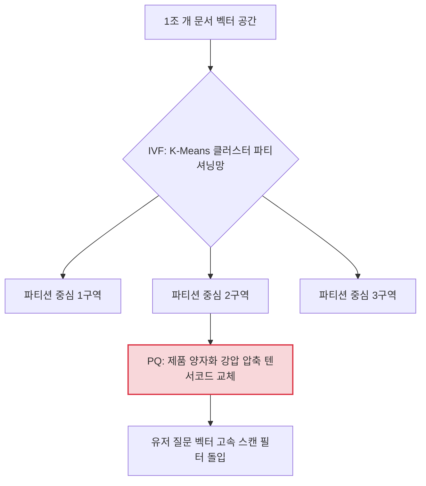

# 5주차: Vector Databases & Retrieval Architecture (천문학적 빌리언 스케일 세계의 무중력 벡터 데이터베이스 인프라 사수)

이전 4주차에서 수억 개의 텐서 숫자로 치환 변형해낸 벡터 노드 방울들! 자, 이제 만약 회사 데이터베이스 공간에 "삼성전자 10년짜리 PDF" 임베딩 점 좌표 1조 개가 둥둥 우주 허공 클라우드 램(RAM) 위에 떠다닌다고 상상해 봅시다. 
유저가 질문 하나를 던지면 이 질문 또한 1개의 벡터 좌표 점으로 우주 허공에 착탄 스폰됩니다. 여기서 컴퓨터가 1조 개의 기존 좌표 점들과 일일이 하나하나 피타고라스 거리(유클리드 거리 산식/코사인 유사도)를 스캔 측정하며 가장 가까운 점 5개를 찾는다면 (Brute Force KNN 탐색), 서버는 단 한 번의 질문만에 메모리가 폭발하며 블랙아웃될 것입니다. 

이 무식한 하드웨어의 재앙을 뚫고, 오차 범위 허용 1% 미만으로 0.05초 만에 신의 손가락으로 콕 점찍어 끄집어내는 전설의 C++, C 기반 고수위 **인덱싱 엔진(ANN 검색 튜닝 생태계)과 뼈대 벡터 데이터베이스 아키텍처망**을 완전 박살 내보겠습니다.

---

## 1. ANN (Approximate Nearest Neighbors) 생태계: 타협과 폭주의 융합

"절대적으로 1등으로 가장 가까운 한 점(정확도 100%)을 찾는 걸 과감히 포기하자. 대신 95% 확률로 제일 비슷할 것 같은 무리들을 0.001초 만에 싹쓸이 선포획하자!"
이것이 ANN(근사 최근접 이웃) 검색의 오만하고도 위대한 철학입니다. 정밀도를 단 5% 양보하는 대가로 연산 스피드를 무려 2만 배 폭등시킵니다. 


*Fig 4.3: [Vector DB Comparison] Pinecone, Milvus, Weaviate, Qdrant 등 글로벌 메이저 벡터 DB들의 HNSW, IVF(PQ) 지원 성능표를 적나라하게 비교한 백서 차트.*

---

## 🌟 전설적 검색 엔진 인덱싱 아키텍처 4대장 & 인프라 융합

벡터 데이터베이스 벤더사(Pinecone, Milvus 등)들이 속에서 어떤 톱니바퀴 엔진 수식 로직을 굴려 저 압도적 쾌속 조회를 뽑아내는지, 그 엔진 룸(Engine Room) 가장 깊은 밑바닥 논문을 해부합니다. 

### 📜 1. HNSW (Hierarchical Navigable Small World): 우주를 잇는 고속도로망
**[논문]** *Efficient and robust approximate nearest neighbor search using Hierarchical Navigable Small World graphs (Malkov et al., 2018)*
* **해설:** 현대 99%의 벡터 데이터베이스(Qdrant, Pinecone, Chroma)가 심장부 디폴트로 채택 탑재한 압도적 원탑 킹 메커니즘 엔진 논문입니다. 점들을 그냥 모아두지 않고, 확률적으로 거대 최상단 빌딩 그래프(고속도로 계층)와 밑바닥 촘촘한 뒷골목 그래프로 계층 피라미드를 쌓아 연결지도를 얽습니다. 찾고자 하는 점이 착탄되면 상공 고속도로를 타고 단 3정거장 만에 주변 지역으로 폭격 다이빙한 후 세밀한 뒷골목망을 서치합니다. 
* 💡 **핵심 산업계 Insight:** 검색 속도가 데이터 개수 $O(log N)$ 스케일로 압도적으로 놀라워서 1억 개든 10억 개 점이든 속도가 거의 일정하게 꽂힙니다. 다만 그 거미줄 맵을 구축하고 유지할 램(RAM) 메모리를 더럽고 끔찍하게 잡아먹는다는 단점이 존재합니다.

### 📜 2. IVF-PQ (Inverted File Index with Product Quantization): 양자의 압축과 군집화 도려내기
**[논문]** *Product Quantization for Nearest Neighbor Search (Jegou et al., 파리 연구소, 2011)*
* **해설:** 페이스북이 만든 전설적 FAISS의 기반 심장 인프라. "점들이 모여있는 군락(Cluster) 지형 공간을 수천 개로 구획 도려내서 센터 중심점만 대표로 세워두라(IVF)." 거기다 "1536차원 텐서를 8토막 내버린 다음, 자주 묶이는 숫자 패턴을 하나의 바코드 도장(Center code)으로 퉁쳐서 저장해라(PQ)." 메모리 용량을 1/64 수준으로 무참히 쥐어짜면서도 정확도를 무시무시하게 지키는 메모리 절약의 가성비 미친 끝판왕 시스템 엔진.
* 💡 **핵심 산업계 Insight:** HNSW가 "무제한 RAM을 줄 테니 엄청난 속도를 내봐라"라면, IVF-PQ는 "RAM 호스팅 비용 결제하다가 우리 회사가 파산 나겠다 이놈들아, 제발 서버 1대로 10억 개 쑤셔 넣어봐라" 할 때 기적의 1순위 돌진 채택 솔루션.



### 📜 3. SCANN (Scalable Nearest Neighbors): 내적 보정 양자화의 최고봉
**[논문]** *Accelerating Large-Scale Inference with Anisotropic Vector Quantization (Guo et al., 구글 리서치 2020)*
* **해설:** 구글의 천재들이 만든 압축 벡터 서치망. PQ(제품 양자화)로 무자비 압축할 때 각도(방향성)가 삐뚤어지는 치명적 왜곡이 생기는 것을 비등방성 보정 계수(Anisotropic Vector Quantization)란 괴랄한 수학 로직으로 보우팅 커버해, 같은 압축 비율 환경에서 타의 추종을 불허하는 무식한 검색 타격 적중률을 도출하는 정점 로직.
* 💡 **핵심 산업계 Insight:** Tensorflow나 Google Cloud Vertex AI 백엔드의 심해 바닥을 떠받치며 미친 괴물같이 동작하는 아키텍트입니다. 하드코딩 엔지니어 사이에서 극한의 C++ 커스텀 구축 파이프라인에서 거론.

---

## 2. 팩트 검열: Relevancy & Preciseness 검증 체계 도입

아무리 데이터베이스가 1초 만에 백과사전을 뽑아 온들, 유저 질문과 팩트가 뒤틀려 있으면 결국 오답입니다.


*Fig 5.2: [Test for Retrieval Quality] 광합성(Photosynthesis) 질의를 검색했을 때, 해당 문서들이 일방적으로 알파벳 스펠링만 겹치는 것이 아니라 실제 Relevancy(문맥 주제상 유사성), Preciseness(정밀도)를 모두 충족하는지 자동 평가하는 QA 품질 검증 시스템 로직.*

---

## 💻 [Implementation Frameworks] Pinecone Serverless 클라우드 구축 및 스웜 주입
서버 관리 없이 인프라를 무한 대역폭 확장할 수 있는 SaaS 기반의 글로벌 점유율 1위 **Pinecone** 백엔드 구축 구조 샘플입니다. 1차원 배열을 초병렬 군집 인덱스로 승화합니다.

```python
import os
from pinecone.grpc import PineconeGRPC as Pinecone # 고속 GRPC 프로토콜
from pinecone import ServerlessSpec

# 1. Pinecone Client 시스템 환경 초기화 런칭
pc = Pinecone(api_key=os.getenv("PINECONE_MAIN_KEY"))

# 2. 1536 차원의 Vector DB Index 클러스터 (우주 방) 생성
index_name = "rag-master-enterprise-index"
if index_name not in pc.list_indexes().names():
    pc.create_index(
        name=index_name,
        dimension=1536, # OpenAI 임베딩 차수 체계
        metric="cosine", # 유사도 함수: 유클리드 대신 각도 중심 코사인 타격
        spec=ServerlessSpec(
            cloud="aws",
            region="us-east-1"
        )
    )

# 3. 인덱스 타겟팅 및 구조 벡터 텐서 주입 (Upsert)
index = pc.Index(index_name)

# *예시 구조: ['id-1', [1536 고차원 행렬 리스트], {"메타데이터_속성": "날짜/저자 정보"}]
# index.upsert(
#     vectors=[
#         {"id": "doc-a1", "values": embedding_vector_array, "metadata": {"category": "finance"}}
#     ]
# )
print(f"{index_name} 인프라 엔진 정상 런칭 가동! 헬스 대기 완료.")
```

---

## 마무리하며 클러스터 파괴

이번 5주 차는 오롯이 HNSW와 PQ 등 초월적 수학 연산으로 10억 개의 문서 덩어리들을 0.1초의 허공 레이더 서치망으로 장악 압축해 좁히는 **Vector Database 아키텍처 세계망**을 발칵 뒤집어 보았습니다. 
하지만! 아무리 우수한 밀집 코사인 수색도, 고유 명사 (예: iPhone 15 Pro Max S2) 모델 번호표와 같은 특정 희귀 스펠링 서치에서는 "과일 사과폰" 문맥 문서와 혼동 맵핑당해 오히려 구식 키워드 엔진보다 멍청해지는 한계 약점이 존재합니다.
이 치명적 절망을 구원 복구시키기 위해 구 스펠링 엔진과 신 텐서 엔진을 융합 교배 진화시키고, 그 뽑혀온 후보 100명을 가장 무자비한 AI 호랑이 면접관 방에 던져 일렬 1위부터 순위를 박살 내 갈아치우는 6주 차 대서사시의 하이라이트! **Reranking Models and Hybrid Retrieval Techniques (투트랙 융합 서치와 교차 압박 순위 재조정 면접 시스템)** 광역 궤도로 풀 슬로틀 폭격 진입하겠습니다!!!
