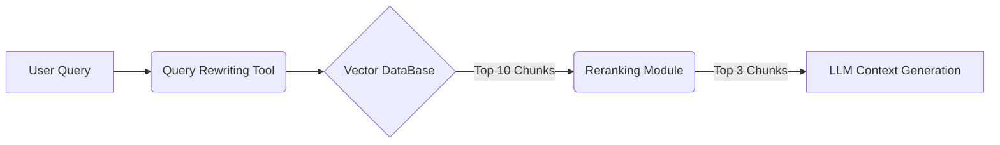

# 5주차: Vector Databases & Retrieval Architecture Design (벡터 데이터베이스와 검색 아키텍처 설계)

4주차에서는 텍스트를 수백~수천 차원의 숫자 배열인 임베딩(Embedding)으로 변환하는 방법을 배웠습니다. 그렇다면 수백만 개의 거대한 텍스트 문서 벡터들을 저장하고, 사용자가 질문할 때 눈 깜짝할 사이에 코사인 유사도를 계산해서 끄집어내는 일은 어떻게 가능할까요? 

5주차에서는 고도화된 RAG 시스템의 척추 역할을 하는 **벡터 데이터베이스(Vector Database, Vector DB)** 와 **검색 아키텍처 구조** 에 대해 다룹니다.

---

## 1. 벡터 데이터베이스(Vector DB)란?

벡터 데이터베이스는 전통적인 (과거의) 관계형 데이터베이스(MySQL, Oracle 등)와는 데이터 저장 목적 자체가 다릅니다. 일반 데이터베이스는 행(Row)과 열(Column)에 맞춰 문자나 숫자를 정확하게 찾아내는 데 특화되어 있다면, **벡터 DB는 공간상의 위치 점을 저장하고, '나와 가장 가까운 이웃 점'이 무엇인지 의미상 가장 비슷한 것들을 초고속으로 찾는 데 최적화된 비정형 데이터베이스 구조** 입니다.

> 🗄️ **이해를 돕는 예시: 도서관 책 찾기**
> 전통적인 DB 검색은 "출판 연도가 2023년이고, 제목에 '우주'가 들어가는 책을 가져와(Exact Match)" 방식입니다.
> 반면 벡터 DB 검색은 "제목이나 내용 상관없이 예전에 읽었던 '별을 여행하는 소설'이랑 전체적인 분위기가 제일 비슷한 책 3권 가져와 줘" 라고 요청하는 도서 검색원과 같습니다. 

---

## 2. 근사 최근접 이웃 탐색 (ANN, Approximate Nearest Neighbor)

거대한 데이터베이스에서 사용자 질문(벡터)과 완벽히 정확한 거리를 계산하기 위해 모든 문서를 순차적으로 대조하는 방식은 너무 느립니다(k-NN 방식). 
그래서 현대 벡터 DB는 속도를 비약적으로 높이기 위해 약간의 정확도를 희생하고서라도 최단 시간에 이웃을 찾아내는 구조를 채택하는데, 그 핵심 알고리즘 기술 집합을 **ANN (Approximate Nearest Neighbor)** 이라고 부릅니다. 

ANN을 구현하는 데에 쓰이는 대표적인 아키텍처 두 가지를 소개합니다.

### 2.1 HNSW (Hierarchical Navigable Small World) 인덱스 알고리즘
데이터끼리의 연결망을 다층(Hierarchical) 그래프 구조로 만들어 길을 쉽게 찾도록 도와줍니다. 
위층에서는 가장 특징적이고 큰 데이터 포인트만 남겨두고 대략적인 숲의 방향을 잡은 뒤, 아래층으로 내려올수록 미세하고 구체적인 나무들 사이에서 정답을 찾아냅니다.

> 🗺️ **이해를 돕는 예시: 고속도로망 찾기**
> 부산에서 서울의 특정 골목을 찾아갈 때, 마을의 모든 소형 도로를 검사하지 않습니다. 먼저 가장 큰 단위의 '고속도로(상위 계층)'를 타고 근처 톨게이트로 빠진 후 '국도'로 내려오고, 최종적으로 '골목길(하위 계층)'로 내려가는 방식과 동일합니다. 넓은 탐색망을 좁혀 들어가는 구조로 최상의 속도를 냅니다.

### 2.2 메타데이터 필터링 (Metadata Filtering) 활용
ANN은 속도가 빠르지만 "의미의 유사도"만 맹목적으로 따릅니다. 사용자가 만약 "최근 1년 내에 발간된" 이라는 특정 기준을 제시했다면 의미를 떠나 연도는 정확히 만족해야 합니다. 이를 위해 최신 아키텍처들은 **Vector Search + Metadata Filtering** 을 조합해서 디자인을 구성합니다.

> 🏷️ **이해를 돕는 예시: 옷 가게 점원**
> "격식 있는 정장 느낌의 겉옷 추천해줘(유사도 벡터 조건)" 라는 옷 요청에, "그런데 색상은 무조건 검은색이어야 해(메타데이터 필터 조건)" 를 추가로 붙이는 것과 같습니다. 점원(DB)은 아예 검은색이 아닌 옷을 후보록에서 완전히 삭제한 채(Pre-filtering) 그중 정장 느낌이 강한 옷만 스캔합니다.

---

## 3. 이상적인 Retrieval 구조 디자인 (Architecture Design)

RAG 아키텍처를 설계할 때, 단순히 질문 -> 벡터 DB -> LLM 으로 이어지는 파이프라인에서 벗어나 효율을 높이기 위한 추가 장치들을 둡니다.

위 다이어그램처럼 이상적이고 최적화된 아키텍처 구조에서는 **질문 재작성(Query Rewriting)** 과 **리랭킹(Reranking)** 모듈을 두어 검색 정확도를 극한으로 끌어올립니다.
(리랭킹 등 더 상세한 기법은 다음 주차에서 배웁니다.)

1. 사용자의 불완전한 질문을 받았고 ("그거 지난달 건데 어떻게 수정해?"), 
2. 즉시 검색하는 게 아니라 질문 재생성기가 문맥을 파악해 정제합니다 ("지난달 상품 DB 수정 절차").
3. 벡터 DB는 ANN 알고리즘을 이용해 고속으로 10개의 핵심 문서를 찾아 LLM에게 안전하게 넘겨 줍니다.

## 마무리하며
이번 주차에서는 방대한 문자열(텍스트) 정보를 신속하게 찾아내는 벡터 데이터베이스 체계의 구성을 깊게 파고들었습니다. 그러나 벡터 DB의 유일한 단점은 "키워드가 정확히 일치해도, 의미적 각도(유사성)가 조금 다르면 핵심 문서를 놓치는" 현상입니다. 

다음 6주차에서는 이러한 문제를 극복하기 위해 키워드 검색과 벡터 검색을 동시에 사용하는 **하이브리드 검색 (Hybrid Retrieval)** 과 순위를 재조정하는 **리랭킹 모델 (Reranking Models)** 에 대해 자세히 다루겠습니다.
