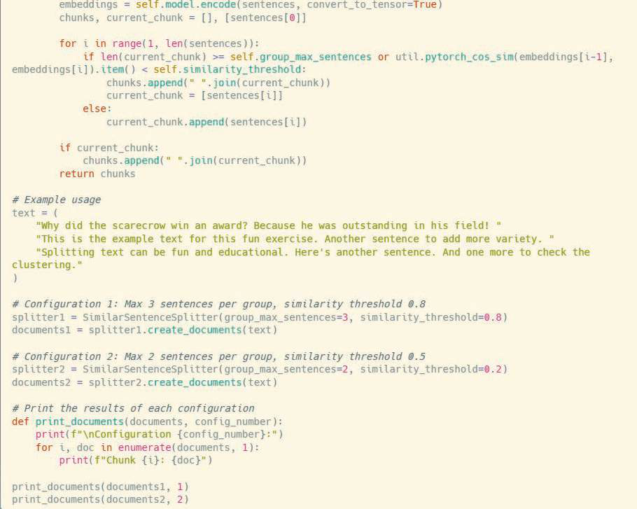

# 6주차: Reranking Models and Hybrid Retrieval Techniques (리랭킹 모델과 하이브리드 검색 기법)

수억 개의 데이터를 처리하는 벡터 데이터베이스 지식으로 무장한 뒤 돌려본 RAG 시스템. 하지만 실제로 사용해 보면 첫 응답 질에 당혹스러움을 가끔 마주칩니다. "음... 얼추 관련된 문서를 가져오긴 했는데, 진짜 결정적으로 내가 듣고자 했던 정답 문서를 맨 앞쪽(Top-1)에 뽑아오진 못하네?" 라는 아쉬움입니다. 

결국 정답 문서가 Top-10 중 9번째로 밀려버리면 LLM은 1번 문서들에 현혹된 채로 답변을 지어내거나 내용 다이제스트에 실패할 수밖에 없습니다. 오늘은 이를 극복하기 위한 혁신적인 필승법인 **하이브리드 문서 검색 (Hybrid Retrieval)** 방식과 **리랭킹 (Reranking, 재정렬)** 기술 기법을 정복합니다.

---

## 1. 두 가지 방식의 단점을 상쇄하라: 하이브리드 검색 (Hybrid Retrieval)

전통적인 검색 기술과 최신 딥러닝 검색 기술은 서로 정반대의 성향과 약점을 극단적으로 보이고 있습니다. 

* **키워드 일치 검색 (Lexical Search / BM25 알고리즘):** 
  과거 구글이나 네이버가 쓰던 전통 방식으로 문장 안에 내가 쓴 단어 스펠링이 정확하고 정밀하게 빈도 높게 들어갔는지를 엄격하게 평가합니다. 
  "Apple iPhone"을 치면 진짜로 Apple이라는 철자가 들어간 글만 띄웁니다. 하지만 단점은 "사과 로고 스마트폰" 이라고 돌려 말하면 절대 관련 글을 찾지 못한다는 것입니다.
* **벡터 임베딩 서치 (Vector/Dense Search):** 
  "지구온난화 대책"이라고 치면 "탄소 배출 정책 규제" 라는 문구를 가져올 정도로 문맥 추론에 매우 매우 깊숙히 관여하고 뛰어납니다. 
  하지만 치명적인 단점으로, 고유 명사 식별이나 전문 코드를 파악하는 능력에는 허술합니다. 예컨대 에러 코드 "ERR-X901"의 해결책을 알려줘! 라고 물으면, 온갖 알 수 없는 에러 관련 문서를 다 소환하지만 정작 X901과 연관된 패치 노트 문서를 소홀히 합니다.

**하이브리드 검색 (Hybrid Retrieval) 의 탄생:** 
RAG 시스템 전문가들은 이 둘 중 하나만 선택하는 오만을 버리고 결국 시스템을 결합했습니다. 질문이 들어오면 키워드 일치성 검색 점수와 벡터 의미 서치 점수를 각각 돌리고, 두 점수의 중간 비율(상대적 중요도 조절 파라미터 Alpha)을 혼합 계산 후 합산(Reciprocal Rank Fusion; RRF 같은 혼합 산식)하여 진정한 하이브리드 랭킹 스코어를 뽑아 모든 치명적 단점을 커버해냅니다.

> 🤝 **이해를 돕는 예시: 형사 탐문 수사의 2인 1조 콤비 방식**
> 한 사건 현장에 극도로 꼼꼼하고 논리적인 회계사 출신 수사관(키워드 검색, BM25)과 촉과 심리학에 의존해 범죄 맥락의 기류를 분석하는 심리 프로파일러 수사관(벡터/시맨틱 검색)을 동시에 현장에 투입합니다. 두 사람은 관점이 다 다르지만 각자가 분석해서 내린 1등 용의자 리스트를 회의실 테이블에 올립니다. 두 명당 모두에게 높은 순위를 받은 용의자가 비로소 종합 1순위 타겟으로 재조립되는 완벽한 콤비 수사를 의미합니다.

*(PDF 자료 참고: 하이브리드 검색 및 리랭크 구조가 반영된 파이프라인)*

---

## 2. 모래 속에 숨겨진 바늘 끌어올리기, 리랭커 (Reranker) 모델

하이브리드 검색이 투망으로 온갖 고기를 잔뜩 잡아왔습니다 (Top-20 문서). 여기에는 상어, 정어리, 참치가 섞여 있습니다. 문제는 LLM은 너무 많은 먹이(Context Limit)를 던져주면 질식하기 때문에(Lost in the Middle), 오직 가장 연관성 있는 최정예 진짜 답변 5개만을 골라내(Filter & Re-sort) 순서를 다시금 세워야 합니다. 이 까다로운 중간 면접관 역할을 하는 것이 별도의 특화된 AI 모델인 **리랭커 (Reranker Model)** 입니다.

### 리랭커의 작동 구조 (Cross-Encoder 아키텍처)
임베딩 모델이 사전에 문서를 다 외워서 벡터 창고에 넣었던 것과 달리, **Cross-Encoder를 차용한 리랭커 모델은 사전에 저장하거나 미리 공부하지 않습니다.**

실시간으로 "사용자의 현재 질문 문장(Query)"과 "1차 검색 엔진이 물어다 준 후보 문서(Context Document)"를 한 몸뚱어리에 집어넣습니다. 그리고 두 개의 문장을 찰싹 붙여서 양방향 연결성 컨텍스트를 극도로 딥하게 상호 참조하고 곱씹어가며 평가합니다. "질문의 이런 뜻이, 여 후보 문장의 이 단락과 소름 돋게 일치하는군!" 이라는 고도의 연산 점수(Relevance Score)를 매 0.001초마다 뽑아냅니다. 

*(PDF 자료 참고: 쿼리와 컨텍스트 간의 직접 비교 Cross Attention 인코더 구조)*

> ⚖️ **이해를 돕는 예시: 대학 입시의 서류 전형과 면접 심층 전형**
> 수백만 명 수험생 데이터를 매번 교수님이 일일이 보는 건 불가능합니다. 그래서 컴퓨터를 돌려 수능 1차 필기 성적이라는 단순 조건(1차 임베딩 서치 & 하이브리드)만으로 100배수인 수천 명의 인원들을 팍 줄여 1차 합격자를 추려냅니다.
> 그 1차 전형에 선별된 수천 명만을 대상으로 면접관 다수가 들어가 서류 한 장 한 장을 심층 평가 전형으로 심사숙고해 꼼꼼히 점검하며(리랭커 모델), 여기서 선별된 최정예 합격생 5명만을 비로소 회사 최종 합격 (프롬프트로 넘겨 LLM 전달) 단계로 데려가는 2단계 필터링 구조 시스템과 정확히 똑같습니다.

---

## 3. 리랭킹 시스템 사용 시 주의사항 (Trade-off)

*리랭커를 쓰면 문서 매칭 정확도가 마법처럼 폭증합니다.* 하지만 엔터프라이즈 프로파일을 제작할 때 시스템 기획자가 반드시 타협해야 하는 숙명적 약점이 있습니다.

바로 **느릿한 로딩 속도 지연성(Latency) 및 폭발적인 연산 비용 (GPU 부하)** 입니다. 1차 임베딩 검색 엔진은 그냥 기하학적 점들 간 공간 길이 거리를 더하기/빼기 계산해서 0.05초 만에 빛의 속도로 값을 내놓습니다. 그러나 리랭커는 수십 개의 질문 쿼리와 문서를 딥러닝 모델 신경망에 다시금 재진입시켜 딥하게 분석하오니 연산량이 무거울 수밖에 없습니다.

따라서 1차 검색에서 문서 1,000개를 리랭커로 던지는 미련한 짓은 피하고, 보통 **Top 50~100개**의 1차 검색 조각 문서만을 리랭커에게 던져 처리 지연(Timeout)이 발생하지 않는 최적의 밸런스(스윗 스팟) 파이프라인을 엔지니어링 해야 합니다. 

---

## 마무리하며

이번 6주 차에는 단순한 벡터 무지성 매칭을 진정한 의미로 스마트 엔터프라이즈 검색 시스템답게 무장 업그레이드하는 과정, BM25 혼합 하이브리드론과 초세분 필터링 엔진인 크로스 인코더 리랭커 모델 (Reranker Model)에 대해 탐구하였습니다!

그런데 만약 질문 속에 등장인물의 복잡한 인간관계 혈연이나 도면의 연결 구조망같이 "단순 텍스트 덩어리들을 문맥으로 파악"하는 것만으로 모자란다면 어떻게 할까요? 다음 주! 단어와 속성 간의 그물망(노드와 엣지)을 만들어 연결 고리를 기계가 깨닫게 함으로써 추론의 기적을 일으키는 7주차 환상적인 테크, **Knowledge Graph RAG & Graph-based Retrieval Systems (지식 그래프 RAG 시스템)**을 맞이하겠습니다!
