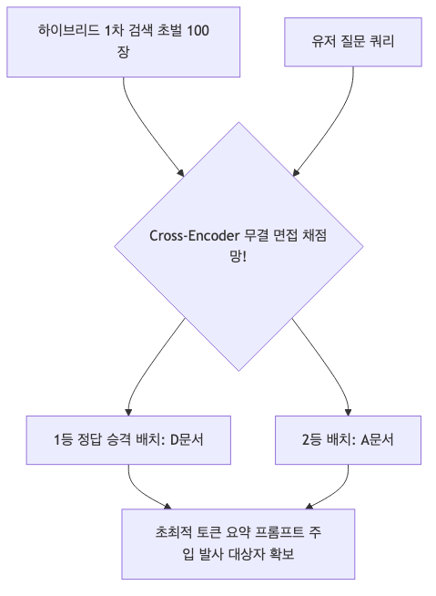

# 6주차: Reranking Models and Hybrid Retrieval (검색 결과 순위 재조정을 통한 답변 품질 혁신망)

5주 차에서 구축한 벡터 엔진이 아무리 광속으로 100장의 답변 문서 목록을 뿜어낸다 하더라도 안심할 수 없습니다. 단순히 코사인 거리만 잰 100위 권의 목록들은 정답의 우선순위를 심각하게 뒤틀어 놓을 가능성이 농후합니다. 

이번 6주 차에서는 초기 검색 결과 더미(Top-K)의 순위를 가장 섬뜩한 정밀도로 갈아 치우고, 가장 관련성 높은 진짜 정답 문서를 무조건 1~5위 상단 권역에 틀어박아 재조정시켜 배치하는 **미들웨어 리랭커(Reranker)의 철통 방어 아키텍처 역할**을 수립합니다 [cite: 994-995]. 나아가 기존 스펠링 검색 장점과 의미 검색 장점을 쌍끌이 쾌속 그물 결합으로 묶어버리는 하이브리드 포획망에 뛰어듭니다!

---

## 1. 검색 엔진의 한계 돌파: 하이브리드 및 고급 검색 패턴 (PDF p.127-130)

모든 데이터베이스의 맹점을 단숨에 씹고 파단시키는 혁신적 구조 패턴들.

* **Hybrid Search (융합 사냥망 결합):** 희소 깡통 스펠링 매치(Sparse BM25) 로직과 밀집 의미 코사인 결합각(Dense Vector) 양쪽 서버 엔진을 동시에 쾌속 듀얼로 포문 개방! 둘의 랭킹을 알파(Alpha) 스코어 가중치로 합쳐 각각의 아킬레스건을 철벽 방어하는 하이브리드 전술입니다 [cite: 1109].
* **HyDE (Hypothetical Document Embeddings):** 가상의 가짜 소설 문서를 생성해 진짜 문서를 낚아채는 미친 천재적 기법입니다. 유저의 단 몇 글자짜리 구구절절 없는 짧은 질문만으로 벡터를 찾다간 100% 헛방 칩니다. 이 짧은 질문을 LLM에게 먼저 주어 "그럴싸한 가짜 정답 에세이 5줄 먼저 창조해봐라" 지시 후, 그 풍성해진 '가짜 답변'을 벡터 스페이스에 통째로 우주 전송 투하해! 진짜 DB 내 정답과 100% 매칭 각도를 유도하는 혁명론 [cite: 1109].
* **Recursive Retrieval (소형 점 탐색 -> 부모 거미줄 융단 반환):** 바늘만 한 크기의 미세 청크 블록 단위로 검색 스캔을 극한 정밀 조준 타격하고! 발견되면 그 미세 블록이 물려있던 연결된 거대 문맥 '부모 문서 전장' 자체를 역추적(Small2Big)해 전체를 반환(환불 교체) 하여 문맥 탈락 단절을 파기 막아버리는 기법 [cite: 1111].

---

## 2. 면접 채점 통제관 : 교차 리랭커(Reranker) 아키텍처 유형 (PDF p.99-101)

100개의 검색 리스트가 뽑혀왔다면, 이걸 1순위부터 100순위까지 피 튀기게 무결점 줄 세우기를 해야 합니다. 가장 적합한 1등 녀석만 프롬프트에 제공할 수 있기 때문입니다(토큰 비용 방어).

### ① 최상급 어텐션 판결 : Cross-Encoders
* 🔬 **[Paper Insight]:** *Sentence-BERT: Sentence Embeddings using Siamese BERT-Networks (Reimers et al., 2019)*
기존 초기 검색기는 쿼리 따로, 문서 따로 각각의 방에서 계산된 점수였습니다(오류 다발생). 
하지만 크로스 인코더는 "유저의 질문"과 "1순위 후보 문서" 전체를 한 개의 트랜스포머 문장 버스에 바짝 같이 태워넣어서 질문의 앞 단어와 문서의 뒷 단어가 1:1로 피터지게 교차 결합 어텐선망(Attention)을 그물 통과하며 대답 가능 확률을 초밀착 검수합니다. 쿼리와 문서를 **동시에 동기방식 연산 타격** 처리하여 타의 추종을 불허하는 매우 미친 높은 정밀도를 압도적 제공 창출합니다 [cite: 1043-1044].

 

 

### ② 생성형 지능 모델을 빌려 쓰는 : LLM 기반 Reranking
비싼 전용 크로스인코더 AI가 없다면 오픈 LLM에게 면접관 역할을 부탁하는 분류 로직 패러다임 3종 [cite: 1081-1083].
* **Pointwise:** 문서 하나하나씩 검수하며 1에서 10점 만점 사이에서 절대 점수를 평가 배팅 매김.
* **Listwise:** LLM에게 10개 후보를 쫙 병렬 리스트로 한 번에 프롬프트에 주고 "등수 1위부터 순서 쫙 매겨서 대가리 가져와봐" 라고 강제 서열 도출 랭킹 박치기.
* **Pairwise:** A문서와 B문서를 이원화 아리나 붙여 "누가 이 대답에 더 가까운 녀석인가!" 승자 독식 비교 토너먼트 배틀을 돌림.

---

## 3. 내 리랭커 성적표는 누가 평가하는가? (PDF p.106 실습 매핑)
단순 검색 50위 밖으로 추락했던 문서를 1위로 기적같이 다시 승격 역전시킨 크로스 인코더. 그 파이프의 전반적 랭킹 질서도 퀄리티는 **NDCG (Normalized Discounted Cumulative Gain)** 메트릭스 수학 척도를 계산 활용하여 "성능 계산" 검증 타격 평가 도출을 연산합니다 [cite: 1087 실습 파트 연계].

 

