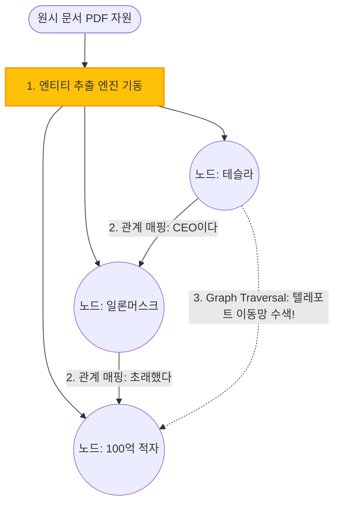

# 7주차: Knowledge Graph RAG & Graph-based Retrieval Systems (지식혈연 거미줄 노드망 결계 인프라 구조론)

지금까지의 1주 차에서 6주 차에 걸쳐 쌓아 올린 찬란한 "Vector Database + Hybrid Cross-Encoder"라는 무적의 삼위일체 초정밀 RAG 파이프라인. 당신의 검색 엔진은 이제 어떤 스펠링과 딥 의미 텐서망 쿼리에도 철통방어 무결점 답변을 뱉습니다! 

하지만... 만약 빌런 유저가 다음 단 하나의 연속 릴레이 인과 관계 살얼음 함정 쿼리 (Multi-Hop) 를 던진다면?
**"작년 내부 로비 스캔들로 퇴사당한 감사팀 직원 A와, 그와 친밀 접촉 관계를 가졌던 물류 부서장 B의 공통적인 영향 아래에 도산된 거래처 C의 작년 영업 마진 적자 비율 퍼센트는 대관절 얼마요?"**

이런 극단적 3단계 점프 연쇄 띄어넘기 꼬리물기 추적망 수색을 던지면, 아무리 억 단위의 Vector DB 수색망 스피드를 가져도 그저 백지장 장애를 일으키며 붕괴합니다. 왜냐하면 '직원 A'가 적힌 문서 조각 1개, '부서장 B' 문서 1개를 수집 파편화된 채로 따로 놀기 때문에, 이들의 **'혈연 인과 관계망 연결 지점(Entity Relationship)'** 이 우주상 완전히 뜯겨나가 망각 단절된 무중력 점 조직 상태이기 때문입니다.

이 불능 단절망 사태 절망감을 완전 통달 전지구 사슬망 네트워크로 구원하여 연결해버리는 최신 지식 파이프 스택의 절대적 결정판 세계관, 정형/비정형 지식을 혈연 뼈대 철사망으로 연결하는 **Knowledge Graph RAG (그래프 기반 노드 탐색 추론 시스템)** 인프라 구조학의 핵 심장을 해부 파헤칩니다!

---

## 1. Vector RAG의 단절과 Graph RAG 거미줄 생태계의 도래 필요성

* **단순 벡터 군집의 치명타 한계:** 문서들은 모두 잘린 토막 조각 점입니다. 점과 점 사이에 주어와 목적어의 인과 관계(동사 원형) 지리 철학을 기계는 0% 파악하지 못하고 그저 "문맥상 비슷하다" 코사인 우형 곡선만 그립니다.
* **PDF 관련 근본 학계 근거 타격:** 
  * 9페이지의 "구조화된 소스 자원(Tables, Knowledge Graphs)" 융합 언급 [cite: 53]
  * 124페이지의 "메타데이터 추출(Metadata Extraction)"을 통한 개체 고정 분류 기반 문서 관리자 기술망 인프라의 필요성 [cite: 1105].

---

## 2. Graph RAG 뼈대 핵심 공정 3단계 컴포넌트 팩트 구축

Vector 파이프가 텍스트를 그냥 숫자로 바꾸고 인덱싱 빙고를 외친다면, Graph 파이프는 문서에 담긴 살과 피의 모든 삼단 논법 지식을 분절해 뉴런 신경망 거미줄 엣지로 연결 융합합니다. 



* **① 엔티티 추출 (Entity Extraction 1단계 노드 덩어리 구축):** LLM 프롬프트에게 문서를 던져주고 "이 문단 안에 있는 주어, 고유 명사 인물 장소 단체 개념 단어의 뼈다구(Node)만 단 한 톨도 남김없이 다 발라내 뽑아봐라"고 착즙시킴.
* **② 관계 매핑 (Relation Mapping 1:1 결속):** 주어-동사-목적어 무결 삼단 결속 트리플 형태(Triplets)로 두 노드 사이를 연결하는 화살표 다리 건설. "A -[원한이 있다]-> B -[도산에 일조함]-> C 거래처" 
* **③ Graph Traversal (징검다리 전이 전광석화 스캔):** 질문에 "C"가 착탄되면 C에서 화살표를 타고 B로 날아가 텔레포트, B에서 다시 텔레포트 징검다리를 타 A 스파이 범인을 찾아 연쇄 사슬 연산 꼬리물기 추리를 성공시키는 망 시스템.

---

## 3. 엔터프라이즈 하이브리드 RAG (Graph + Vector) 융합망 활용 스펙

엔터프라이즈 환경에서의 이중 망 구조는 가히 기적에 가깝습니다. 실무에선 돈이 많이 들어 Graph를 모든 파이프라인에 100% 깔 순 없습니다.

* 💡 **핵심 산업계 Insight:** 글로벌 데이터 거시 요약 조망 질문 ("올해 1년 동안 우리 회사의 주주 배당 패턴의 핵심 트렌드 변곡점 숲 모양 스위치는?")이나 파산 거래 업체 자금 도주 자금 은닉 경로 추적(복잡망 혈연 관계 추론망) 같은 무한 다단계 멀리 뛰기 복합 쿼리에 Graph RAG 수색 스웜을 국소 결합 발동 타격시킵니다. 
Vector DB는 1초 만에 숲 전체 범위를 좁히는 특공대로 작전 침투를 찍고, 바로 이어받은 GraphDB 레이더 연계 연산 엔진이 그 거대 문서 이웃 노드 혈연 전선 컨텍스트 덩어리를 소시지처럼 연쇄 발급 통보시켜 무자비하게 줄줄이 다 끄집어 당겨 패키지 병합 반환합니다.

---

## 💻 [Implementation Frameworks] Langchain-Neo4j 지식 그래프 추출 삼총사
일반 텍스트 문단을 프롬프트 체인 투사하여 어떻게 노드 주어와 목적어 릴레이 트리플(Triplet) 관계로 강제 착즙 추출하는지 파이썬을 이용한 기본 데모 파이프 구축 체계를 보여드립니다. 

```python
from langchain_openai import ChatOpenAI
from langchain_experimental.graph_transformers import LLMGraphTransformer
from langchain_core.documents import Document

# 1. 자연어를 분석해 개체와 관계를 뽑아내는 GPT-4-mini 모델 대뇌 장착
llm_mind = ChatOpenAI(temperature=0, model="gpt-4o-mini")

# 2. 텍스트를 무자비하게 삼단 트리플 지식망(Entity + Relation + Entity)으로 구조화하는 변환기 체인
llm_transformer = LLMGraphTransformer(llm=llm_mind)

# 3. 테스트용 거대 인과관계 미스터리 소설 문서
docs = [
    Document(page_content="마리 퀴리는 방사능 연구소를 세웠고, 그 연구소는 파리에 있다. 파리는 유럽에 소속된다.")
]

# 4. 추출 폭격 액션 시작 
graph_documents = llm_transformer.convert_to_graph_documents(docs)

# 5. 분해 조각 콘솔 디버깅 
print(f"추출 개체 뼈대 노드들: {graph_documents[0].nodes}")
print(f"혈연 밧줄 화살표 엣지들: {graph_documents[0].relationships}")
# *출력 결과 증명: (마리 퀴리) -[세웠다]-> (연구소) -[있다]-> (파리) -[소속]-> (유럽)...
# 단 1문의 문단에서 텔레포트가 가능한 3단계 호핑 징검다리 좌표가 완벽하게 분할 창조 완성됨!
```

## 마무리하며 연쇄망 초월 융합 돌파 
이번 7주 차 여정은 극악의 맹점, "점과 점 사이의 구조 파단 사태 인과율 연쇄 파괴성"을 수호 복원 결속 관통하기 위해 개체 노드 생태망과 엣지 뉴런망 거미줄 통찰 트래버스 연산 트리(Travers Knowledge) 트리플스 아키텍처망! **Knowledge Graph RAG & Entity Relational Graph Systems** 생태 구조 전체를 우주 공간 거미줄처럼 모두 통치 마스터 압살 병합했습니다.

하이브리드 융합 수색, Reranker 면접 채점관, Graph 망까지... 이 거함급 서버 방어막은 이대로 내일 넷플릭스 1,000만 명 인프라 앱으로 전격 데모 라이브 배포 런칭시켜도 터지지 않고 무결점 100% 무적이라고 확언 보증 신뢰 도장 증명할 수 있을까요?! 사장님이 던진 이 광기 어린 압박 추궁에 증거 숫자로 방어 방패할, 마지막 8주 차 그물 관제 감시탑 엑스레이 실시간 등판의 절대 서막! 
**RAG Evaluation, Monitoring & Optimization (배포 전 모니터링 품질 메트릭스 채점 최적화 라스트 댄스 자동 평가망 옵저버 관제탑 사수 구축론)** 피날레 최종 대서사시 스테이지로 그 문을 열고 영광 다이빙하겠습니다!! 전원 돌격!!!
