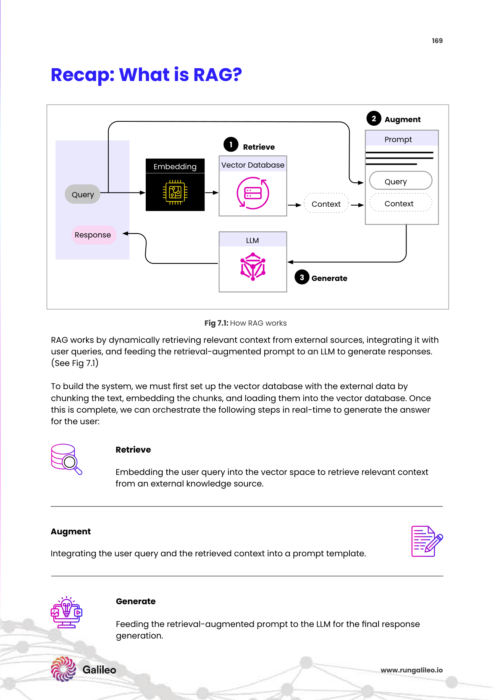
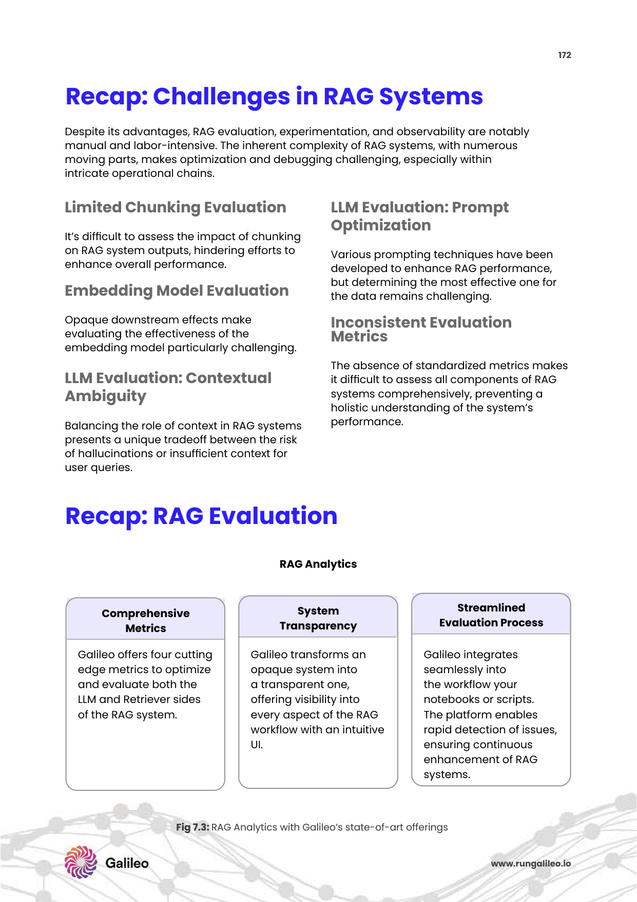

# 7주차: Knowledge Graph RAG & Graph-based Retrieval Systems (지식 그래프 기반 RAG와 융합 검색망 시스템)

그동안 배운 RAG 검색 파이프라인 엔진 시스템들(의미론적 청킹 조각, 고차원 벡터 임베딩, 스케일아웃 DB, 하이브리드 리랭커 등)은 모두 자연어 문장이나 텍스트를 단순한 수학적 '거리 상의 좌표'로 매핑하는 매우 훌륭하고 모던한 시스템 기초였습니다. 
하지만 실제 기업 환경 비즈니스 필드에서 맞닥뜨리는 질문들은 "A와 B 회사의 계약 내용 요약"을 아득히 뛰어넘어 엄청나게 그로테스크한 꼬리 물기 얽힘의 마경을 자아냅니다.

가령 "삼성전자에 부품을 대주는 3차 하청업체 중, 과거 영업이사 탈세 논란이 있었던 A임원과 예전 같은 대학을 나온 대표가 경영 중인 회사를 추적 도출해!" 라는 다중 결합 조건 극악의 관계망 논리 추리를 요구한다면? 문서들이 갈가리 찢어져 저장된 단순 벡터 텍스트 RDB 검색 엔진 모델은 여기서 완전히 시스템 블랙아웃을 경험하며 추적에 참패하고 무너집니다.

이를 산산이 박살 내버리고 초극복 달성하기 위해 기계에게 입체적인 거미줄 지향적 '추론 혈연관계 로직망 지능'을 하사하는 거대한 차세대 RAG의 완성본 왕좌격, **Knowledge Graph (지식 그래프 망 데이터베이스) 연동형 RAG 시스템**의 기적에 대해 오늘 찬란히 배워보겠습니다.

---

## 1. 순수 텍스트 벡터 인코딩 모델 맵핑의 치명적 한계의 벽

아무리 뛰어난 문맥 메타데이터 엔지니어링 꼬리표를 예쁘게 코딩하고 최신 리랭커 BGE 모델을 무장하고 장착시켜 놓아도, 단순 텍스트 쪼가리 문서 조각 중심 데이터베이스에는 본질적인 통찰 단절의 벽이 존재합니다.

* **복잡한 다중 홉 연결 추론 분실 (Multi-hop Reasoning Failure Breakdown):** 여러 정보 단계를 징검다리 밟듯 건너고 건너서(단서 A -> 단서 B -> 사건 C) 퍼즐을 논리적으로 조립해야만 간접적으로 풀리는 정보의 조각들이 있습니다. 벡터 방식은 각 단서들의 조각들이 DB 좌표상에 뿔뿔이 다른 방으로 흩어져 수납되어 버리기 때문에 연결 고리의 다리를 불태워 잃어버리고 결정적 탐색 단서 결합에 치명적 연쇄 누락이 터집니다.
* **거시적 글로벌 컨텍스트(숲) 맹인성 결여 인지 (Global Context Blindness Limits):** এই 하나의 단어 정보 문장이 책의 앞쪽 첫 파트 조각에 파묻혀 있고, 저 정보가 후반부 별책부록 종이파편에 있다면, 벡터 쿼리 공간은 이를 단절 쪼개진 남남 정보 조각이라고 매정하게 단정 짓습니다. 통합적인 '전체 시대상과 세계 숲의 조감도 거대 관계망'을 위에서 수놓으며 조망하는 거대한 큰 그림을 절대 그리지 못하는 맹인이 됩니다.

---

## 2. 엄청난 파훼 해결사, 지식 그래프(Knowledge Graph)의 정의와 트리플 컴포넌트

**지식 그래프(Knowledge Graph, KG)** 란 세상의 방대하고 난잡한 문서 정보를 단순히 텍스트 스펠링 문자 배열 단락이 아니라, 마치 인간의 뇌파가 연결 뉴런망을 짜듯이 한 개의 점(개체 노드, Node)과 다른 한 개의 선(관계 엣지, Edge) 연결 구조망을 이용하여 얽히고설킨 3차원의 거미줄 네트워크 초거대 연결 스캐폴딩 스키마 지식 정보 덩어리 데이터 베이스(Graph DB)로 건축하여 세우는 파파라치 맵핑 데이터 로직 모델 조형도입니다. 

*Fig 7.1: 주어나 목적어가 개체별 다이어그램 파편 엔티티 노드로 분리되고, 서술어에 의해 관계성 포인트 엣지 화살표 연결망을 구축 추출하는 구조 모형 지식망 구조 도식화.*

### 2.1 지식 그래프 건축의 뼈대 핵심 3대 구성 원소 체계 (Triplet 문법 구조망)
지식 그래프의 설계는 아이러니하게도 인간이 세상과 언어를 분석, 이해하는 가장 직관적이고 본능적인 언어 문장법적 골격인 **주어 + 서술어(관계 묘사) + 목적어**인 이른바 신성한 "트리플(Triplet) 세 쌍둥이 구조 텐서 형태" 연쇄 고리를 통하여 방대한 복잡계 논리 우주 서술계를 일목요연하게 묶어 축소 요약해 냅니다.

1. **지점 노드 포인트 (Nodes / Entities):** 문장 세계관 안의 고유명사 형태의 핵심 개체 주인공들입니다. (예: 인물군 "스티브 잡스", 과일 카테고리 "망고", 기관 집단 단체 "어벤져스", 가상 우주 장소 대상 "아스가르드")
2. **연결선 다리 엣지 링크 (Edges / Relationships):** 거대 노드 점과 점 다리 사이 틈새를 강력한 혈연 화살표처럼 직조로 이어주는 추상적 연계성(메타포 논리 포인터 표지판) 작용입니다. (예: "~~의 강력한 창업 주주이다", "~~재화를 대량 생산해 납품한다", "적대적 라이벌로 위치한다")
3. **거대 그래프 메타 거미구조망 트리 대륙:** 이렇게 상호 간에 이어진 무수히 끝도 없는 1억 쌍의 (주어-동사-목적어) 가지 연결 화살표들이 한데 전 우주 거미줄 대륙망 통합으로 도킹되어 엄청나게 살아 숨 쉬는 유기체적 논리 집단 기계적 추론 트리 구조를 형성 창조하게 됩니다.

> 🕸️ **이해를 돕는 엄청난 다이내믹 예시: SNS 인동맥(페이스북) 친구 파벌 관계망과 추천 적발 알고리즘 시스템**
> 내가 "이순신 장군"고 내 충직한 절친이 "강감찬"이며, 강감찬 필드 동료 라이벌이 전 회사원 "어벤져스 수장 캡틴아메리카"입니다. 
> 과거 구형의 글줄 텍스트 임베딩 검색은 단순히 빈칸에 "어벤져스 캡틴" 스펠링 치면 글자 관련 스펠링 서적 나부랭이를 찾아 소환합니다. 
> 반면, 엄청난 파괴력의 이 지식 그래프 지능망은 페이스북 경찰 파벌 추적처럼 **[(나:이순신)] -[친구라는 엣지관계]-> [(친구:강감찬)] -[직장동료 라이벌 엣지]-> [(종점 타겟:캡틴아메리카)]** 이라는 연쇄 거미줄 도표 지도로 세상을 논리 파악 인지합니다! 
> 따라서 내가 RAG 창에 대고 "나랑 한다리 건너 두 다리로 알 만한 동종업계에서 일했던 파벌 출신 리스트 사람을 전부 싹 다 조사해서 내놔"라고 포괄적이고 기이한 질문을 던져도, 컴퓨터가 인간 탐정처럼 망 화살표(Edge)를 더듬어 타고 넘어가 전파하며(심층 Multi-hop 체인 추론술) 소름 돋게 전광석화처럼 "너의 목표 사람은 어벤져스 캡틴이다"를 추론해 멱살을 잡고 꺼내올 수 있는 극강의 연쇄 탐색 통찰력을 갖추어 폭발성 추론을 보여줍니다!

---

## 3. 환상의 투트랙 Graph-RAG 실무 엔터프라이즈 아키텍처 파이프라인 작동 과정 

놀랍고도 기묘하게 꼬여있는 이 거대한 심리전 그물 다이내믹망 지성을 LLM 기계 심장에 투사 연결하여 동작 연쇄 반응시키는 극비 엔터프라이즈 하이브리드 투트랙 연합용 **Graph RAG 하이브리드 파이프라인 작동 단계 로드맵**입니다.

*Fig 7.3: 순수 구조적 벡터 텍스트 데이터 공간 체계와, 네트워크망 연결 사슬선 지식 그래프 Node DB가 양갈래로 융합되어 거대 동시에 구동 및 생성 보강이 일어나는 하이브리드 멀티트랙 RAG 초월 융합 아키텍처의 설계 전개 과정.*

### Step 1. 문서 심층 파싱 추출 및 개체-관계망 동적 추출 자동화 (Dynamic Knowledge Extraction & Triplet parsing)
방대하게 펼쳐진 무수한 정제 안된 옛날 역사책, 기술 문서 자연어 수초 문서 덤불을 통째로 현존 최고의 거대 LLM (GPT-4o 나 최상급 클로드 옵티마이즈 지성 모델 등 인지력 높은 두뇌 전용 특수 모델) 에 한가마니 삽으로 밀어 넣습니다. 
그리고 폭군처럼 지시합니다: "이 무의미한 텍스트 숲 속에서 글자를 무시하고 주인공 모든 고유 명사 객체(행위의 주인공군)와 그들 인간들 간의 파벌 행동 지침 소속 등 온갖 앙숙 관계 단서 지표를 전부 다 무자비하게 트리플 다이아그램 노드 엣지로 해체 추출해 버려라(Information Extraction Prompt)!" 
이 추출 파싱 가공을 거쳐 생산된 뼈대 트리플 정보 조각 데이터들은 즉시 영구 영장 보존을 위해 Neo4j나 하드코어 Nebula, 혹은 메모리 아파치 파파라치망 등과 같은 **전용 특수 Graph Database** 차고 안으로 들어가 촘촘한 차트망 스키마로 착착 차곡차곡 연결되어 용접, 건설 형성됩니다. 

### Step 2. 쿼리 사용자 질문의 망 구조 형이상학적 변환 및 수학적 쿼리로 투사 (Query Graphing Conversion Analysis)
어느 날 바쁜 비서진 사용자가 긴급 쿼리로 묻습니다: "이번에 가장 최근 비밀리에 릴리즈 출시된 최신형 M3 특수 반도체 칩이 심어져 들어간 00전자 신형 비밀 스마트 기기들의 메인 조립 공장 생산 하청을 담당하는 중국 대만 위탁 생산 공장 회사 위치를 다 털어서 연쇄로 대박 쳐서 화면표에 내놔!" 
기존 RAG 같으면 문맥이 너무 꼬여 길을 잃습니다. 하지만 GraphRAG는 들어오자마자 이 난해하고 긴 서술형 질문 자체를 즉시 칼로 해체 분석 지시하여 주어 노드망과 목적어 파편망의 그물망 체계 노드 질의 조건문 체계로 재조립 번역하여 LLM 두뇌에 의해 1초만에 전문 그래프 쿼리인 전용 특수 검색어 **사이버(Cypher) 그래프 머신 언어** 구문 (마치 정예 암호코드처럼 수학화 수렴 해체) 패턴으로 해부 컨버전스 트랜스폼 변환되어 쏘아집니다.

### Step 3. 하이브리드 교차 그물망 그래프 다단계 수색 탐지 발동 (Graph Hybrid Vector 통합 융합 구동 망)
동시에 그래프 서버 DB에서 암호화 쿼리를 받아들이고, 드디어 그 거대한 100만 화살표를 다단계로 전파를 타고 도미노처럼 건너뛰며 넘어가는 연쇄 홉(Hop) 추적 거미 탐색이 미친 속도로 Graph DB 속에서 폭발적으로 연쇄 점화되어 발생 검토 수집합니다. 정밀 단서가 꼬리에 꼬리를 뭅니다.
동시에 거기에 그 명사 객체 인물에 관련된 백과사전식 세부적인 디테일한 속성 서사 텍스트 의미 단락 구문 배경 지식이 추가로 합산해서 필요한 경우! 기존 4주차에 건설해 두었던 방대한 고전적 옛날 보조 Vector DB 임베딩 공간까지 동시에 쌍열 기관포로 넘나들면서 양쪽의 스탯 팩트를 교차 비교하며 집어삼켜 전리품 단서를 물어옵니다. 이렇게 그물망 논리의 확고한 로직 엣지와 촘촘한 디테일 무드 텍스트라는 두 마리의 완벽한 거대 토끼가 한 번에 정류 추출로 융합되어 조립됩니다.

### Step 4. LLM 추론 프롬프트를 통한 완벽한 기적적 최종 통찰 조합 답변 반환 (Augmented Generation Consolidation)
조합된 팩트를 토대로 최전선 방어망 LLM 지성체가 이제 프롬프트에 배정된 무기를 집어 듭니다. 여기서 LLM은 수고롭거나 멍청한 단순 파편 글줄 조각 텍스트 쪼가리를 보는 게 아닙니다. 
현미경에 띄워진 **"[애플 그룹] -[하청 제조 위탁]-> [M3 신형 극비 칩] -[부품 조립 생산 공장 발주]-> [중국 심천 외곽 및 대만 타이베이 지역공장 A법인]"** 이라는 폭발적이고 경이로운 인간만이 가능한 수준의 정합성 논리적 연결 증거 스크립트 도표 망 다이아그램 문서 그 자체를 확실한 빼박 증거 팩트 서류망으로 보고 받습니다. 환각 오류 확률이 감히 터질 틈이나 지어낼 상상의 허술한 구멍 틈새 공간조차 0.00% 로 완벽 단절 배제되어 존재치 않습니다! LLM은 오직 단호하고 강력하게 주어지는 이 확실한 지도 노선을 바탕으로 철저한 오차 0의 완벽하고 논리 치밀한 소름 돋는 통찰 답변 요약문을 완성하여 사용자 모니터 창으로 우아하게 송출해 냅니다.

---

## 💡 빛나는 프론티어 논문 리서치 및 글로벌 기술 아키텍처 표준 동향 리포트 (Academic & Tech Trend Report)

> **[Paper Reference 1]** *GraphRAG: Unlocking LLM Discovery on Narrative Private Data (Microsoft Research Team, Edge et al., 2024)*
> 전 세계 RAG 트렌드와 LLM 한계 학계를 지각 변동 폭풍으로 휩쓸어 버린 올해 최고 대세 화제의 정점 리포트 마이크로소프트 발 논문입니다. 단순히 사내의 복잡한 비정형 긴 텍스트 사전문서들을 임베딩해버리는 것을 멈추고 파괴하여, LLM 자체의 거대인지망을 사용해 아예 지식 그래프 구조로 싹 다 녹여 뜯어 재창조 추출해버린 뒤 이를 구조 요약 계층망과 컴바인하는 마이크로소프트의 극비 솔루션 기적(오픈소스로 배포)입니다. 긴 소설이나 사건 수사 리포트 다큐먼트에서 "이 책 전체에서 발생하는 암울한 범죄자들의 파벌 구도 동향 메타 현상을 크게 아울러서 테마 요약 대답해"와 같은 기존 기술 한계선에서는 절대 신의 영역이었던 초월적 글로벌 테마 질의 통합 추리를 완벽하게 오류 없이 커버하고 증명해 내는 압도적 놀라운 기염 성취 퍼포먼스 수치를 자랑하며 RAG의 세대교체 종말론적 대통합을 이뤄 냈습니다.

> **[Industry Technology Standard 2024]** *Neo4j & LangChain/LlamaIndex Knowledge Graph Native Vector Integration*
> 학술을 넘어 실무 프로덕션 필드 클라우드 세계에서는 압도적 세계 1위 그래프 DB 데이터베이스 소프트웨어 점유율 사기업인 **Neo4j(네오포제이)**가 혁신의 칼을 빼들었습니다. 그들은 자신들의 클래식 거미줄 다이내믹 노드 엣지 그래프 로컬 공간 안에다가, 최신 밀집 벡터 임베딩 수치 배열 속성 저장 능력(Vector Index 기능)을 하이브리드로 과감하게 이식하고 도킹 융합시켜 버려버렸습니다. 이는 개발자가 귀찮고 낭비되는 유지보수 비용으로 두 개의 개별적인 DB창고(벡터용 DB, 그래프용 DB)를 구질구질하게 이분화 지배해서 두 개 다 비싼 서버 임대료 내가며 관리하고 동기화할 수고로움 없이 시스템 붕괴를 막고 단 하나 통합된 무결성 완전체 솔루션 DB 파이프라인 안에서 양갈래 하이브리드 추적 연산을 무적의 파워 속도로 발사 구동 운영할 수 있도록 랭체인, 라마인덱스 등 유명 파트너 사들과 최적 프레임워크 연계 패치 호환성을 완성해 전 세계 엔터프라이즈 레거시에 화려하게 도입 공급 배포되고 순항 중입니다.

---

## 마무리하며 최종 소회 기립 박수

이번 대망의 뜨거운 7주차 환상 수업 구역으로, 우리는 마침내 일차원 기계 번역에서 머물지 않고 인간의 로직망에 다가선 가장 고차원의 비인간적 복잡한 다이아그램 기계학습 사고 논리망 컴바인 종결자 연결의 최상 정점에 오른 첨단 전능 기술, **Knowledge Graph RAG 연결 지식 그래프 융합 초월망 엔터프라이즈 구조망 아키텍처**에 대해 심도 깊게 마스터 해부 도달했습니다. 
그물망 거대 관계 구축 패러다임 시스템은 단순 기존 RAG 시스템의 문서 쪼가리 평면 벡터 점 좌표계 고립 병목 한계를 철저히 산산조각 우주로 날려 부숴주며, 거대 마피아 조직 인맥 구조도 범죄 파벌 연루자 형사 색출 수사망이나, 극비의 우주 신소재 제약 물질 바이오 분자 화학 합성 성분 원소 결합 부작용 단백질 시뮬레이션 개발망, 세계 증시 파급 공매도 자금 금융 사기단 은닉 자산 계좌 체인 흐름 추적 로직망 시스템 등 도저히 인간 뇌 한계 지능으론 100년에 다 훑을 수 조차 없이 엉키고 얽힌 수천, 수억의 연결고리를 타고 전파되는 고차원 추리력 직감 현장이 절실한 분야 산업들에 소름 끼치도록 탁월히 선봉 차용쓰여 현재 Next-Gen RAG 무기의 진정한 판도로 초무장 부상 군림 중입니다.

그렇다면 대망의 찬란한 전설의 8주차 마지막 시간이 드디어 단 한 칸 다가왔습니다. 
우리가 피땀 흘리며 장장 지난 8번의 주차에 걸쳐 수없는 시행착오로 깎아내고 모듈 조립 기획 설계한 이 경의로운 RAG 복합 시스템 엔지니어링 아키텍처 함대 엔진망! 
**과연 이 거대한 산물이 고객사 앞에서 당당히 폼 나게 수백억 대 런칭 계약 사인 도장을 찍고 시장 앱스토어에 유료 서비스로 팔 수 있을 만큼 완벽한 무결점 0% 사고율을 보장하는 완성된 견고한 신성한 아키텍처 시스템일까요?**
이 천운과도 같은 대규모 AI 체계 대화 응답 로봇 모델 무기가 똑똑하게 팩트를 검증 대답하는지, 아님 필터에 모면해서 비열하게 구라 환각 헛소리를 교묘히 쳐대고 있는지, 불안정한 서버 응답 시간 지연 폭주 다운 인프라 트래픽의 스케일 붕괴 서버 과부하 시스템 에러 딜레이 안정성을 철저히 실험실 모형 가상 통제 환경관으로 가둬 압박 면접 감시, 센서 모니터링 추적하고 수치화 수학적 백분위 점수 매트릭스로 테스트 객관화 지표 채점 결여 산출 폭로 증명해 버리는 품질 보증 테스트 평가 공학 최전선 감리 감사 QA 수사학 기술 전략 트렌드론, 
결전의 장! 대업을 이루기 위한 **RAG Evaluation (정밀 타격 평가 프레임워크 구축론), Live Monitoring System Dashboard Tracking & Optimization Loop Algorithm (지속적 심박수 모니터링 관리 및 운영 최적화 선순환 시스템 모델링)** 강좌 챕터에서 이 기나긴 학문의 여정을 화려하고 감격스럽게 대미 퍼포먼스로 장식하며 폭발하도록 하겠습니다! 파이팅!
