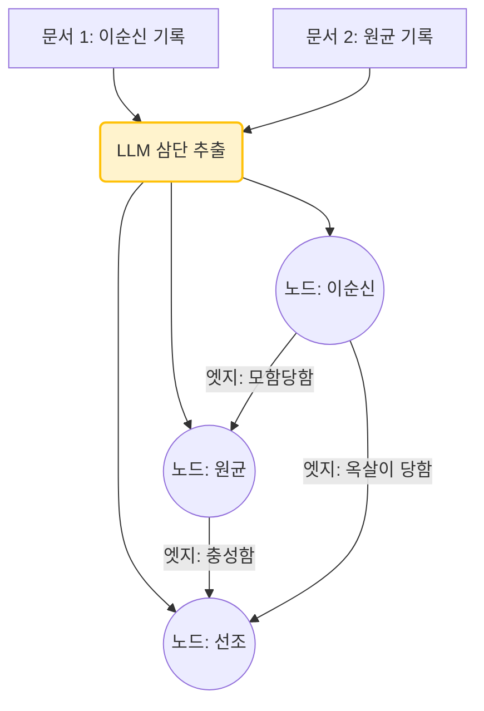

# 7주차: Knowledge Graph RAG & Graph Retrieval Systems (지식혈연 거미줄 추론망 지리 그래프 네트워크 결계 구축론)

지금까지의 1주차에서 6주차까지 쌓아 올린 찬란한 "Vector Database + Chunking + Reranking"이라는 무적의 삼위일체 파이프라인도, 다음 단 하나의 킬러성 함정 쿼리가 날아오면 유리 멘탈 조각처럼 산산조각 바닥으로 와장창 붕괴해 버립니다.

**"작년 퇴사한 직원 A상무가 친했던 부서장 B의 추천으로 방문한 거래처 C의 작년 영업 마진 적자 비율은 대관절 얼마요?"**

이런 극단적 연속 줄다리기 연쇄 탐색(Multi-Hop Reasoning) 쿼리를 맞으면 아무리 엄청난 100만 원짜리 벡터 DB서치도 그저 길을 잃고 헤매거나 전혀 상관없는 'A상무' 단일 문서 1개, 'C거래처' 단일 문서 1개를 제각각 멀뚱히 퍼오고 끝납니다. 수천 개에 달하는 흩어진 점 조직 정보 문서들의 **'혈연 관계망(Relation)'** 이 송두리째 뜯겨나간 단절 상태이기 때문입니다.
이를 위해 도출된 전 인류 최고의 데이터베이스 융합 모델, 세상을 노드(명사 주체)와 엣지(동사 관계)로 끝말잇기 그래프로 전부 매핑 엮어버려 뇌 구조 뉴런망 그대로 생체 이식하는 **Knowledge Graph RAG (그래프 노드혈연 RAG 시스템)** 의 대경지를 폭살 헤집겠습니다!

---

## 1. Graph RAG의 대탄생 : Vector의 단절에서 네트워크망으로

Microsoft가 전면에 내세운 최신 아키텍처이기도 한 이 분야는, 텍스트를 임베딩 벡터로 숫자 구겨 넣기 전에 LLM을 통해 문서 속에서 "(주어) A상무 -> (관계) 알고지냄 -> (목적어) B부서장" 이라는 삼단 논법 지식 트리플(Knowledge Triples)을 무자비하게 수백만 줄 추출합니다.


*참고: 마이크로소프트의 공식 GraphRAG 시스템 아키텍처 추출-그래프 파이프라인. 방대한 문서를 노드로 추출하고 계층 서머리를 생산하는 아키텍처 뼈대.*


*Fig 7.1: [Recap: How RAG Works] RAG의 근본적 기본 연쇄 파이프라인(Query -> Embedding -> Vector DB -> Context -> LLM Prompt -> Generate Final Response)을 한 눈에 직관적으로 볼 수 있게 정리한 튜토리얼 기본 아키텍처 도안.*

기본 RAG가 단절된 벡터 덩어리들의 단순 각도 거리라면, GraphRAG는 위 그림들처럼 점과 점 사이가 명확한 '인과 관계 철사 밧줄' 엣지로 엮여, 대답을 추적할 때 노란 길을 따라 징검다리를 타듯 텔레포트 무한 연쇄 탐색하는 기막힌 추론 동기화 퍼포먼스를 가집니다.

---

## 🌟 글로벌 그래프 구축 및 하이브리드 노드 검색 모델 패러다임 논문 파격 해체

Vector DB 하나만 유지하기도 벅찬데 왜 악몽같이 복잡하고 난해한 Graph DB(Neo4j)를 이중으로 깔아가며 발악을 해야 하는가? 수만 개의 문서 속에 은닉된 수십만 줄의 커넥션을 파헤치는 SOTA 기술 트렌드를 격파합니다.

### 📜 1. 마이크로소프트 GraphRAG (거시적 숲 계층 요약 지배)
**[혁신 논문 모델]** *From Local to Global: A Graph RAG Approach to Query-Focused Summarization (Edge et al., Microsoft 2024)*
* **해설:** "이 책의 전체 주제를 요약해 줘 (Global Query)" 같은 질문에 기존 RAG는 극소수 토막 문서 5개만 읽고 사기 답변을 뱉었습니다. 마이크로소프트는 "우선 책 전체를 Triple 네트워크로 분석해! 그런 পরের 끼리끼리 엄청 많이 엮여있는 커뮤니티(군집 그룹) 단위들을 계층으로 파악해! 그리고 각 커뮤니티별로 요약본을 수천 개 쫙 다 만들어둬!" 라고 세팅합니다. 
* 💡 **핵심 산업계 Insight:** 데이터가 들어올 때 벡터화뿐 아니라 수백만 개의 Graph 추출 연산 때문에 OpenAI 토큰 요금(과금) 창이 폭동 폭발 수준으로 어마어마하게 박살 나 터지는 심각한 부작용이 있습니다. 하지만 한 번 군집 커뮤니티 서머리를 축적해두면, "회사 내부 10년 치 감사 보고서를 통과 관통하는 핵심 범죄 인사이드 트렌드는 뭐야?" 같은 전능자 수준의 글로벌 거시 통찰 지능 답변이 무조건 보장됩니다. 



### 📜 2. Graph & Vector Hybrid Search (교차 하이브리드 커넥션 체인망)
**[구조 아키텍트 로직]** *VectorDB + GraphDB Dual Stack Architecture*
* **해설:** Graph 연산만 하면 결국 단어의 뉘앙스를 모르고 철자에 의존하게 됩니다. 따라서 이 메커니즘은 유저의 질문이 들어오면 우선 Vector DB에서 코사인 거리로 문서 청크를 폭격 스캔한 다이빙을 칩니다. 문서가 5개 잡혔다 치면, 바로 Graph DB로 텔레포트 전송 접속을 때려 해당 문서의 ID 노드들과 혈연 엣지로 거미줄처럼 직접 줄다리기 연결되어 있는 이웃 노드 텍스트 2~3 뎁스의 주변부 컨텍스트 데이터까지 무자비하게 줄줄이 다 끄집어 소시지처럼 연쇄 발급 통보시켜 당겨옵니다.
* 💡 **핵심 산업계 Insight:** 지식 그래프 DB인 Neo4j의 라이선스를 구매하고 Cypher(그래프 전용 SQL 문법) 쿼리망 코딩을 할 수 있는 백엔드 엔지니어링 생태계 구축이 필수. 최근 LangChain 커넥터가 이를 자동 LLM 생성 체인으로 뚫어내어 허들이 수직 급감했습니다. 파산한 거래처와 얽힌 자금줄 세탁 도메인(금융 사기 방지망 망 구조)에서 대체 불가 절대 1위 아키텍스 구조망.


*Fig 7.6: [Langchain Chunk Utils Loading] Vector와 Graph 투트랙 분할 생태계를 매끄럽게 보조 연산 파싱하기 위해 백그라운드에 세팅된 RecursiveCharacterTextSplitter와 SpacySentenceTokenizer 등 고급 파싱 장치를 튜닝 설정하는 Configuration 코어 임베딩 스니펫.*

---

## 💻 [Implementation Frameworks] LangChain 기반 Neo4j Graph DB 멀티홉 호핑 파이프라인
무작위로 토막 난 수천 개의 문서를 그래프 노드(주체)와 선 혈연 엣지망(관계)으로 상호 결합하여 멀티 홉 연쇄 질의의 허점을 보완하는 실전 생태 Neo4j 체인 샘플.

```python
import os
from langchain_community.graphs import Neo4jGraph
from langchain_openai import ChatOpenAI
from langchain.chains import GraphQAChain

# 1. Neo4j Graph Database 라이브 연결 서버 클라우드망 파이프 오더 세팅
graph_db = Neo4jGraph(
    url=os.getenv("NEO4J_URI", "neo4j+s://유어-인스턴스.databases.neo4j.io"),
    username=os.getenv("NEO4J_USERNAME", "neo4j"),
    password=os.getenv("NEO4J_PASSWORD", "당신의-패스워드-텍스트")
)

# 2. Graph QA Chain 구성 (자연어 질의를 읽고 알아서 Cypher SQL 질의어로 자동 생성 스왑 타격)
chain = GraphQAChain.from_llm(
    llm=ChatOpenAI(temperature=0, model="gpt-4o-mini"),
    graph=graph_db,
    verbose=True # Cypher 쿼리 변환 체증 과정을 백그라운드 터미널에 콘솔 출력 디버깅
)

# 3. 홉 체인 다단계 연쇄 그물망 질문 
query = "최근 비자금 장부 스캔들의 A회장(노드1)과 인수합병을 한 라이벌 B대표(노드2) 간의 공동 투자 로비 회사(노드3, 4)는 어디지?"
ans = chain.run(query)

print("--- [그래프 멀티 호핑 릴레이 답변] ---")
print(ans)
```

---

## 마무리하며 연쇄망 초월

이번 7주 차 여정은 단순히 무중력 우주 은하수 숫자 점 배열 벡터 딥 서치(Vector Search)의 지독한 맹점인 "점과 점 사이의 연결고리 혈연 인과율 망각 단절 사태"를 정면 박살 타격 강타내기 위해! 거대 서머리 클러스터로 문법을 짜깁고 관계 엣지 노드망 뉴런으로 문서 생태를 인쇄 묶어버리는 **Knowledge Graph 추론 생태계 융합 포맷 시스템 파이프(GraphRAG)**를 무자비하게 해부 마스터 완료했습니다!
자! 이제 검색 속도는 빛보다 빠르며, 하이브리드 투트랙망으로 정확도를 끌어올렸고, 크로스 인코더 압박 면접관을 세웠으며, Graph 망으로 징검다리 스캔 혈연 이웃 탐색 능력망까지 무결점으로 구축 탑재했습니다. 이 시스템은 대체 세상 어디 내놔도 결점이 없을 완전 무결 신계 인프라일까요?!
다음 대망의 마지막 8주 차 피날레, **RAG Evaluation, Monitoring & Observability Systems (초거대 인공지능 재판관 기반 품질 채점 모니터링 자동화 감시 옵저버망 구축론)** 파이널 스테이지에 당도하여! 이 무결점 서버 생태가 과연 에러 렉 환각이 터지지 않는지 숫자로 증명해 내는 마진 채점 방어 모의고사 구축 통제 궤도를 미치도록 정복해보겠습니다! 최후의 라스트 댄스 어택!!
