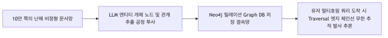
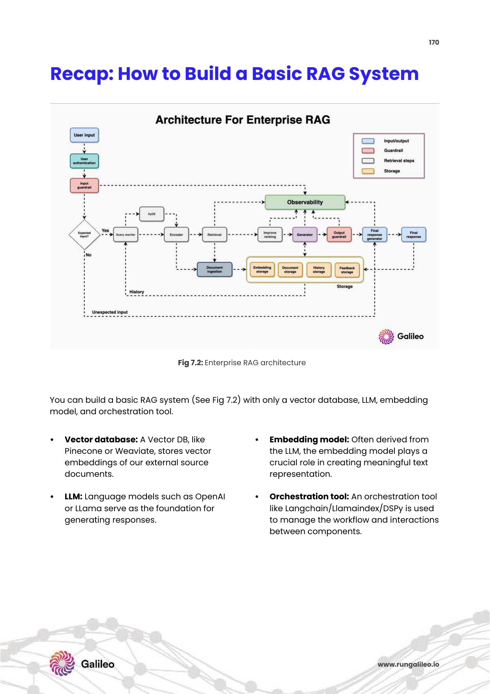
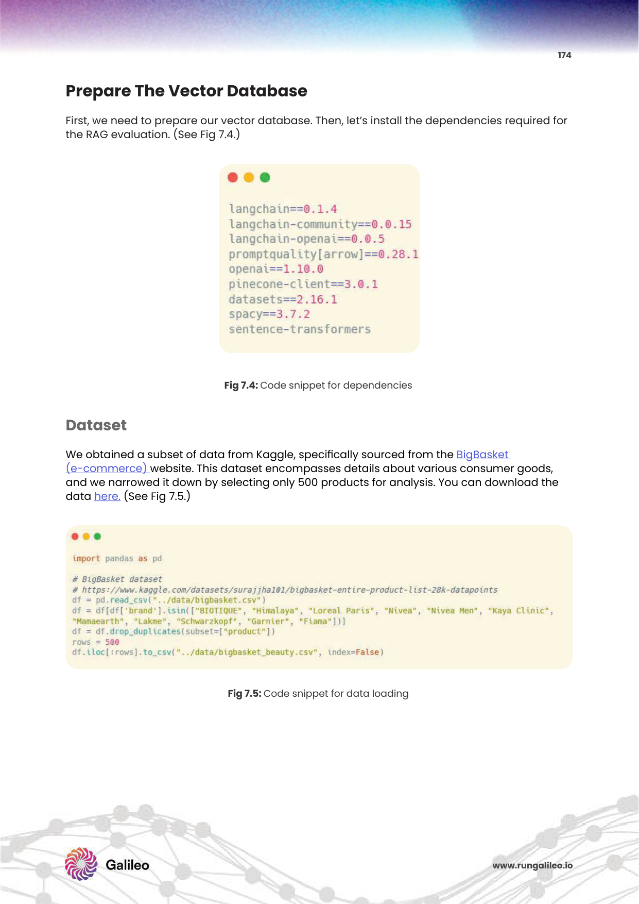
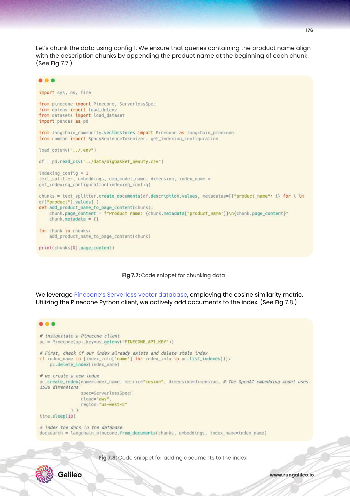
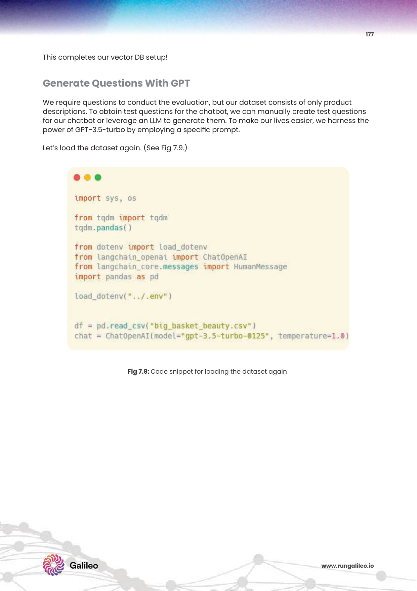

# 7주차: Knowledge Graph RAG & Graph-based Retrieval (정형/비정형 지식을 연결하는 그래프혈연망 RAG 진수)

RAG의 극한 인프라, 하이브리드 검색망까지 장착했건만, 9페이지 가이드라인에서 경고하듯 '단순 벡터 유사성 나침반 검색'은 개별 문서의 지엽적 스펠링 포착에는 신이지만, **"전체 문서들에 걸친 복합적인 릴레이 혈연 관계망 인과 추적 관계(Entity Relationship)"** 를 연쇄 파악 유추하는 데는 끔찍한 한계 벽돌 장벽에 꽉 막혀버리고 맙니다. 
이를 뚫어내기 위한 무차별 융합망 인프라의 최종 병기 진화 생태계, 노드의 혈연으로 끝말잇기를 매핑하는 **GraphRAG 시스템**을 박살 부검합니다!

---

## 1. GraphRAG 시스템의 시대적 도래 및 학술적 근거

* **단순 벡터 군집의 치명타 한계성:** "퇴사자 A가 알고지낸 물류부장 B가 만난 하청업체 C의 영업 이익률은?" 이라는 다단계 꼬리물기 징검다리 복합 연속 쿼리가 터지면 깡통 벡터 DB는 관계 혈연 밧줄을 엮어낼 도리가 없어 오답 100% 먹통 정지를 일으킵니다. 
* 🔬 **PDF 학술적 근거 백서:** 
  * 9페이지의 "구조화된 소스 자원(Tables, Graphs)" 융합 인프라 필요성 필연 언급 [cite: 53]. 
  * 124페이지의 인물/장소/날짜 메타데이터를 뽑아내어 문서의 속성 태그를 맵핑 걸어버리는 "메타데이터 추출망(Metadata Extraction)" 기반 아키텍처 제어 기술 [cite: 1105].

---

## 2. 뼈대 핵심 3대장 구성 요소 및 시스템 기동 전선망

벡터의 단절된 토막 파편들을 유기체 생물처럼 다리 뉴런 인과를 엮기 위한 핵심 공정 3가지!

1. **엔티티 추출 (Entity Extraction):** LLM이 방대한 날 텍스트 문서 덩어리 속으로 침투해 들어갑니다. 그 안에서 서술된 세계관 속 핵심 **주요 인물, 조직 명칭, 장소, 핵심 개념 개념어** 들만 뼈다구(Node)로 산산이 식별 발라 추출해냅니다.
2. **관계 매핑 구조화 (Relation Mapping):** 발라낸 점들에게 피와 살의 연관망 거미줄을 주입합니다! 문맥의 행동 원소들을 `주어-동사-목적어 무결 결합 (Triplets)` 형태의 지식 망 지도로 재조합 연결 구축합니다. (강감찬 -> 격퇴함 -> 거란군)
3. **그래프 순회 스캔 (Graph Traversal):** 실제 유저의 연쇄 탐색 검색 쿼리가 날아와 착탄되면, 벡터처럼 랜덤하게 찌르지 않고 관련된 인과 밧줄 노드 혈연선을 따라가며 **징검다리 롤러코스터 호핑 연쇄 이동** 하여 전체적인 거시 숲의 숨겨진 살인마 맥락을 싹쓸이 추적 파악합니다.

 

 

---

## 3. 엔터프라이즈 B2B 킬러 활용 파급

이 거대한 더블 하이브리드 투트랙망 구조는 실무 현장에서 상상 이상의 파괴력을 수반 강제 도출합니다.

* 🔬 **[SOTA 아키텍트 패러다임]:** *From Local to Global: A Graph RAG Approach to Query-Focused Summarization (Microsoft, 2024)*
* Microsoft GraphRAG 논문 등에서 증명하듯, **"내부 전체 10년 치 감사 보고서를 관통하는 글로벌 조직 자금 세탁 도주 트렌드의 핵심 패턴 스위치 망 거시 패턴 조망 요약해 줘! (글로벌 데이터 통괄 요약)"** 및 **"복합적인 관계 추론 인과 연쇄 사태 모순 질문(예: 경쟁사 A와 인수합병 법인 B 합병이 향후 우리 자회사 C 물류마진에 초래할 공통적인 악재 폭탄 영향은?)"** 과 같은 사기적인 고위드 엣지 추적 해결책을 기계 스스로 논리 파파라치 셜록홈즈로 돌변하여 모조리 뚫어냅니다.

 

