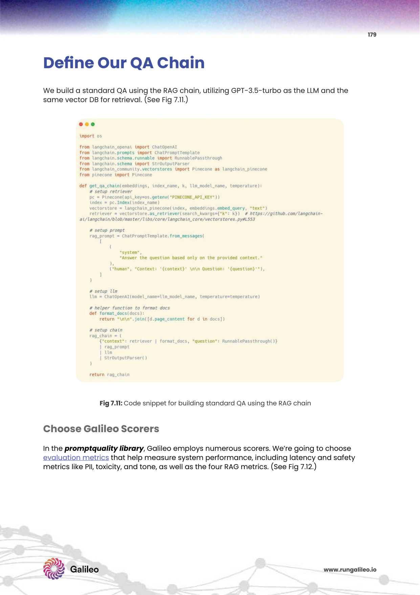
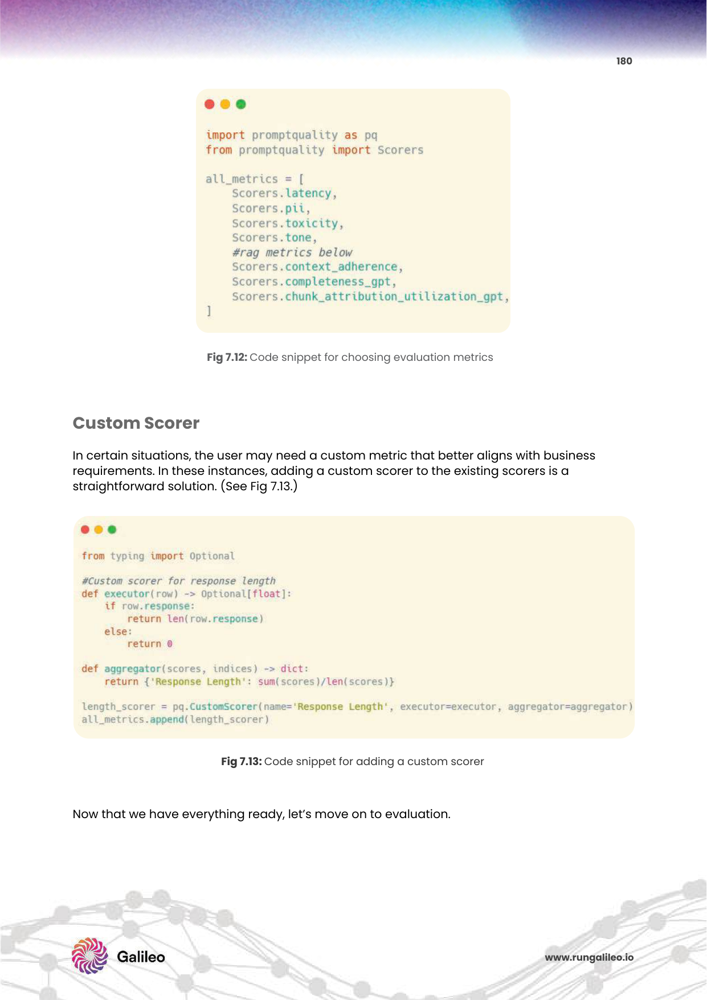

# 7주차: Knowledge Graph RAG & Graph-based Retrieval Systems
> 정형/비정형 지식을 연결하는 그래프 기반 RAG

벡터 검색은 개별 문서의 의미적 유사성을 찾는 데는 탁월하지만, **여러 문서에 걸쳐 존재하는 복합적 관계(Entity Relationship)를 추적하는 Multi-hop 추론**에는 구조적 한계가 있습니다. Knowledge Graph RAG는 엔티티-관계 그래프를 구축하여 이 한계를 극복합니다.

---

## 1. GraphRAG의 필요성

### 이론 설명

**벡터 검색의 한계 시나리오:**
- "A 회사가 인수한 B 기업의 CTO가 이전에 근무했던 C 회사의 기술 스택은?"
- 이 질문은 A→B→CTO→C로 이어지는 3단계 홉(hop)이 필요
- 벡터 검색은 각 단계의 개별 문서는 찾을 수 있지만, **이를 연결하는 추론 체인을 자동으로 구성하지 못함**

**그래프의 해결 방식:**
- 각 문서에서 엔티티와 관계를 추출하여 노드/엣지로 저장
- 쿼리 시 그래프 순회(Graph Traversal)를 통해 연쇄 관계 탐색 가능

### PDF 원본 자료


*Fig 7.1: 기존 RAG와 Graph RAG의 아키텍처 비교 — 벡터 유사도 검색과 그래프 순회 검색의 차이 (PDF p.169)*


*Fig 7.2: Knowledge Graph 구성 요소 — 노드(엔티티), 엣지(관계), 속성(Properties)의 구조 (PDF p.170)*

---

## 2. 핵심 구성 요소

### 2-1. 엔티티 추출 (Entity Extraction)

### 이론 설명

비정형 텍스트에서 **Named Entity Recognition(NER)** 을 수행하여 노드를 생성합니다.

- **인물**: 이순신, 일론 머스크
- **조직**: 삼성전자, OpenAI
- **장소**: 서울, 캘리포니아
- **개념**: 반도체, 대형언어모델
- **날짜/수치**: 2024년 3분기, 150억 달러

### PDF 원본 자료


*Fig 7.3: LLM 기반 엔티티 추출 프롬프트 및 추출 결과 예시 (PDF p.172)*

### 관련 논문

**📄 REBEL: Relation Extraction By End-to-end Language generation (Cabot & Navigli, 2021)**
- 텍스트에서 관계 트리플(Subject-Relation-Object)을 자동 추출하는 엔드투엔드 모델
- 220개 관계 유형을 지원하며 TACRED 데이터셋에서 BERT 대비 10% 향상

---

### 2-2. 관계 매핑 (Relation Mapping / Knowledge Triplets)

### 이론 설명

추출된 엔티티 간의 관계를 **트리플(Subject - Predicate - Object)** 형식으로 구조화합니다.

```
(삼성전자) - [인수했다] - (하만인터내셔널)
(이재용)   - [이사회 의장이다] - (삼성전자)
(하만인터내셔널) - [생산한다] - (카오디오 시스템)
```

### PDF 원본 자료


*Fig 7.4-7.5: 관계 트리플 추출 및 그래프 시각화 — 노드와 엣지로 구성된 Knowledge Graph (PDF p.174)*

---

### 2-3. Graph Traversal (그래프 순회)

### 이론 설명

구축된 그래프에서 쿼리에 관련된 노드부터 시작하여 엣지를 따라 이동하며 연결된 정보를 수집합니다.

- **BFS (Breadth-First Search)**: 가까운 관계부터 탐색, 특정 홉 수 이내 관련 정보 수집
- **DFS (Depth-First Search)**: 하나의 관계 체인을 끝까지 추적
- **Metapath**: 특정 관계 유형 패턴을 따라 탐색 (예: 인물→조직→제품)

### PDF 원본 자료


*Fig 7.6-7.8: Graph Traversal 과정 — 엔티티에서 출발하여 연결된 노드를 순회하는 Multi-hop 추론 시각화 (PDF p.175-176)*

---

## 3. Microsoft GraphRAG

### 이론 설명

Microsoft Research가 제안한 GraphRAG는 단순 그래프 순회를 넘어, **커뮤니티 감지(Community Detection)와 계층적 요약**을 결합합니다.

**주요 혁신:**
1. **Community Detection**: Leiden 알고리즘으로 밀접히 연결된 엔티티 그룹(커뮤니티) 자동 감지
2. **계층적 요약**: 각 커뮤니티를 LLM으로 요약한 "Community Report" 생성
3. **Global Query 처리**: 전체 데이터에 대한 추세 분석, 패턴 파악 쿼리를 처리 가능

### 관련 논문

**📄 From Local to Global: A Graph RAG Approach to Query-Focused Summarization (Edge et al., Microsoft Research, 2024)**
- 전통적 RAG가 개별 문서 QA에 치중한 반면, GraphRAG는 데이터 전체를 아우르는 글로벌 질문에 강점
- 실험 결과: 1,200개의 인간 평가에서 지식 포괄성이 72%, 다양성이 62% 향상
- **Sensemaking 쿼리** (예: "이 데이터셋의 5대 핵심 테마는?")에서 기존 RAG 대비 압도적 우위

### 아키텍처 다이어그램

<br>

<br>

### PDF 원본 자료




*Fig 7.9-7.11: GraphRAG 파이프라인 — 문서 처리, 그래프 구축, 커뮤니티 감지, 레포트 생성 단계 (PDF p.177-179)*

---

## 4. Vector + Graph 하이브리드 활용

### 이론 설명

**Vector DB와 Graph DB를 병행 운용**하는 하이브리드 아키텍처:

1. 벡터 검색으로 관련 엔티티 후보를 빠르게 식별
2. 식별된 엔티티를 Graph DB에서 조회하여 연결 관계 탐색
3. 벡터 청크 + 그래프 관계 컨텍스트를 함께 LLM에 제공

### PDF 원본 자료




*Fig 7.12-7.13: Vector + Graph 하이브리드 검색 아키텍처 및 쿼리 처리 흐름 (PDF p.180)*

---

## 💻 구현: Knowledge Graph RAG 실습

### 관련 프레임워크

| 라이브러리 | 특징 |
|-----------|------|
| **LangChain + Neo4j** | 자연어 → Cypher 쿼리 자동 변환 |
| **LlamaIndex + KnowledgeGraphIndex** | 자동 엔티티 추출 및 그래프 구축 |
| **Microsoft GraphRAG** | 오픈소스 전체 파이프라인 제공 |
| **NetworkX** | Python 순수 그래프 분석 라이브러리 |
| **PyKEEN** | 지식 그래프 임베딩 학습 |

### 클라우드 서비스

| 서비스 | 제공사 | 특징 |
|--------|--------|------|
| **Neo4j Aura** | Neo4j | 완전 관리형 그래프 DB, Cypher 쿼리 |
| **Amazon Neptune** | AWS | 완전 관리형, SPARQL/Gremlin 지원 |
| **Azure Cosmos DB (Gremlin API)** | Microsoft | 글로벌 분산 그래프 DB |
| **TigerGraph** | TigerGraph | 수십억 엣지 실시간 분석 특화 |

### 코드 샘플 1: LLM 기반 Knowledge Triplet 추출

```python
from langchain_openai import ChatOpenAI
from langchain.prompts import ChatPromptTemplate
from langchain_core.output_parsers import JsonOutputParser
from pydantic import BaseModel, Field
from typing import List

# 출력 스키마 정의
class Triplet(BaseModel):
    subject: str = Field(description="주어 엔티티")
    predicate: str = Field(description="관계 (동사형)")
    object: str = Field(description="목적어 엔티티")

class TripletList(BaseModel):
    triplets: List[Triplet]

llm = ChatOpenAI(model="gpt-4o", temperature=0)

extraction_prompt = ChatPromptTemplate.from_template("""
다음 텍스트에서 엔티티 간의 관계를 트리플(주어-관계-목적어) 형식으로 추출하십시오.
중요한 사실 관계만 추출하고 JSON 형식으로 반환하십시오.

텍스트: {text}

반환 형식:
{{
  "triplets": [
    {{"subject": "엔티티A", "predicate": "관계", "object": "엔티티B"}},
    ...
  ]
}}
""")

parser = JsonOutputParser(pydantic_object=TripletList)
chain = extraction_prompt | llm | parser

# 테스트
text = """
삼성전자는 2017년 미국의 하만인터내셔널을 80억 달러에 인수했습니다.
하만인터내셔널은 JBL, 하만카돈 등 프리미엄 오디오 브랜드를 보유하고 있으며,
이재용 회장이 주도한 대규모 해외 M&A 사례로 기록됩니다.
"""

result = chain.invoke({"text": text})
print("추출된 트리플:")
for t in result["triplets"]:
    print(f"  ({t['subject']}) --[{t['predicate']}]--> ({t['object']})")
```

### 코드 샘플 2: Neo4j 그래프 DB 구축 및 Cypher 쿼리

```python
from langchain_community.graphs import Neo4jGraph
from langchain_openai import ChatOpenAI
from langchain.chains import GraphCypherQAChain

# Neo4j 연결
graph = Neo4jGraph(
    url="bolt://localhost:7687",
    username="neo4j",
    password="your-password"
)

# 트리플을 Neo4j에 저장
def insert_triplets(triplets: list):
    for triplet in triplets:
        cypher = """
        MERGE (s:Entity {name: $subject})
        MERGE (o:Entity {name: $object})
        MERGE (s)-[r:RELATION {type: $predicate}]->(o)
        """
        graph.query(cypher, params={
            "subject": triplet["subject"],
            "predicate": triplet["predicate"],
            "object": triplet["object"]
        })

# 자연어 질문 → Cypher 자동 변환 QA 체인
llm = ChatOpenAI(model="gpt-4o", temperature=0)

qa_chain = GraphCypherQAChain.from_llm(
    llm=llm,
    graph=graph,
    verbose=True,
    return_intermediate_steps=True  # 생성된 Cypher 쿼리 확인용
)

# Multi-hop 추론 쿼리
result = qa_chain.invoke({
    "query": "삼성전자가 인수한 회사가 보유한 오디오 브랜드는 무엇인가?"
})

print("자연어 답변:", result["result"])
print("\n생성된 Cypher 쿼리:")
for step in result["intermediate_steps"]:
    if "query" in step:
        print(f"  {step['query']}")
```

### 코드 샘플 3: LlamaIndex Knowledge Graph 자동 구축

```python
from llama_index.core import KnowledgeGraphIndex, SimpleDirectoryReader
from llama_index.core.graph_stores import SimpleGraphStore
from llama_index.llms.openai import OpenAI
from llama_index.core import Settings

# 설정
Settings.llm = OpenAI(model="gpt-4o-mini", temperature=0)

# 문서 로드
documents = SimpleDirectoryReader("./company_docs/").load_data()

# Knowledge Graph 자동 구축 (LLM이 트리플 추출)
graph_store = SimpleGraphStore()
kg_index = KnowledgeGraphIndex.from_documents(
    documents,
    graph_store=graph_store,
    max_triplets_per_chunk=10,  # 청크당 최대 트리플 수
    include_embeddings=True,    # 벡터+그래프 하이브리드 활성화
    show_progress=True
)

# 쿼리 엔진 생성
query_engine = kg_index.as_query_engine(
    include_text=True,       # 원본 텍스트 컨텍스트 포함
    embedding_mode="hybrid", # 벡터+그래프 결합 검색
    similarity_top_k=3,
    response_mode="tree_summarize"  # 계층적 요약
)

response = query_engine.query(
    "우리 회사의 주요 파트너십 현황과 각 파트너사의 핵심 역량은?"
)
print(response)
```

---

다음 주차 → [8주차: RAG Evaluation, Monitoring & Optimization](week8.md)
