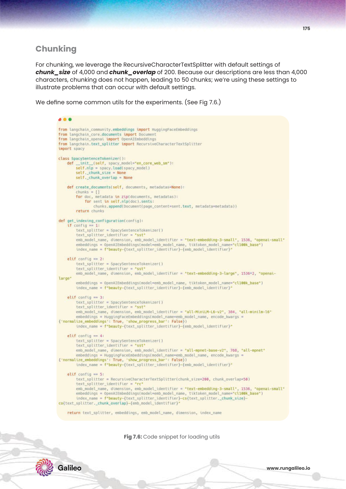

# 7주차: Knowledge Graph RAG & Graph-based Retrieval Systems (지식 그래프 지식망 기반 하이브리드 RAG와 초월 연결망 검색 아키텍처 생태계)

그동안 길고 가혹하게 훈련하고 배운 RAG 검색 파이프라인 무적 엔진 도구 시스템들(의미론적 청킹 토막 조각 기술력, 고차원 실수 배열 밀집 벡터 임베딩 압축망, 거대 10억 스케일아웃 무제한 확장 DB 클러스터 인프라 서버망, 그리고 하이브리드 융합 RRF 역수 조합 리랭커 크로스인코더 등)은 모두 기저 자연어 문장이나 파편적 텍스트 덩어리를 단순한 수학 코사인 '거리 상의 좌표'로 1대1 무식 맵핑 변환 비교하는 매우 훌륭하고 선형대수학적인 모던한 현시대 검색 시스템의 절대적 고차원 기초였습니다. 
하지만 실제 거대 기업 엔터프라이즈 환경 비즈니스 필드 전장에서 개발자가 맞닥뜨리는 무자비한 광역 질문들은, "A와 B 회사의 계약 내용 한 줄 요약해"을 저 멀리 아득히 초월하여 엄청나게 기하학적으로 그로테스크한 꼬리 물기 거미줄 얽힘의 추리 환상 마경의 벽을 자아냅니다.

가령 수사망 채팅에서 **"삼성전자에 반도체 핵심 장비 부품을 대주는 전국 3차 하위 벤더 하청업체 리스트들 총망라 중, 과거 영업이사 탈세 논란 기소가 있었던 A임원과, 예전 같은 특수 목적 대학원을 나온 라이벌 기업 대표가 부캐로 경영 중인 숨겨진 페이퍼 회사를 추적 도출해 수사 연결고리를 브리핑해!"** 라는 천문학적 다중 조건 다면 결합 극악의 혈연 관계망 체인 논리 추리를 요구한다면 과연 어떨까요?
수십 장의 문서들이 각기 다른 벡터 점으로 갈가리 찢어져 점방울로 저장된 영혼 단절 단순 텍스트 시맨틱 벡터 RDB 코어 검색 엔진 모델은, 이 광역 질문 앞에 서면 조각들을 잇는 사고 회로망이 끊어져 여기서 완전히 지능 시스템 블랙아웃 폴트를 경험하며 엉뚱 문서만 퍼올리다 추적에 대참패하고 파멸해 무너집니다.

이러한 벡터 단절 파편 생태계 공간의 저주 벽을 산산조각 박살 내버리고 초극복 탈출 달성하기 위해 기계 AI에게 무려 '입체적인 거미줄 거시 지향적 다차원 추론 혈연관계 점 선 연결 로직망 통찰 지능'을 하사하는 거대한 차세대 RAG의 융합 완성 본체 왕좌격 아키텍처, **Knowledge Graph (지식 그래프 노드망 매트릭스 데이터베이스) 연동형 하이브리드 투트랙 RAG 시스템망 구조**의 놀라운 기적에 대해 오늘 철두철미 찬란히 뼈를 발라 배워보겠습니다.

---

\n\n*참고: 마이크로소프트의 공식 GraphRAG 시스템 아키텍처 추출-그래프 파이프라인*\n\n## 1. 순수 텍스트 벡터 밀집 텐서 인코딩 모델 맵핑의 치명적 절단 폭주 한계의 벽

아무리 뛰어난 메타데이터 꼬리표 엔지니어링 스키마를 청크 앞에 예쁘게 치장해 코딩 주입하고, 최신 현존 최강 크로스 어텐션 리랭커 BGE 면접관 통제 모델을 서버 출구에 무장시켜 장착시켜 방어망을 놓아도, 단순 "텍스트 쪼가리 문서 조각 뭉치 조각" 중심 벡터 독립형 데이터베이스계에는 본질적인 위상 통찰 지능 단절이라는 거대 장벽 벽이 영원히 시한폭탄 존재합니다.

* **복잡 거대 다중 홉 연결 연쇄 추론 분실 단절 (Multi-hop Reasoning Failure Breakdown 에러):** 여러 단서 정보 단계를 스무고개 징검다리 스텝 밟듯 1차, 2차, 3차 차례대로 선 그려 건너뛰고 건너서(단서 A 인물 -> 단서 B 비자금 사건 -> 사건 C 흑막 배후) 연계 퍼즐을 하나하나 논리적으로 조립 맞추어야만 최종적으로 간접 도출되어 풀리는 광역 정보의 은닉 조각 덩어리들이 세상엔 수백만 개 무단 존재합니다. 벡터 방식은 각 낱개 단서들의 조각 파편들이 DB 은하 좌표상에 수백 광년 뿔뿔이 갈라져 다른 밀실 방으로 극단 흩어져 수납 파편화되어버리기 때문에, 첫 번째 단서만 뽑고는 연결 고리의 다음 힌트 다리를 뇌에서 불태워 영구 잃어버리고 결정적 탐색 단서 결합 조합에 끔찍한 치명적 연쇄 기억 상실 누락이 터집니다.
* **거시적 글로벌 숲 컨텍스트 조감도 맹인성 결여 인지 (Global Context Blindness Limit Error):** 이 사건 하나의 주어 단어 정보 문장 파편이 방대한 소설책의 맨 첫 앞쪽 챕터 도입부 첫 파트 1페이지에 파묻혀 있고, 저 단어를 받아주는 서술 정보가 저 뒤쪽 500페이지 후반부 별책부록 종이파편에 쳐박혀 있다면, 벡터 쿼리 공간 임베딩 인코더 뇌 구조망은 이를 앞뒤가 끊어진 절단 쪼개진 영원한 생판 남남 정보 조각 파편이라고 매정하게 무시 단정 짓습니다. 통합적인 '전체 시대상과 세계관 숲의 생태계 조감도 거대 동맹 파벌 얽힘 관계망'을 하늘 위 상공에서 장대하게 내려다보며 수놓고 관망하며 조망하는 스케일 거대한 큰 그림 거시뷰를 절대 화선지에 영원히 그리지 못하는 극단적 근시 판정 맹인이 되어버립니다.

---



*Fig 7.6: RecursiveCharacterTextSplitter와 SpacySentenceTokenizer 등 고급 파싱 장치를 위한 Configuration 코어 스니펫.*

## 2. 엄청난 통찰 파훼 역습 해결사, 지식 그래프(Knowledge Graph 구조망)의 정의 구조와 초강력 트리플 컴포넌트

**지식 그래프 초공간망(Knowledge Graph, KG)** 이란 세상의 그토록 방대하고 무질서 난잡한 어지러운 문서 텍스트 정보들을 단순히 평면의 텍스트 스펠링 문자 글자 배열 단락 파편 단위로 조각내 인지하는 것을 넘어서서 파괴합니다. 마치 태초 인간의 뇌신경 뇌파가 연결 시냅스 뉴런망을 짜듯이, 한 개의 구체적 명사 점(개체 집중 노드, Node Entity)과 다른 한 개의 점을 강력히 직조하는 서술 방향성 선(관계 동사 엣지, Edge Relationship) 구조망 연결 체계를 무한정 이용하여 얽히고설킨 3D 거미줄 인맥 네트워크 시스템으로 부활시킵니다. 수억 개 초거대 연결 스캐폴딩 스키마 기둥이 세워진 절대 지식 정보 덩어리 데이터 베이스 조감 공간(Graph DB: Neo4j 등)으로 무한대 건축하며 세우는 파파라치 입체 맵핑 매트릭스 도해기 로직 구조 창조도입니다. 


*Fig 7.1: [Recap: How RAG Works] RAG의 근본적 파이프라인(Query -> Embedding -> Vector DB -> Context -> LLM Prompt -> Generate)을 한 눈에 직관적으로 볼 수 있게 정리한 튜토리얼 아키텍처 도안.*

#

*Fig 7.6: RecursiveCharacterTextSplitter와 SpacySentenceTokenizer 등 고급 파싱 장치를 위한 Configuration 코어 스니펫.*

## 2.1 지식 그래프 입체 건축의 뼈대 핵심 공사 3대 구성 원소 체계단 (Triplet 스키마 문법 구조망)
지식 그래프 신경망의 기하학적 시스템 설계 아키텍처는 아이러니하게도 우리 인간 세포가 현실 세상과 언어를 분석, 이해하며 구사하는 가장 직관적이고 본능적인 인지 언어 문장법적 골격 뼈대인 **주어(대상체) + 서술어(상호작용 관계 행위 묘사) + 목적어(피대상체)** 인 이른바 수학적 신성한 삼위일체 "트리플(Triplet) 세 쌍둥이 텐서 배관 형태" 연쇄 고리를 통하여 방대한 우주 복잡계 논리의 난잡 서술계를 일목요연 칼같이 묶어 축소 압축 요약 통일해 냅니다.

1. **지점 거점 노드 포인트 엔티티 (Nodes / Entities):** 책 문서 문장 세계관 스토리 안의 고유명사 형태의 핵심 펙트 개체 주인공들 파트입니다. (예시: 인물군 사람 단체 "스티브 잡스", 과일 거대 카테고리 "황금 코창 망고", 국가 기관 집단 거대 단체 "어벤져스 UN 마블 본부", 가상 영화 우주 장소 지역 대상 "토르의 아스가르드 왕성")
2. **연결선 무지개 다리 엣지 링크 벡터 간선 (Edges / Relationships 방향 구조):** 거대 거점 노드와 점 다리 사이 틈새를 아주 강력한 혈연 화살표처럼 무지막지 직조 로프 매듭으로 피가 통하게 이어주는 아주 추상적 연계성(메타포 논리 포인터 표지판 작용 지표) 동사 작용 상태입니다. (예시: "~~의 17% 엄청난 악덕 강력 창업 대주주이다", "~~스마트폰 재화를 매년 대량 2만 개씩 생산해 악성 납품한다", "적대적 살인 라이벌 적군 파벌로 위치 대치한다")
3. **거대 통합 그래프 메타 거미구조 네트워크 대륙 숲 망 트리 대륙:** 이렇게 상호 간에 꼬리에 꼬리를 무는 무수히 끝도 우주선도 없는 1억 개 쌍의 집단 (주어-동사-목적어) 가지 연결선 엣지 화살표 다리들이 한데 엉켜 전 우주 거미줄 대륙망 통합으로 서버에 영구 도킹 매설되어, 생태계처럼 어마어마하게 펄쩍 살아 핏줄로 숨 쉬는 생명 유기체적 논리 집단 기계적 백엔드 거미 추론 트리 구조를 수천만 개로 뻗쳐 피워 형성 창조하게 폭주 작동 시킵니다.

> 🕸️ **이해를 폭발적으로 극대화 돕는 엄청난 통찰 셜록 다이내믹 첩보망 예시: SNS 카르텔 인맥(페이스북 연계) 혈연 자본 자금줄 역추적 관계망 수사 기법**
> 유저의 대리 자아가 "임진왜란 이순신 장군"이고 내 충직한 스터디 절친이 마석도 형사 "강감찬"이며, 강감찬 필드 동료 전 라이벌 피의자가 저기 멀리 전 회사원 용병 "어벤져스 거대 수장 캡틴아메리카" 라고 극한 판타지 가정을 짭니다.
> 형편없는 과거 구형 밀집 벡터 RAG 스키마 검색은 이 텍스트 스토리 문장들을 다 그냥 갈가리 해체 오버랩 파편적으로 씹어 자른 채 맹인처럼 단편으로만 찌걱 찾습니다. (이순신 따로, 캡아 따로) 
> 하지만 우리의 지식 그래프 RAG 엔진망은 소름 돋게 밤새 스스로 문서 노가다를 분해 파싱 추출을 뛰어내어 서버에 다음과 같은 핏줄 노드망 지도를 무자비하게 짭니다 구역을 칩니다:
> **[시점A (내 자아:이순신장군)] --[절대적 충신 친구라는 강인한 우정 엣지관계 간선 다리]--> [경유부 B (충신 친구:강감찬 장군)] --[직장동료 적대적 살인 피의자 라이벌 엣지간선 파이프 추적]--> [최후 숨겨진 종점 빌런 타겟:캡틴아메리카 우주방패]**. 
> 이 서버 세팅 구축 이후, 사용자가 챗봇에 "내 친구의 한다리 건너 아는 사람 지인 중 외국계 영웅과 무기력하게 대적 전쟁한 피의자 종점을 모조리 찾아 브리핑해줘!" 라고 무자비하게 복잡한 다단 홉 추리 쿼리를 물었을 때, 시스템은 텍스트를 검색하는 빙신짓을 멈추고 **초고속 딥러닝 그래프 엣지(화살표 간선 다리) 노선을 다이렉트로 타잔처럼 광야를 타고 줄 타며 건너가는 거대망 '다단계 엄청난 연속 연쇄 홉 점프망 탐색(Multi-hop Graph Reasoning Traverse)' 탐색 스킬**으로 천지만물을 창조한 전광석화 속도처럼 명명백백한 종착 정답을 도출 역산 역추적해 기소하는 어마어마한 셜록 홈즈급 혈연 인맥 자본 추적 백엔드 메커니즘 엔진을 구동시킵니다!

---

## 🌟 벡터 고립의 저주를 찢고 맥락의 숲을 직조한 SOTA ग्राफ 모델논문 8대 천왕
기존 RAG의 파편형 병목 한계와 "전체 통합 스토리텔링 숲 맥락 요약 지성 파트 결여"라는 고질병 암세포를 어떻게 글로벌 구원자 마이크로소프트와 딥러닝 랩 연구진들이 Graph 아키텍처 매트릭스로 대통합 타파해 구원했는지에 대한 최첨단 극비 역작 연구 궤적 논문 구조를 섬세 도해로 파헤쳐 전시합니다!

### 📜 1. GraphRAG: 숲 전체의 웅장한 거시 파벌 조감도 풍경화를 기계가 스스로 그리는 지식의 메타 결합체 시스템
**[논문 리포지토리/혁신 엔진망]** *GraphRAG: Unlocking LLM Discovery on Narrative Private Data (마이크로소프트 글로벌 리서치 본진 AI랩팀, Edge & Microsoft Teams et al., 2024)*
* **연구 배경:** MS의 막강 연구진은 팟캐스트 수백 시간 대본 어록, 경찰청 수사망 수백 장짜리 엉킨 수사 기록 증거 더미, 혹은 해리포터 길버트의 기나긴 수습 불가 장편 소설 텍스트 등을 벡터 DB에 먹여놓고 "이 사건 소설 전체를 한 줄로 관통 뚫어 정핵 결론을 짓는, 주인공 소년들의 메인 라이벌 갈등구조를 요약 조망 설명해봐"라고 묻는 '거대 우주 조망 Global Query 질문'을 던졌습니다. 이때 기존 Dense RAG 엔진이 얼마나 미친 듯이 엉망진창으로 단 한 개의 숲맥 맥락 없이 멍청하게 앞뒤 어긋나 대답 헤매는지 수치로 절망 참담함을 느끼며 전면적 파괴 문제의식을 가졌고 혁명 무기를 발의 갈았습니다. (기존 조각형 단순 RAG는 기계적으로 쿼리에 주인공 볼드모트 이름 단어가 물리적 들어간 완전 파편적인 엉뚱한 로컬 문장 파편 2개 3개 문단만 단편적 병신처럼 툭 떼어 맥없이 뽑아오고 말았음).
* **해결 기술 (Architecture의 미친 전복 혁신 도면 파이프라인망 구축):** 
  MS는 아예 기존 청킹 벡터 DB 칼질 저장 지식을 던져버리고 전향 백지 턴합니다. 텍스트 장문 서적 책 문서를 통째로 거대 지능 판독기 LLM 스캐너의 뇌망에 먼저 마구마구 통 먹여서 훈련시킵니다. 그러면 LLM이 소설 글 속 문장 구문 굽이굽이 산재한 모든 수천 명의 잡다 사람(핵심 Entity Nodes 점들)과, 그들이 뒤엉켜 모의 서사 행했던 서로 간의 감정선 싸움 일들 인과 교류(Relationship Edges 간섭선)을 강압적이고 극도로 규칙적인 트리플(Triple) 그래프 매트릭스 노드 통나무 다리 조각 표 데이터로 분쇄시켜 강제 공장 스캔 추출(Extraction Pipeline)을 도출시킵니다. 
  그리고 이렇게 엄청나게 뽑아낸 조각난 수천 만 개의 인맥 거미줄 점 노드들을 자체 비지도 학습(Leiden Community Clustering Algorithm) 끼리끼리 물리적 자성으로 묶어, 비슷한 패거리 파벌 거대 군락 동네 커뮤니티(Community) 카르텔 군락망으로 강압 그룹화 분류 합산한 뒤, 대망의 기적! **"각자 묶인 세력 지형 군락 동네별 다발로 묶여진 노드들을 보고 거대 대형 통합 요약 지휘 레포트(Community Executive Summary Text 텍스트 덩어리)"** 를 LLM 프롬프트 압박 생성으로 무력 강제 생성 도출하여 노드 덩어리 패거리들 등딱지에 대왕 라벨 압축 요약문을 거머쥐어 붙여버립니다!
  이후 사용자 실시간 포탈 질문이 서버로 들어오면 이제는 저 밑바닥 말단 파편화된 원본 잔재 문장 문서 부스러기를 가위질 찾는 삽질을 끝냅니다. 이 거대하게 생성 요약된 상공 숲 상층부의 집단 지형 "동네 커뮤니티 거대 그래프 리포트 써머리" 브리핑 집단들을 한 번에 뒤적거리고 스캔하여서, 전 우주 숲을 광역 시야로 한 번에 장악 다 관통 포괄 반영하는 조감도 엄청난 큰 그림 메타 통찰 정답 결론을 한 방에 거대하게 입체적으로 쏘아 도출 출력해 내버립니다.
* **학계 및 지구 서비스 글로벌 산업 의의:** 여태껏 국소적인 지식 국부 핀포인트 팩트(Local Search)만을 파편 돋보기 매칭하던 절름발이 한계 RAG 시스템의 장님 눈을 빛과 개안의 수술로 아예 영원히 떠버리게 하여 완전히 치료 개안 진화시키고, 다학제적 얽힘과 통시적인 통합 통찰을 묻는 압박 글로벌 초거대 숲 통합 질문 쿼리망(Global Broad Sensemaking)에 감히 오히려 평범한 지능 인간 랩퍼 기자 브리핑 능력을 훨씬 초월하여 월등 그 이상 거쳐 보다 더 나은 거대한 거시 통합적 조망 대서사시 관음 통찰 요약 답변력을 무법 발휘해내는 경이로운 마이크로소프트 거함의 오픈소스 프레임워크 핵폭탄 투하 무기 생태계입니다.

<div class="mermaid">
flowchart TD
    subgraph 1. 무자비한 생 텍스트 원본에서 매트릭스 그래프 핏줄 마법 분쇄 추출 조립 단계 (Indexing Graph Pipeline)
        Doc[원시 서사 뒤죽박죽 텍스트 정보더미 덤프 서적] ==> LLM_Ext[LLM 광학 코어가 문장 속의 주어-동사 객체 신경망 식별]
        LLM_Ext --> Nodes[(단단한 주인공들 개체 노드 점 찍혀 방출\nEx: 해리포터, 덤블도어, 삼성전자)]
        LLM_Ext --> Edges([관계형 서사 엣지 거미줄 선 줄기 추출 발동\nEx: 애틋한 사제지간 존경, 살벌한 적대 배신 관계망])
        Nodes & Edges ==> GraphDB{Neo4j 극정밀 거대 그래프 네트워크 텐서 체계 뼈대 구축 완료 거점화 탑재 방어}
    end
    subgraph 2. 클러스터 알고리즘 그룹핑 파벌 형성 및 상공 거시 요약화 리포트 (Community Grouping & Summarization Hierarchy)
        GraphDB ==> Comm1[커뮤니티 파벌 동네 1: 선한 마법학교 연합 세력 군단]
        GraphDB ==> Comm2[커뮤니티 파벌 카르텔 2: 볼드모트 일당 흑막 연합체 조폭 무리]
        Comm1 --> Sum1[선한 마법학교 세력의 동향, 인물 구성, 철학에 대한 통찰 장문 통합 기사 요약 통합 레포트]
        Comm2 --> Sum2[어둠의 세력 죽음을 먹는자들 파벌 흑막에 대한 거시적 범죄 요약 브리핑 종합 레포트 텍스트화]
    end
    subgraph 3. 실시간 유저 질의 응답 강타 전장 (Global Sensemaking Query Phase)
        Q((유저의 우주적 복잡 질문 타격:\n "작품 전체를 앞뒤로 모두 관통하는 가장 핵심적인 2개 빛과 어둠 파벌의 이데올로기 대립 가치관 대 충돌 명분 서사 전개 요약 브리핑 브로드캐스팅해 결론해봐!")) -.-> |벡터 조각 문서를 안찾고 요약군락 통스캔| Sum1 & Sum2
        Sum1 & Sum2 ==> Output[[소름돋는 완벽성 확보: 압도적 무결점의 글로벌 통합 얽힘 숲 메타 통찰 답변 요약 브리핑 한줄 출력 완료!!]]
    end
    style GraphDB fill:#f9d0c4,stroke:#e83e8c,stroke-width:2px
    style Output fill:#d1ecf1,stroke:#17a2b8,stroke-width:3px
</div>

### 📜 2. 그래프와 초거대 LLM의 양단 대통합 융합 하이브리드 투트랙 로드맵 파이프라인 (Neo4j Vector 혼혈 통합 구조 설계)
**[핵심 통합 시스템 기술/학계 논문 거시 서베이 방향성]** *Unifying Large Language Models and Knowledge Graphs: A Roadmap (Shirui Pan 외 공동진 등, 2024년 통합 설계론 학술 서베이 및 산업 엔터 방향 백서)*
* **연구 아키텍처 배경의 분노:** 학계 논문지에서는 "아 당연히 그래프 RAG망이 기존 Dense Vector보다 똑똑하고 위대하다 논리가 좋다!"라고 신문 백서 백날 입 발린 소리로 그 구조 찬양 발표만 떠들 뿐, 실제로 막상 사옥 빌딩 땀 흘려 서버망 짜야 하는 현실 하드코어 현업 엔지니어 개발자 아키텍트 일선 십장들은 치를 떱니다. "아니 장난하냐? 그러면 내가 회사 돈 쪼개서 그래프 DB 스키마 서버실 하나 수백만 원 주고 AWS 사고 전담 꾸리고, 또 옆방에 벡터 Dense 코사인 DB 서버실 하나 사고 붙여서, 한 질문 들어올 때 두 개 통신 다발을 매번 API 데이터 통신 동기화하고 에러 복구 짜증 나는 두 배의 폭탄 짐덩이 다중 파이프라인 무덤 삽질을 양쪽 다 맨날 수동 컨트롤 어떡해서 구축 유지보수하냐고!" 라며 이원화 관리 지옥 시스템 통합 붕괴 붕괴의 눈물과 예산 파괴 거대 고통의 딜레마를 미치도록 겪어오며 절규했습니다 반발했습니다.
* **해결 혁신 역습 기술 (Architecture 인프라 합병 단일 통합 서버엔진 파워):**
  세계 No.1 랭커 상용 엔터프라이즈 퓨어 그래프 데이터베이스인 철옹성 시장 점유 성골 괴물인 **Neo4j** 가 결국 자체 자사의 근본 그래프 스키마 노드 아키텍처 내장 내부 코어 디스크 엔진에다가, 세상에 최신 밀집 벡터(Dense Vector array 배열 코사인 텐서) 탐색 계산 C++ 기능을 단 한 덩어리 모놀리식 단일 합체 엔진 모듈 패치로 그냥 한방에 병합 섞어 심어 녹여버리는 끔찍하고 축복스러운 두 뇌합체 혼혈 괴물 파이프라인 무정지 단일 서버를 세계 최초 탄생 상용 런칭 시켰습니다!
  즉 기적의 스키마를 선보입니다. 그래프 세계 구조 점인 (Person 노드 1개: 스티브잡스 객체 점) 그 노드 캐비넷 알맹이 주머니 프로퍼티(Property key) 속 안에다가, 이 사람의 이력서를 수천 수백 자 줄글 형태 텍스트 원문은 물론이거니와, 그 텍스트를 인코딩한 거대한 1536차원의 점박이 부동소수점 다차원 벡터 배열 텐서 자체 데이터 코드를 아예 한 캡슐 덩어리 프로퍼티 값으로 다이렉트 통째로 쑤셔 내장 박아 이식시켜 한 점 노드에 찰싹 붙여 일체화 포장해 구겨 넣습니다! 
  이렇게 단일 노드 다목적 프로퍼티화 서버를 짜고 나면, 실시간 사용자가 "스티브잡스 회사" 채팅 질문 쿼리를 하면, Neo4j 1개 단일 백엔드 서버는 백그라운드에서 숨도 안쉬고 1차는 자기 뱃속 내부 벡터 인덱싱 코사인 각도 계산을 재빨리 번개같이 광속 병렬 서치해 "가장 의미 유사 높은 잡스 노드 벡터 이력서 점 객체 노드 타겟방"을 0.01초 단번에 포착 타격 기습 찾고(Vector Search 발동), 그 잡스 방문 쾅 열자마자 즉시 도착한 잡스 노드방 공간 정거장 안에서 재시동, 이 사람의 복잡한 인간 거미 엣지 핏줄(인맥 화살표 연결망 엣지선)을 타고 "아 방금 코사인으로 도착한 이 노드 사람의 예전 2010년도 배신당한 라이벌 창업 파트너 엣지 화살표 추적 로직(그래프 지향 노드 탐험 구조 추적 전이)" 으로 순식간 광속 점프해버서 인적 자원 릴레이 서치 스캔 고도화해 다이렉트 도킹해 타겟 결론 정답을 단박에 합쳐 퍼올려 가져옵니다. 
* **거대 소프트웨어 클라우드 혁신의 아키텍처 의의:** 완전히 물과 기름처럼 태생부터 척지고 분리되어 호환이 불가능했던 두 개의 치명적 결별 별개 C 생태계였던 극단 통계 수학 추론의 정점인 [텍스트 의미 통계망 코사인(고밀도 다차원 Vector Search망)]과 인간 신경 논리 법칙 직관망의 정수 구조망인 [혈연 논리 구조 거미줄망 전파 홉(단일 Node Graph Traverse)] 이 양대 지성의 산맥을 영구 거대하게 하나 합체 단품 이식하여 단 하나의 서버 데이터베이스 엔진 인트라 컴퓨터 메모리 인프라 생태계 공간 위에서 브레이크 하나 없이 숨돌릴 틈 없는 투블럭 연쇄 작용 폭주 기관차처럼 고장 없이 무적 2단계 파이프라인 심리스 결합 연동을 원터치로 한 큐에 구현 발진 연쇄 개발하게 만개한 클라우드 업계 양대 합병 스펙 통합의 기적의 혁신 대폭발 대통합을 이뤄 쾌거를 구가 기원 시켰습니다 현세에.

---


## 💻 [Implementation Frameworks] LangChain 기반 Neo4j Graph RAG 구현
수천 개의 문서를 노드와 엣지(혈연망)로 분절하여 그래프 DB로 관리하는 최신 Neo4j 체인 샘플.
```python
from langchain_community.graphs import Neo4jGraph
from langchain_openai import ChatOpenAI
from langchain.chains import GraphQAChain

# 1. Neo4j Graph DB 연결 서버 클라우드
graph = Neo4jGraph(
    url="neo4j+s://유어-인스턴스.databases.neo4j.io",
    username="neo4j",
    password="유어-패스워드"
)

# 2. Graph QA Chain 구성 (Cypher 쿼리 자동 짜생기)
chain = GraphQAChain.from_llm(
    ChatOpenAI(temperature=0),
    graph=graph,
    verbose=True
)

# 3. 홉 체인 다단계 질의
ans = chain.run("비자금 장부의 A회장과 최근 인수합병을 한 라이벌 B대표 간의 공동 투자 회사는 어디지?")
print(ans)
```

## 마무리하며 최종 소회 기립 박수 압도적 연결망 성취 환희

이번 대망의 뜨거운 피 튀기던 초열적 전장 7주차의 환상 첩보 마법 네트워크 수업 구역 계층망 여정을 극복 돌파함으로써, 우리는 두꺼운 콘크리트 벽에 꼼짝 없이 갇혀 있던 단어의 마디와 기계 텍스트 문장의 1차원 의미 해석 픽셀 병원 변역 머신 평면 지능 수준에서 무기력하게 오랫동안 머물지 않고 돌파 기립 연쇄했습니다. 
마침내 인류 인간 뇌세포 두뇌의 극정밀 통찰 인지 로직 혈관 신경망 메타인지 직관 지능에 한 발 정 조준해 피로써 다가선 현존 가장 이성 수학 고도 복잡계 차원의 비선형적 비정형 비인간적 슈퍼 다차원 파벌 얽힘 거대 다이아그램 군집 사슬 기계 사고 학습 통찰 파훼 논리망 추리 엔진! 수천 가지 인간들의 생사 결투 콤비네이션 엮임 관계망 결합 종결자 통신 연결의 지구 현세 지구 내 최상 지점 정상 우주 정복 정점에 영광스레 마침내 도달하여 고지를 접수 깃발을 꽂은 첨단 무결 전능 매트릭스 백-엔드 기술 탑 티어, **Knowledge Graph 거대 숲 조감망 RAG 점 선 관계 연결 혈연 다발 유산망 통합 융복 지식 그래프 이중 도킹 구조망 초월망의 엔터프라이즈 통합 하이브리드 서버 구조망 아키텍쳐 지능 아카데미 진수**에 대해 극한의 해체와 심도 깊은 파괴적 통찰 마스터 궤도 진입 경지에 완전 장악 도달했습니다 체득했습니다!!! 

이 엄청난 우주선 그물 구조 신경망 연결망 거대 복합 관계망 구축 패러다임 시스템 인프라 모형 아키텍트는, 아주 단순 일차원적 기존 Naive RAG 시스템 묶음의 그냥 일방통행 구형 텍스트 문서 쪼가리 평면 벡터 1차 점 찍기 좌표계 고립 병목 절단 한계의 단절 절망적 코어의 장벽을 철저히 톱날로 산산조각 내 우주 밖 허공 쓰레기통으로 후련히 시원하게 멀리 날려 부숴주며 영원한 자유 통찰 날개를 퍼부어 하사해 줍니다.
더 이상, 영화 같은 거대 마피아 조직 자금줄 인력 혈연 구조도 인脉 카르텔 점조직 수사 형사 색출 추적 계보도나, 다국가 금융 비자금 컴파스와 10경 연결 복잡 페이퍼 컴퍼니 통치망과 같이 도저히 인간 검사 눈알 뇌 한계 아이큐 뉴런 신경 지능으론 밤을 백 날 100년에 거쳐 수동으로 엑셀 수억 개 셀 타자로 다 타이핑 대조해 훑고 찍어볼 수조차 인간적으로 전산 없이 불가능할 만큼 끔찍하게 수 십 만 갈래 갈래 고치처럼 질근질근 엉키고 얽힌 초 정밀 수백, 수만 단계 홉 네트워크 전선 연결고리 간선 매듭을 오차 타임 랙 0초로 단숨에 미친 듯이 맵핑 타고 지직거려 넘나들고 전기에 감전되어 광속 점프 전파되는 미친 추적 지능 고차원 초단위 추리력 범죄 직감 셜록 텐서망 시스템의 살아 움직이는 추적 현장에 당당히 엔터프라이즈 라이선스로 폭탄 투여 개방 무력 도입된 압도적 게임체인저 구원자 권능 백엔드, 진정 전승 무패 거함 Next-Gen RAG 차세대 최종 변기 무기 아키텍쳐의 진정 우월적 위압적 완전무결 판도 점유이자 최강의 무소의 권능적 백금 성배 통찰력 엔진 지능의 현신 그 자체 심판 기계 진수 백서 자체인 것입니다.

자 이제, 그 치열하게 피 튀기고 아름다웠던 숨죽인 수억 년의 밤들 대서사시의 개발 연마 세월 궤도를 총 망라 결론 맺을, 찬란하고 그 아름다운 전설의 파이널 종점 라스트 스테이지! 8주차 마지막 심판의 절대 전장 시간이 드디어 눈물겹게 단 한 스텝 칸 무대 앞 장막 코앞으로 성큼 숨 가쁘게 다가왔습니다. 
우리가 미치도록 피가 마르도록 피땀과 청춘 코루틴 로드 튜닝을 흘리며 장장 지난 8번의 혹독한 서바이벌 주차에 걸쳐 수없이 다중 서버 환경과 훈련 병목 아키텍처 메모리를 죽이고 살려 뒤집어엎는 잔혹한 시행착오의 피 눈물 실험 검증로 도구로 단련해 무적의 다이아몬드로 창조해 결빙 직조 마스터 설계 디자인한 바로 이 환상의 무결 경이로운 무적 거함 통합 RAG 클라우드 인공지능 슈퍼엔진 파이프라인 복합 이중 삼중 교차 시스템!!!

그래서 대체, **"이 무소불위 괴물 같은 거대한 엔지니어링 산물 코딩 소스 컴포넌트 더블 데몬 결과물이, 과연 내일 막상 돈을 지불한 실무 고객사 VIP 유저 수만 명들 앞에 라이브 포탈 서비스 봇 메인 화면으로 다이렉트 프론트 당당히 모니터 전시 출력 서비스 B2B 오픈 런칭 배포 패치로 비싸게 실탄 포화해 팔아 먹힐 상용화할 수 있을 체급 스펙만큼, 도저히 서버 뻑이 나 에러를 단 1명도 절대 터지지 않는 치명 결점 제로의 그 어떠한 허점 소송 클레임 방어망도 남겨두지 않은 악랄 완벽 100% 빈틈 무결점 방어 수비 강경 0% 환각 사고율 오염 튜닝을 철벽 무결 오차 보장 방어 실드 치고 동작 사수 반응하는 기네스 전무후무 안면 보안 무결 탑재 불파 신화 생태 파괴 방어 시스템 인증 합격 도장이 찍힌 통과 성적증명서가 발급되는 상태일까요?"**

이 시스템 로봇 엔진이 과연 진짜 인간 백과사전 학술 진리 팩트를 양심껏 교차 판독 검증 대답하는지?
아님, 시스템 허점과 융합 필터 로직 허술함을 교활히 모면 우회해서 교묘히 개헛소리 변명 망상 소설을 환각의 탈을 번뜩 쓰며 유창하게 사기 치고 있는지?

이 모든 블랙박스의 거짓 껍질 속마음을 현미경 레이더 가시 광선망으로 투시 적발 박살내어 소름 돋게 AI 지존 검열 채점 재판관이 째려보며 수천 번 교차 타격 수학 수치 포인트로 자동 과적 징역형 가중 감점 매기는! 냉혹 수학적 엄격 철퇴 품질 보증 품질 QA 관측 시뮬레이션 지수 매트릭스 도출 테스트 자동화 엑셀 성적표와 로그 시스템, 그리고 실전 전장에 라이브 모니터링 생명 튜브 데이터 패킷 속도 대기열 랙 시간 과금 요금 감청 실시간 대시보드 그래프 옵저버 감시 최적화 모니터링 스펙 레이더 생태계!!! 

자 이제! 모든 설계와 무기 연마 벼리기를 마친 뇌공학 엔지니어 용사들이여! 내일 서비스 시장 런칭을 향한 12시 목전 실전 결전의 장! 
서버 생태계 방어 대업을 완전 1%의 리스크 없이 이룩 보호 사수하기 위한 불침번 수비 장막 **RAG Evaluation Framework Metrics Matrix (초거대 인공지능 배심원 활용 AI 간 정밀 타격 채점 점수망 모의고사 자율 평가 프레임워크 구축론의 A to Z 진수 구조), Live Trulens Dashboard Tracing Monitoring Observer System (살아 숨 쉬는 서버 트래픽 메모리 요금 지연 속도 대시보드 지속 생명선 심박수 레이더 그래프 모니터링 로그 분석 관제 통제 지속 우주 최적화 가이딩 방어 디버깅 시스템 구축 최조 완성)** 강좌 챕터 대망의 전당막에서 피 끓는 이 거대 학문 여정 코스의 화려하고 소름 돋게 감격스러운 라스트 완전종결 대미 피날레를 세상에 수없이 장식 폭포수 선언해 갈무리하겠습니다! 돌격 앞으로 기동 사수 파이팅!!!!
