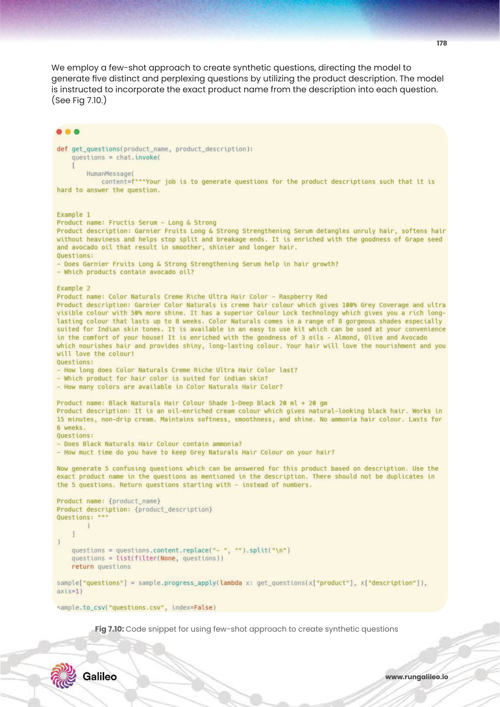
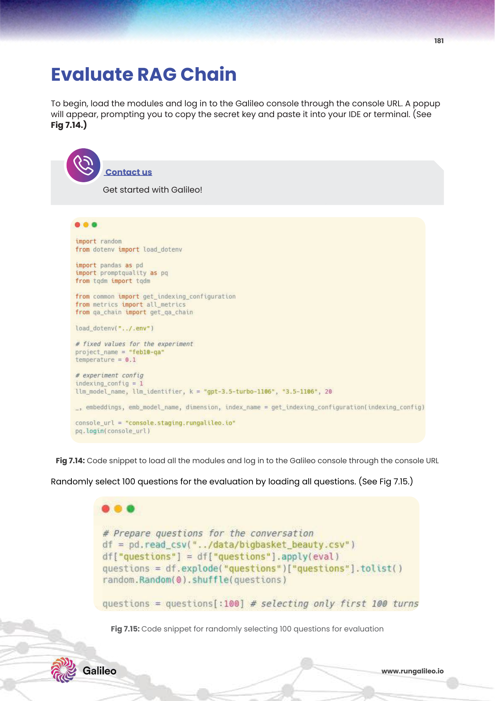

# 8주차: RAG Evaluation, Monitoring & Optimization (RAG 시스템 평가 제어 체계 아키텍처 구축, 런타임 모니터링 및 선순환 최적화 플라이휠)

숨 막혔던 대장정 스터디 교육 코스의 장엄한 마지막 관문 종착역 전당에 오신 것을 무한한 경의로 열렬하게 환영 축하합니다!
지금까지 치열하게 달려온 여정 7주차 과정의 전 시간 내내 우리는 무에서 유를 창조하며, RAG 기본 거시 설계 시스템 건축을 파고 구상하고(아키텍처 인지학), 난해한 다량 문서를 마이크로 단위 조각으로 현미경처럼 분쇄해내 파편화하고(문서 청킹술), 영혼을 발라 수치 좌표화하여 컴퓨터의 마음에 무한 보관 텔레포트하고(초고차원 임베딩 차원 변환 수식과 무결점 검색 초고속 Vector DB 맵핑 트랜잭션), 투망에 잡은 쓰레기 문서 노이즈 필터를 용서 없이 걸러버려 면접으로 재조립 재정렬해 천재적 검증 무기를 장착하고(크로스 인코더 하이브리드 리랭커 엔진 모형망), 그물처럼 이어진 얽히고설킨 마성의 관계 초월 대륙 통찰망으로 소름 돋게 전우주를 깊게 파고들며 포옹하는(Knowledge Graph GraphRAG 인체망 뉴런) 이 세상에 현존하는 첨단 인공지능 엔터프라이즈의 거대한 성벽 모든 구축 설계 스택 조립 공학론 코어를 철저하고도 혹독하게 학습 숙달 섭렵했습니다. 

하지만 아무리 내부 부품이 눈부시게 현란해도 그건 당신 엔지니어 홀로의 착각일 뿐입니다, 현존하는 치열한 무한 경쟁 시장 전쟁터 프로덕션 현장에서 "저희 RAG 앱 서비스 솔루션 검색 백과 엔진 제품이 이제 완벽하게 버그 오류 없이 결함 0%로 안정성 완성되었습니다"하고 기업 최고위층이나 전 세계 고객사들 일반인 환경 오픈 무대에 대대적 런칭 상용 서비스 유료 제공 마이크로폰 대고 어필 내놓기 위해서는, 피도 눈물도 없는 무섭도록 냉랭하고 싸늘한 객관적 잣대 평가 심판 수치 "수학적 데이터 무결성 정규 성능 품질 심의 성적표(평가 매트릭스 도장)"가 만천하에 투명한 절대 권위 선제 의무 무기 통과 조건 방패 문서로 작용해야만 무사할 수 있습니다. 

8주차 대미 강좌 대단원에서는 오로지 휴먼 에러, 즉 개발자만의 아집과 주관적인 뿌듯한 감정적 "느낌, 직감, 촉"을 철저히 단두대로 도려내 배제시키고, 완전무결 기하학적 통계 점수 수치 연산식과, 무서울만치 똑똑한 AI 스스로를 다시 옥죄어버려 채찍 검열관 심판관으로 이원화 강제 고용 토대로 수만 수십만 개의 대화 RAG 답변 쿼리 쌍들을 아주 싸늘하고 냉정하게 자동화 테스트 배치 수치화 점수 매겨버려 타격하는 엄청난 체계적 자동 QA 심리 전술 평가 평가 계측 모형 스캐폴드 프레임워크 툴킷 생태계론, **RAG Evaluation Metric Framework(RAGAS, ARES, TruLens 등 SOTA 평가 방법론)** 과 프로덕션 이후의 사후 라이브 **서버 상태 헬스 모니터링 관제 시스템 감시망, 사용자 피드백 운영 지속 튜닝 최적화 피드백 루프 서클망**의 모든 본좌급 노하우 전모를 마지막으로 남김없이 심층 해부 추출해 보겠습니다. 자 마지막 종소리 스퍼트에 돌입합시다!

---

## 1. 개방형 RAG 인공지능 답변 모델 결과물은 도대체 어떻게 심판, 채점 매겨 검증하는 절차를 거치는가? (평가 채점 방식 난제의 모순과 고뇌)

본디 고전 기계학습 모델링이나 딥러닝 비전 분류 이미지 회귀 모델 튜닝 AI 분석들의 테스트 성적 산출 채점표 도식은 사실 유치원생 체킹만큼 채점이 너무나도 심플 단일화되고 이진법 명확 그 자체 선상이었습니다. 
강아지 사진 조각을 무작위 화면에 픽셀 던져주고 기계 모형이 이건 백 퍼센트 "강아지 개과동물입니다" 라고 올바르게 레이블로 대답 매칭 연산 적중하면 깔끔하게 1점 만점(정답), 고양이 표범류라고 오답 판정하면 냉혹하게 0점(오답 패스). 이렇게 인간이 라벨링한 데이터 정답 텍스트와 기계 아웃풋이 한 글자라도 틀린지 아닌지를 통해 정확한 숫자 수치의 Loss 율 오차 계산 수렴, "고정형 절대정답률 정확도 평가 지표(Accuracy, F1-Score)" 로 돌리면 수만 장 방대 건 1초 만에 테스트 채점 기계 스캐닝이 자동 종결 마감됩니다.

하지만 작금의 RAG 파이프라인 생성형 엔진이 대답 산출 구성을 토해내는 서술형 결과 텐서는 수학이 아닙니다. 정답이 딱 떨어지는 객관식이 없는 "유려한 산문형, 광활한 오픈 도어 형태 다단 논술 주관식 열린 작문 답변 텍스트 창작"의 형태 속성을 전면으로 무장 띄고 있기 때문에, 컴퓨터 시스템 엔지니어들이 이것의 정확도와 품질을 코드 한두 줄 테스트식으로 산정 채점 검사하기가 아예 가장 고통스럽고 까다롭습니다. 
똑같은 팩트의 맥락 정답 내용을 기계가 답변 문장 어투를 조금 화려하게 다르게 길게 변형 비틀거나, 조사형을 꼬아 서술하면 이는 어긋난 오답 처리일까요? 만약 까다로운 사용자가 절실히 원하는 핵심 팩트 정답 명제가 문맥 안에 딱 눈에 띄게 한 줄 두 문장 확실하게 은연중 포함 들어가 있기는 무조건 들어갔건만, 동시에 아뿔싸 나머지 앞뒤 여백 공간으로 세 문장 다섯 문장이나 관련도 없는 되지도 않는 허황된 구라성 환각(가짜 뉴스 잡소리, Hallucinations)을 쓸데없이 조잘조잘 줄줄 엮어 붙여놓으며 같이 끼워넣은 채 문장을 생산 파멸시켰다면 100점 만점에 과연 이 봇에게 몇 점의 부분 감점을 판사처럼 내려 매겨 타격해야 시스템을 정의할까요? 

수만 개의 테스트 파일 질의응답 창작 세트 모의고사 질문지 답변 건들을 인간 품질 평가자 인부 노가다 수백 명을 공장에 돈과 시간을 들여 고용해서 일일이 눈알이 빠지도록 읽어보고 형광펜으로 채점표 매점 수수방관할 수는 없는 엄청난 리소스 출혈과 무리한 시대적 파행 노릇의 경제 결손입니다!

**혁명적 전환의 해답 해결책 묘안 코어: AI 판사가 범죄자 AI 피고인을 직접 심문, 취조 재판하는 맞불작전 채점 시스템을 도입하라! 강한 힘을 강한 힘 규제로 치환해라!** (이 기법을 학술 용어론 **LLM-as-a-Judge (초거대 인공지능을 엄중한 교차 재판관 판사 배심원단으로 활용 평가하기 채점 매트릭스 채택)** 전략이라고 전세계를 아우러 일컫습니다) 매우 강력하고 엄청난 권위의 냉정한 절대 프롬프트 규칙 세팅 규약을 먹여둔 (GPT-4 같이 아예 지능 이해 파워 원탑이 최고로 높은 SOTA 1군 판별관) LLM 검사 모델에게 전권과 판사봉을 전부 위탁 채점 하달 명령을 전가 내려버리고, 네가 너희들의 동족 하등 LLM이 쓴 하급 RAG 앱 출력물 응답 결과 텍스트를 보고 객관 주관 항목별로 잔혹하게 심판해 조목조목 수치 퍼센트 환산 비판 레포트 점수 지표를 때려서 엑셀 점수 그래프로 그려 오라고 기계 감사원 프롬프트 압박 채점망을 통제 개발 구축하는 메커니즘 학문 분야입니다.

---

## 2. RAGAS (RAG Assessment Frame) 글로벌 지표 프레임워크 뼈대 기반 황금 3요소 측정 지표 메트릭 삼각축

최근 폭발하는 LLM 오픈소스 개발망 가장 파괴적 혁명적으로 오픈 생태계 업계 전역 표준 널리 글로벌 글로벌 스탠다드 교과서급 지위로 무조건 장악 채택되어 압도적으로 대중 상용 사용하는 대표적 SOTA 통합 자동 평가 모형 벤치마크 산출 매트릭스 프레임워크 툴킷 라이브러리의 당당한 이름이 바로 영광스러운 이름 **RAGAS (RAG Assessment 래그어세스먼트)** 입니다. 
RAGAS 학술 시스템 평가 설계 방식은 모호할 수 있는 텍스트 평가 기준의 채점 기준표 항목 차원의 틀을 뭉뚱그려 총점이 아니라 아주 철갑같이 견고하게 쪼개 크게 세밀한 개별적 3개의 컴포넌트 독립 기능 도메인 삼각형의 평가 점수 축 레이더망 매트릭스로 분리 구조를 각기 나누어 매우 과학적 메스 수술급으로 구분 평가 절단하여 도출합니다, 그리고 이를 각각 0.0 에서 1.0 (100점 만점) 백분위 연속형 점수 지표 스코어로 산산이 뽑아내 해부 수치를 뱉어줍니다. 데이터 아키텍트 실무자가 이 3가지 랭크 수치 원인 분석의 맥만 짚어 뽑을 줄 깨우치고 알면 오류 해결의 즉결 원인을 감지 격파함에 있어 감히 디버깅의 신 지저스 통찰권의 품격이 수직으로 폭발 상승합니다.

*Fig 7.10: 시스템 응답을 분해하여 다면적으로 해체 분석하여 RAGAS 시스템 삼각형 컴포넌트 평가 측정 점수 지표 프레임워크 레이더망 대시보드 상관관계. 3가지 항목이 파트별 원인을 적나라하게 나타내는 모식도 도해판.*

### 삼각축 1 (수색 타겟망 품질): Context Precision & Recall (문맥 검색 밀도 타겟 등수 정밀성 요인 - 검색 리트리버 리랭커 임베딩 엔진 성능 품질 순도)
생성을 담당하는 말하기 능력기(LLM) 쪽의 탓과 잘잘못은 철저히 뒤로 빼버려 논외로 차치 덮어두고, 우선적으로 시스템 백본의 코어! 즉, 당신이 그동안 자랑스레 구축해 놓은 파이프라인 1차 전초기지 임베딩 엔진 동체와 리랭커 망의 검색능력 자체가 썩었는지 안 썩었는지, 최고의 탐지견 성능 탑재가 되었는지 백분위 수치 최적 성능을 들이대 까발리는 검진입니다. 
당신의 앱 RAG 검색기가 질문을 듣고 온 벡터 바다를 뒤져서 뽑아 올려 토해낸 이 Top-K개의 수십 문장 조각 꾸러미 단락 문서 뭉치들이 얼마나 가짜 찌꺼기 없는 온전한 알짜배기 영양 만점의 "정답 스나이퍼 신호(Signal) 단서 문서"만 빽빽하게 배출 데려왔고, 쓸모도 가치도 쓰레기인 노이즈 쓰레기 단어 문서를 얼마나 최소한으로 배제 커트해서 정제된 선별 문서의 정수를 데려왔는지를 채점 평가합니다.
* 😢 **시스템 개판 폭망 절망 질 나쁜 수치 사례 현상**: 쿼리 정답 추리가 반드시 은닉 담긴 "핵심 보물 패스포트 한 단락 원석"을 찾기 위해, 쓰레기 정보에 가까운 문서 10페이지짜리 가짜 유사도 껍데기 청크 패키지 15개를 죄다 가져다 프롬프트 입력창 목에 잔뜩 욱여넣어 바치면서 쓸데없는 부하를 맥이고 가뜩이나 모자란 LLM 토큰 컨텍스트 창 목통을 호흡 곤란으로 질식 막히게 콱 멘 메워버린 한심한 답답 상황 (이 경우 Context Precision 연산 점수 0점대로 나락 폭락하여 알람이 울려 퍼집니다). -> 당장 엔지니어는 LLM 프롬프트를 교체해 만질 생각 말고, 시급히 앞단 프로세스로 돌아가 1차 임베딩 모델 체계 차원을 수정 교환 스위칭하거나 파인튜닝, 리랭커 점수 랭킹엔진 재설계 모듈 청킹 재공사 최적화가 숨 넘어갈 듯 발등 불 튜닝이 초시급하다는 경보 진단이 바로 내려집니다!

### 삼각축 2 (순수 조작 저항망 충실도): Faithfulness (사실 기인 충실성 신뢰 한계 평가 - 지독한 대국민 사기 참사 할루시네이션 탐지 및 원천 조작 차단 방어 억제도 파동)
가장 기업 비즈니스 보안 서비스 런칭에서 목숨을 걸고 사수해야 할 가장 핵심적인 환각 병폐 방어 패널티 치명 점수입니다. 생성된 모든 단어 주장의 조합 명제 문장들과 단언 대답 증거 정보가, 외부 검색망에서 실제로 구해온 **'사전에 제공 전달 급여된 문맥(Context DB 리스트)'** 내부에 적혀 박혀있는 오리지날 사실 팩트 글귀 정보의 진실 영역 테두리 한계의 제한 범위를 감히 단 한 뼘 조차도 오만하게 뇌피셜로 상상 무단 침범, 자가 복제 탈조 뇌내 망상 조작 왜곡 허구 창작을 추가하지는 않았는지를 가혹하게 한 문장씩 도려내 분해 역추적으로 채점 증명합니다.
* 😢 **충격적인 소설 창작 질 나쁜 수치 사례 현상**: 제공되어 띄워준 레퍼런스 문서 내부에는명백히 글자로 ["이 회사 복지 직원 아침 아메리카노 모닝 커피는 하루 무조건 정확히 1잔 무료 제공 복지 제한"] 이라고 팩트 규제가 명시되 적혀 있는데도 불구하고, 감히 LLM 모델이 자체 미친 과대 흥분 친절도 오버를 떨며 억지로 과장 문장을 지어내어 창작 포장하며 ["저희 회사 자랑스러운 복지는 전직원 아침 출근 최고급 샌드위치 조식 뷔페 룸세비팅과 프리미엄 스페셜티 아메리카노 커피는 매일 매시간 시간대 불문 영구 무한 리필 무제한 무료 통과라는 파격 복지 혜택 기지 입니다!"] 라고 한없이 허풍을 부풀려 사기 구라성 악질 뻥튀기 텍스트를 막 생성해 냈고 유저가 이를 보았다면? 즉각 현미경에 검출 적발되어 판사 AI가 신뢰성 거짓말 허위 판정을 쳐서 바로 서비스 중단 급 치명적인 페이스풀니스(Faithfulness/사실부합 한계 준수성) 점수 패널티 대폭탄 사형 선고를 때려 맞아 스코어가 휴지 조각이 됩니다. LLM 프롬프트에 입마개를 강제 수갑 채우는 프롬프트 튜닝이나 창의적 Temperature 값을 0 수렴 제어 조절이 긴급히 투입되는 경고 신호 처방전입니다.

### 삼각축 3 (해답 과녁 타겟망 명중률): Answer Relevance (답변 의도 적중성 관련성 - 최종 생성 프롬프트 동문서답 회피 최적 질 정제 출력 품질)
이번엔 검색이 잘 되고 팩트 범위를 잘 지켰어도 생기는 마지막 출구 화법의 문제입니다. 데이터를 뒤로 잠시 차치하고, 어쨌거나 LLM이 대화에서 인간 사용자가 진짜로 묻고자 했던 숨은 쿼리의 속마음 질문 본질의 정확한 논지가 과연 무엇인가 타겟 의도를 문맥 파악 명확히 정중하게 포위 파악, 간파하여 **어수선한 사족 헛소리 방언과 시간 끄는 불필요한 동문서답 변사 횡설수설 설명충 버릇을 완벽히 피하고 깔끔하게 과녁 한가운데 정곡을 찌르는 오직 핵심 팩트 대답 핵심 결론만 군더더기 없이 간결하고 신속히 날카롭게 찔러 제공 정돈**했는가의 센스와 요약 압축 요약 답변력을 평가합니다.
* 😢 **짜증 폭발 질 나쁜 수치 사례 횡설수설 현상**: 사용자가 다급하게 "제출 마감 인사팀 2024 부서 샌드위치 연휴 특별 휴가 전산 접수 양식 신청서 결재 업로드 포털 정책 위치 URL 링크창만 지금 빨리 당장 알려줘" 라고 단답형 요구 질문을 쏘아붙였는데, LLM이 -> "저명하신 질문 감사합니다! 아 휴가를 가시는군요 축하드립니다 휴식은 생명! 덧붙이자면 저희 회사는 작년부터 여름 휴가를 적극 권장 장려하는 훌륭한 휴머니즘 문화 정책 풍토 복지 문화를 매우 적극 권장 시행 좋아하며 지니고 있습니다. 무더운 여름 햇살 아래 직원분 한 분의 가족의 안녕과 휴식 쉼표의 소중한 명상의 공기 행복은 회사의 매우 지대한 생산성 결합 근간 사료 가치 중요하며, 아무튼 뭐 찾아보니 대충 이달 인사 복리후생 시스템 메인넷 부서는 본사 타워 3층 북문에 있습니다. 아 URL은 http;//...휴가접수.com 입니다." (이처럼 듣도 보도 못한 가치 없는 불필요 감정 과몰입 수다 투머치토커 TMI 잡동사니 정보 문장 생성 폭우로 인간 눈의 피로를 과중 유발시켜 화를 당겼다면, 타겟 요점 분실 명중률 점수 감점 연타 폭탄 처벌 하락을 맞습니다. RAG는 잡담 봇이 아니라 신속 정보 지식 백과 자판기이므로 이를 프롬프트 체계로 긴급 통제 출력 출력 강제화 마감 제한 글자 수 제한 제어를 걸도록 지시 원인을 알려줍니다).

> 🎓 **이해를 가장 대명확 통쾌하게 돕는 명품 비유 비유 다이내믹 예시: 대학 본고사 최상위 논술 대학 학과 수시 실기 주관식 시험 대논술의 사정관 3원칙 성적표 채점표**
> 1. 방어기제 Answer Relevance 스코어 (교수 심사: 동문서답 딴소리 안 하고 묻는 핵심 논지 문항만 제대로 짚기 = 논점 이탈, 문제 의도 파악력 방어 점수율 산출)
> 2. 수색기제 Context Precision 스코어 (교수 심사: 시험장 입장 시 제대로 된 두꺼운 전공 교과서 핵심 판례 도서 장부만 꺼내 펼치기, 엉뚱한 만화책 참고서 배제 = 수색 탐색 논거 도서 판례 참조 탐색 적중률 점수율 산출)
> 3. 제한기제 Faithfulness 스코어 (교수 심사: 정답 쓸 때 절대 본인 고집 소설 상상 뇌피셜 섞어 쓰지 말고 무조건 교과서 텍스트 조문에 나온 근거 말구조만 칼같이 인용해 증거로 작성 쓰기 = 공상 과학 허구 소설 창작 거짓말 허언 감점율 산출)
> 명문대학교 논술 본고사 대입 시험지의 서면 서술형 채점관 기준 3요소 교차 검통 채점 메커니즘 방식과 기가 막히게 소름이 돋고 이빨이 맞물리게 본질 싱크 패턴 구성이 정확히 100% 동일하게 겹쳐 떨어지는 인공지능 평가망 진단의 경이로운 통찰 패턴입니다. 

---

## 3. 실전 프로덕션 서비스의 지속적 피, 땀 나는 사후 감시망 모니터링 로깅 아키텍처와 성장의 플라이휠(Flywheel) 자동 배포 최적화 사이클

무사히 그 험난한 오프라인 시험 평가 진단 성능 통과 기준점 목표 벤치마크 테스트 시험 전 수치화 96점 지표 점수 벽을 환희스럽게 달성 돌파하여 비로소 대고객 오픈 서비스 오픈 런칭 운영 라이브 스트리밍 프로덕션 상용에 돌입 들어갔더라도 백엔드 엔터프라이즈 서버 방어의 진정한 피 말리는 싸움 실전은 이제야 도어 문이 열린 참전 끝난 것이 절대 아닙니다. 현실 세계의 트래픽 변수는 상상을 초월해 모형을 파괴합니다.

*Fig 7.15: 지속 운영 가능한 RAG 엔터프라이즈의 라이브 생태계 데이터 무한 재활용 사이클. 관제망 및 프로덕션 오류 플라이휠 파이프라인 자동 피드백 오류 모니터링 데이터 수집 루프 모형 순환도 흐름 아키텍트 분석망.*

1. **사용자 행동 암묵적 은밀한 행태 클릭 지표 기반 데이터 피드백 루프 (Implicit User Pattern Feedback Loop Tracking Collection):**
   유저가 서비스 채팅창 포탈에서 자기가 묻고 얻은 결과 답변 텍스트 덩어리를 감사하게도 마우스 우클릭 "전체 복사 클립보드(Copy 텍스트)" 연산을 실행 추출해 가거나, 하단의 따뜻한 "엄지 척 버튼(좋아요 따봉 Up-vote 칭찬)" 평가 별점 버튼을 눌러주었다면, 해당 백엔드 서버 로깅 API는 이 과거 쿼리 파라미터 조합 셋트 검색어 히스토리를 대환호성 대성공 템플릿(Success True Positive Case) 황금 데이터 코퍼스 엑셀 표본으로 자동 마킹 식별해 저장, 차후 영구 추가 파인튜닝 학습 데이터 비료 모범 정답지로 즉석 자가 재활용하는 놀라운 기적을 이룹니다. 
   반대로, 사용자가 글을 읽다 말고 1초만에 화를 내며 곧바로 어플리케이션 브라우저 앱 프로세스 창 버튼을 탭 닫기 강제로 엑스 꺼버리거나 분노의 연속 타이핑으로 욕설, 화남, 혹은 계속 질문을 조금씩 단어만 바꿔가며 수차례 무한 클릭으로 "재질의/재검색 재생성(Regenerate response)" 회전 롤링 타격 버튼 로딩을 신경질적으로 몇십 번 미친 듯이 연타 갱신 클릭 눌러대기 징후를 보였다면! 
   컴퓨터 시스템은 그것을 최악의 재앙 폭망 오답, 악질 사용자 분노 유발 환각 환멸 이탈(False Negative, Fail case) 로그 데이터 시그널로 즉각 경보를 쳐 감지, 백엔드 로거로 조용히 어둠 속에서 자동 수합하여 별도의 전용 위험 로거 실패 모니터 보관 데이터 창고 슬랙 데쉬보드로 격리 저장 경보 알람을 보내 분석합니다. 이처럼 살아 움직이는 모든 인간 유저의 클릭 타겟 행동 제스처 하나하나를 버리지 않고 주워서 재학습 퇴비로 뿌리는 놀라운 선순환 성장의 인피니티 자동 진화 바퀴! 이것을 구축해 내는 아키텍처가 시가총액 구글 아마존 등 세계구급 으뜸가는 글로벌 IT 탑 티어 빅테크 거성 공룡 기업들이 무자비하게 경쟁 검색 품질 성능의 한계를 미친 듯이 차원 초월 지속 독주 성장하며 파괴적으로 끝없이 올려버리는 가장 소름 돋게 무시무시하고 무서운 초격차 자동 진화 생태계 플라이휠(Flywheel Effect) 무한 동력 비결의 진짜 핵 코어 뇌수익 원동력 생존 병기 원천 메커니즘입니다.

2. **천문학적 지출 비용 청구 요금 추적 및 클러스터 실시간 지연 랙 딜레이 추적 관제 (Cost Analysis Bill & System Latency Time Breakdown Tracking 클러스터 모니터링 데쉬보드 관제 레이더):**
   수요가 널뛰며 사용자가 갑작스럽게 순간 동접자 피크 트래픽 폭주 대란으로 장문의 악의적 엉망진창 질문을 하루아침에 수만 트래픽 개가 넘는 공격으로 미친 듯 동시 부서 API 쿼리 전송 호출로 연타 요청 작렬할 때, 외부에 지불해야 하는 유료 비싼 LLM 클라우드 공급사 외부 API(GPT-4 API 과금 당 콜 지출)를 무제한 무지성으로 자동 방어벽 없이 콜 호출과 무수한 딥러닝 크로스인코더 리랭킹 내부 연산 클러스터 GPU 폭주에서 천문학적인 과금 지출 폭탄 비용(어마어마한 청구서 메일 폭발)과 응답 지연 인프라 병목 스케일 장애 마비 보틀넥 지연 다운 타임 누수 패킷 손실이 어딘가 터져서 박살 붕괴 발생하지는 않는가 방벽을 구축해야 합니다.
   시중의 최고위 상용 Grafana 대시보드 옵저버빌리티 시각망이나 전용 LangSmith 파수꾼 툴 체인의 시스템 메트릭 트래킹 관제탑 대시보드망의 센서를 즉시 전진 구축해 놓아 지표를 감시해야만 합니다. 개별 채팅창 질문당 모델 토큰(Token Count) 소모 입출력 바이트 사용 스펙 요금 정산액 과금 지표와, 각 단계별 노드 탐색 구간별(임베딩 0.05초 -> 리랭킹 벡터탐색 0.3초 -> LLM 텍스트 창작 생성 발화 지연출력 2.5초) 등 정확히 어디서 시간이 하세월 잡아먹고 버벅대는지 병목 정체 정체 구간을 실시간 초 단위 쪼개기 그래프 트래픽 진단 분석망으로 시력 10.0의 해상도로 24시간 철두철미하게 매 눈으로 무인 교란 모니터링 감시하고 통제 압박 최적화 지연 방어선 리드타임을 컨트롤해 나가야 완벽한 무패 엔터프라이즈의 자존심 구호, 99.999% 업타임(Uptime SLA) 안정성을 자랑하며 영구 수호 유지할 수가 있게 됩니다!

---

## 💡 빛나는 학계 최신 연구 스포트라이트 프론티어 리서치 논문 검토 및 글로벌 최전선 평가 기술 프레임워크 표준 아키텍처 동향 리포트 (Academic & Tech Evaluation Trend Breakthrough Report)

> **[Paper Reference 1]** *RAGAS: Automated Evaluation of Retrieval Augmented Generation (Es et al., 2023)*
> 전 세계 RAG 진영의 검증 패러다임 역사 연대기를 폭풍 같은 지각 변동 충격 대서사시로 두 동강 내며 갈라버려 판도를 완전히 뒤엎어 버린 올해 최대 최고 대세 화제의 지배적 평가 프레임워크 스탠다드 제안 학계 논문 기점입니다. 단순히 추상적인 기분으로 텍스트를 인간이 판단하지 말고, 시스템을 아주 예리하게 정밀 타격 해부하여, LLM 자체의 방대한 상식 채점망을 "역으로 거꾸로 다시 사용하여" 재판 채점관 체계로 수학적 싹 다 녹여 증명 수치화 백분위 점수 매트릭스로 뜯어 재창조 조작 수치 추출해버린 놀라운 채점 로직 계층망 아키텍처 공식화 공표 제안입니다. 긴 다큐먼트에서 "이 봇이 제대로 팩트를 배반하지 않은 수치율은 이 프롬프트로 역산출 가능해"와 같은 기존 기계학습 계량 모델링 기술 한계선에서는 절대 터부 금기 신의 영역 불가능 난제였던 초월적 글로벌 테마 자연어 주관식 질의 통합 추론 답변 수치 채점을 완벽하게 아무런 오차 없이 고도 커버하고 수학화 증명해 내 공신력과 정제력을 확보하는 압도적 놀라운 기염 수학적 성취 퍼포먼스 수치를 학계에서 입증 증명 자랑하며 RAG 평가 체제의 완고한 세대교체 통합 제패 종결론적 깃발 대통합을 무력으로 이뤄 냈습니다.

> **[Paper Reference 2]** *ARES: An Automated Evaluation Framework for Retrieval-Augmented Generation Systems (Saad-Falcon et al., Stanford, 2023 - 2024)*
> 초거대 대학 연구 학계 기관의 정점인 명문 스탠포드 대학교에서 작심하고 야심 차게 전면에 쏟아내 발표 출격한 초강력 하드코어 최신 파기 평가 프레임워크 ARES 모델에 관한 저명한 마일스톤 논문입니다. RAGAS가 약간은 상업적 API (오픈AI 토큰 낭비 돈)를 매 라운드 테스트 판사로 낭비 타지출하며 돈을 쓴다는 과금 단점 한계를 꿰뚫고 저격 보완하기 위해, ARES 시스템은 초기에 퓨샷 훈련 데이터만을 영리하게 소수로 활용 합성해 내어 아예 경량 억지 독립된 소형 "심판용 자체 채점관 AI 봇 평가망"을 따로 경량 로컬로 자체 파인튜닝 구축 제작해 버리고 띄웁니다! 즉 비용이나 라이센싱 토큰 낭비, 외부 유출 지연 없이 무한정 로컬 자가 PC 폐쇄 로컬 클러스터 내부 안에서도 무료 무제한 수만 건의 꽁짜 공짜 자가 생성 자가 무한 루프 모의 수십만 건 모의 자가 평가 반복 시뮬레이션 지표를 쉴 새 없이 돌며 점수를 폭격 산출할 수 있는 압도적 신비한 폐쇄 독립 환경 지침 시스템 혁신 방안을 고안 선포 제시해 실무 서버 엔지니어 설계 진영 구축가들에게 막대한 돈 낭비 제로 환호와 절대적 열광 지지, 산업 표준 대환장을 끌어내고 뜨거운 트렌드 급부상 중에 위치하고 있습니다!

> **[Industry Technology Validation Standard 2024]** *TruLens Eval & LangSmith Open-Source Integration Observatory*
> 학술을 아득히 험난하게 넘어 현업 찐 실무 프로덕션 땀내 나는 진흙탕 필드 생태계 세계 클라우드에서는 압도적 평가 라이브러리 지원 통합 옵저버 점유율을 차지 점거한 **TruLens(트루렌즈)**와 옵저버 감시 스파이 솔루션 **LangSmith**가 양대 산맥으로 칼을 빼들고 산업 시장 독점을 달리고 있습니다. 그들은 자신들의 클래식 평가 도구를 랭체인, 라마인덱스 등 파이프라인과 플러그인 모듈 코드로 다이렉트로 즉시 이음새 단 한 줄 코드만으로 파괴적으로 융합 도킹 접합시켜 버립니다. 이는 개발자가 귀찮고 낭비되는 유지보수 백엔드 감시 서버 코드를 수백 줄 밤새 울며 따로 짤 구질구질한 하드코딩 수고로움 없이, 단 1시간 만에 시스템 채팅봇 로깅부터 RAGAS 백분위 3요소 테스트 차트 계산, 비용 추적 통계 지연 속도 모니터링 추락 감시, 위험 문자 이탈 탐지까지 단 하나 프론트 웹 통합된 완전체 UI 대시보드 시각화 파이프라인 스크린 안에서 양갈래 하이브리드 투트랙 연산 감시망을 무적의 가시성 초광역 파워 시야 속도로 파악 관측, 실시간 운영할 수 있도록 극찬 최적 프레임워크 연계 패치 호환성을 지원 완성해 제공함으로써, 현재 전 세계 굴지의 엔터프라이즈 레거시 대기업 IT 산업 현장에 가장 화려하게 도입 필수 불가결로 배포 공급 설치되고 맹위를 떨치며 눈부신 성공 신화 순항의 가속도를 독주하고 밟고 있습니다.

---

## 🎊 최종 완성 클라이막스 8주 대장정 마감 마무리 영예의 맺음말!

길고도 밀도 미치도록 높았던 지난 숨 막힌 나날들, 수만 문장에 걸친 지적 유희와 대여정의 지평! "RAG 인공지능 엔진 시스템과 LLM 운영 건축 대서사시 및 클라우드 마이크로서비스 무한 아키텍처 생태계"에 대한 치밀한 8주 차 과정 대단원 모든 커리큘럼 과정을 이제 피와 땀으로 영광스럽게 대망의 찬란한 완전 정복 올 클리어 종료 마킹 모두 마스터 달성 끝마치게 되심을 마음 깊이 우러러 큰 격려와 박수로 환송 축하드립니다! 정말 너무나도 긴 수고 투혼 고생 많으셨습니다.

무지의 상태, 백지였던 1주 차의 무지성 망언을 쏟아내는 환각 덩어리 골칫거리 LLM 모델의 본질의 치명적 절벽 구멍 민낯 결함 한계성 파악부터 시작해서, 
그 주둥이에 강제로 족쇄 입마개를 씌워 천재적 대답만을 인두로 새겨버리는 프롬프트 엔지니어링의 정교한 숨막히는 매뉴얼 제어 심리학론(2주차), 
무자비하게 거대한 산 같은 수만 페이지 긴 문서를 컴퓨터 목에 이물감 하나 없이 침투시키기 위해 맛깔나는 황금비율 과육의 조각 단위로 예쁘게 가공 조리 칼질해버리는 청크 조각술 해체 예술 미학(3주차), 
인간만의 고유 언어 단어를 초월 분해해 형이상학적 우주 속 공간 문맥 좌표라는 무한 7000차원의 숫자 은하계 평면의 거대한 수 체계 별자리로 꿰뚫어 수놓아 버리는 소름 돋는 수학 마법 임베딩 모델 인코더의 수학 작동 원리(4주차), 
마침내 이 수조 개의 점찍힌 별자리 은하 데이터 우주를 단단히 담아내고 1억 분의 1초 찰나에 빛으로 수색, 관리, 보관 해내는 광대한 ANN 트리 서치 계층별 그물 벡터 데이터베이스 대저택 구조 빌딩 건축망 탐색 엔지니어링(5주차), 
투망에 걸린 혼탁한 잡어 노이즈 쓰레기 단서들을 교차 체망 현미경 체에 올려 싹 다 가차 없이 탈탈 털어 나락으로 날려버리고 오로지 에센스 진리 단 5장만 구출해 살려내는 극강의 무자비 필터 면접관 리랭커 이원 압박 엔진의 기적 같은 구원 진가(6주차), 
평면 텍스트를 초월해 화려한 연결망 간선 지도로 입체적 인간 범주급 초직관적 혈통 파벌 파악 다단계 추리의 마법 경지 통찰에 오르는 신의 지식 그래프 망 전지적 연결 기술 지능(7주차), 
그리고 마지막으로 이 모든 거대한 마천루 AI 복합 기계 우수수 부품 군단 하모니들을 수치와 점수 지표 백분위 채점 매트릭스로 차갑고도 냉혹하게 자체 실험, 재판 심판대 평가 시험 도마에 올려 관측 감시 통제 압박 채점 통과시키는 전 과정 지휘관 옵저버 평가 지표 전략론(8주차 대미)까지...!

경이로운 8가지 이 단계를 총망라한, 이 모든 방대한 글로벌 최고 수준급 강좌 학술 과정 내용의 핵심 코어 파이프라인 철학과 심해의 바닥 뼈대 밑바닥 엔진 심층 로직 개념들 모두를, 당신 인간 뇌 세포 속에 단 한 점 누락 없이 가장 완벽하게 무장 장착, 완전체로 스며들어 흡수 체득하셨으리라 의심의 여지 없이 굳건하게 100% 자부 확신합니다.
이제 모니터 밖 현실로 돌아가, 진정한 스터디 마스터 수료자로 거듭난 위대한 자랑스러운 여러분 두 눈 앞에는 오로지 거칠 것 없는 대로 지능 무대만이 활짝 개방 전개되었습니다! 
어떤 극한의 엔터프라이즈 환경 복잡 최고난이도 실무 기업 프로젝트 전선 폭풍 속에서도, 어떤 무지막지한 엄청난 대규모 무관련 클라이언트 데이터베이스 원시 사료 진흙탕 빅데이터의 쓰레기 더미 숲 쓰나미가 닥치며 거센 도전 과제로 파도치고 범람 압박을 조여 덮쳐 내려올지라도, 여러분은 기필코 이제 여유로운 웃음과 함께 그 거친 물살 위에 군림하여 진흙 텍스트 속에서 완전무결 금맥의 순도 100% 진리 정답만을 폭포처럼 토해내고 창조해 내는 찬란하게 오차율 체로 수렴 완벽에 가장 가까운 궁극의 지성체 성벽 "초 프리미엄급 AI의 거대한 두뇌 최고 참모 비서(마스터 피스 RAG)" 솔루션을, 어떠한 망설임과 오차 두려움조차 0.1밀리미터 없이 기필코 직접 내 손으로 위풍당당하게 시스템 탄생 도출과 코드 지휘 배포 설계, 아키텍트 전 시스템 디자인을 단 일도 거칠 것 없이 전지전능하게 통제 지배하며 직접 일선에서 진두지휘 궤도에 올려버리실 천문학적 엄청난 초절정 레벨 만반의 준비 자격 면허와 검증된 최고의 엔진 설계 역량 로직을 이미 한 치 흔들림 없이 가슴속 철저히 탑재 완벽 구비 돌파 장착 완료하셨습니다.

세상이 놀랄 만한 거대한 대륙 스케일 지능형 서비스 AI 앱의 시대를 찬란하게 앞서 힘차게 열어 당겨 이끌어 쟁취하실, 향후 전례 없는 혁신으로 세상에 펼쳐내실 무한하고도 영광스런 미래 챔피언십 프로페셔널 영웅 수석 AI 데이터 메인 최고 아키텍트 테크리더 리더십의 위대한 독주 행보와 전설이 될 거대 발자취, 그리고 당신의 손끝에서 런칭 폭발될 모든 위대한 다가올 눈부신 혁신 테크 창조 데이터 프로젝트들의 대성 돌진을 저 너머 우주 끝 저 멀리 넘어서부터 가슴 벅차 광활히 깊이 우러러 큰 찬사 깃발 휘날리며 뜨겁게 힘차게 열광 지지 무한정 기원 보증 전력 응원 지지하겠습니다. 
승전보 승리의 영광과 성공 신화 대업의 여신 전리품을 모두 당신의 품으로 당당히 거머쥐어 올리시길 온전하게 간절한 마음 쏟아 열망 소망해 바랍니다! 다시 한번 압도적 수료 달성에 거듭 눈부신 감사 영광 치하 인사를 크게 올립니다! 진심으로 머리 숙여 영광스럽게 너무나 대 수고하셨습니다! 감사합니다!
