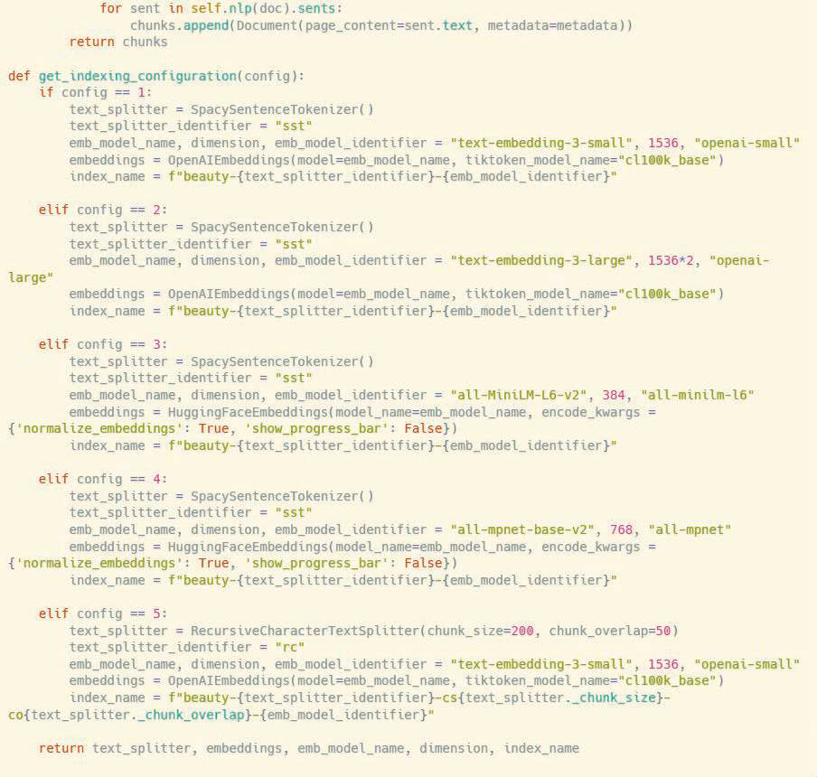
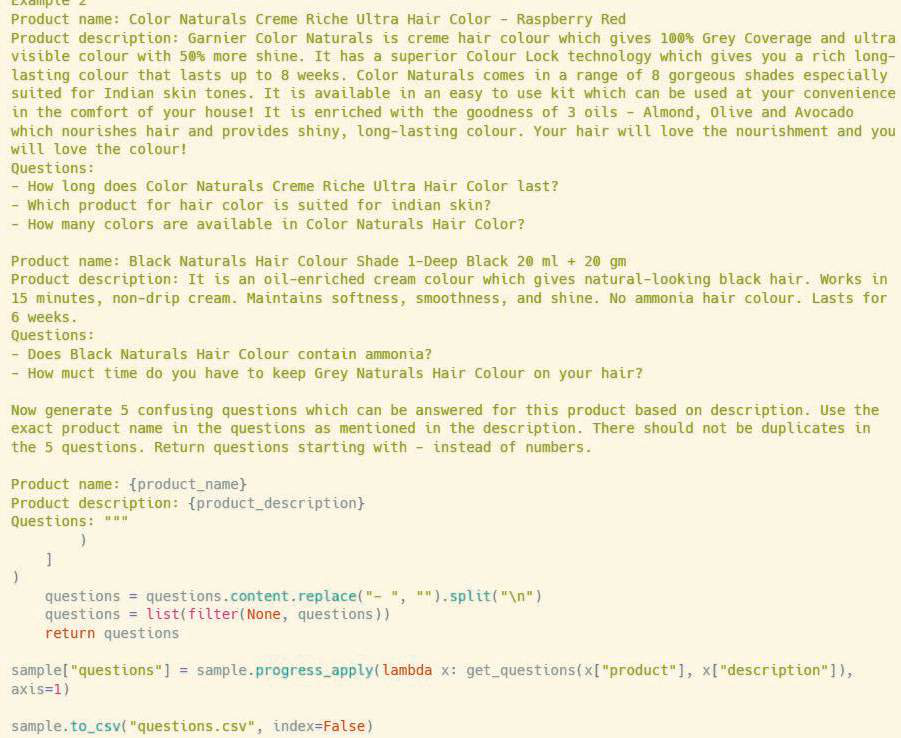

# 8주차: RAG Evaluation, Monitoring & Optimization (RAG 평가 체계 구축, 모니터링 및 최적화)

긴 스터디의 대장정 오심을 환영합니다! 지금까지의 7주차 여정 동안 우리는 RAG 시스템을 구상하고(아키텍처), 파편을 쪼개고(청킹), 수치화하여 보관하고(임베딩과 DB), 재정렬해 검증하고(리랭커), 가장 깊게 통찰하는(지식 그래프 망) 모든 구축 공학을 학습했습니다.

하지만 현장에서 "우리 시스템이 이제 다 되었습니다"하고 고객과 비즈니스 환경 오픈에 내놓기 위해서는 무섭도록 객관적인 "데이터 정규 성적표(평가)"가 선제 조건이어야 합니다. 

8주차 대미 강좌에서는 인간 개발자의 개인적인 "느낌"과 "직감"을 철저히 배제하고, 수학 수치와 AI 자가 심판관을 토대로 수만 개의 RAG 답변들을 냉정하게 테스트 수치화 해버리는 체계적 평가 평가 모형 프레임워크, **RAG Evaluation (RAGAS 등 평가 방법론) 과 모니터링 시스템 최적화**의 모든 것을 심층 해부합니다.

---

## 1. RAG 모델은 도대체 어떻게 채점하는가? (평가의 어려움)

과거 회귀나 분류 AI 분석들은 채점이 너무나 명확했습니다. 강아지 사진을 던져주고 모형이 강아지라고 대답하면 1점(정답), 고양이라고 하면 0점(오답). 이렇게 정확한 수학 숫자의 "고정형 정답률 지표"로 1초 만에 테스트 채점이 끝납니다.

하지만 RAG가 산출하는 결과는 "오픈형 주관식 논술 답변" 이기 때문에 시스템 테스트가 가장 까다롭습니다. 똑같은 정답 내용이어도 어투를 다르게 길게 서술하면 오답일까요? 사용자가 원하는 팩트가 한 문장은 들어있지만, 세 문장이나 환각을 붙여 놨다면 몇 점을 줘야 할까요? 수만 개의 테스트 질문지를 사람이 일일이 읽어보고 채점표를 찍을 수는 노릇입니다.

**해결책: AI(LLM)가 또 다른 AI(LLM)를 채점하게 하라!** (LLM-as-a-Judge)

---

## 2. RAGAS (RAG Assessment) 프레임워크 기반 3요소 지표 메트릭

최근 가장 혁명적으로 널리 글로벌 스탠다드로 채택되어 사용하는 대표적 오픈소스 평가 산출 프레임워크의 이름이 바로 RAGAS 입니다. RAGAS 시스템은 평가 기준의 차원을 크게 3개의 컴포넌트 도메인 삼각형의 평가 점수 축으로 매우 과학적으로 구분하여, 각각 백분위 점수 지표를 뽑아냅니다. 이것만 뽑을 줄 알면 엔지니어의 품격이 폭증합니다.

*(PDF 자료 참고: RAGAS 컴포넌트 프레임워크 지표)*

### 축 1: Answer Relevance (답변 관련성 - 프롬프트/생성 질 품질)
데이터를 차치하고, LLM이 사용자의 의도를 정확히 파악하여 **불필요한 동문서답을 피하고 핵심 답변만 간결히 찔러 제공**했는가를 측정합니다.
* 😢 질 나쁜 예시: "인사팀 휴가 신청서 정책을 알려줘" -> "우리 회사는 휴가를 좋아합니다. 직원의 행복은 중요하고, 아무튼 복리후생 부서는 3층에 있습니다." (투머치토커 생성으로 감점)

### 축 2: Context Precision / Relevance (문맥 검색 등수 정밀성 - 리랭커 품질)
1차 임베딩 및 검색 엔진의 최적 성능 수치입니다. RAG가 Top-1 등수, 가장 최우선 순위로 끌어올린 검색 문서가 얼마나 알짜배기 정답 신호(Signal) 문서였고 쓸모없는 노이즈 문서를 배제하여 잘 데려왔는지 평가합니다.
* 😢 질 나쁜 예시: 정답이 담긴 단락 하나를 찾기 위해, 쓰레기에 가까운 문서 10페이지짜리 청크 15개를 죄다 가져다 바쳐서 LLM의 목을 멘 상황 (Precision 점수 폭락). 리랭킹 엔진 재설계 튜닝이 시급합니다!

### 축 3: Faithfulness (사실 충실성 평가 - 할루시네이션 탐지 및 파동)
가장 핵심적인 환각 지표 방어 점수입니다. 생성된 모든 단어 명제와 문서 사실 정보가, 실제로 **'제공된 문맥(Context DB)'** 내부에 적혀 있는 사실 내용의 범위를 단 한 뼘도 무단 탈조하지 않았는지를 문장 분해 역추적으로 채점합니다.
* 😢 질 나쁜 예시: 제공된 문서에는 ["직원 커피는 하루 1잔 무료"] 라고 적혀 있는데, LLM이 문장을 지어내어 ["직원 조식과 커피는 전담 제공되며 매일 무제한 무료"] 라고 부풀려 뻥튀기 생성해 냈다면 바로 치명적인 페이스풀니스(Faithfulness) 점수 패널티 폭탄을 받습니다.

> 🎓 **이해를 돕는 예시: 논술 주관식 시험 성적표**
> Answer Relevance (동문서답 안 하기 = 논점 이탈 방어율)
> Context Precision (교재를 제대로 펴기 = 판례 탐색 적중율)
> Faithfulness (교과서에 나온 말만 쓰기 = 소설 창작 감점율)
> 학교 시험의 서술 채점 기준 3요소 교차 방식과 기가 막히게 동일한 패턴입니다. 

---

## 3. 지속적 사후 모니터링 로깅과 플라이휠 배포 최적화

시험 전의 평가 지표 점수를 넘겨 런칭 운영에 들어갔더라도 엔터프라이즈의 싸움은 끝난 것이 아닙니다. 

*(PDF 자료 참고: 지속 가능한 RAG 데이터 사이클 및 프로덕션 플라이휠 피드백 루프 모형)*

1. **사용자 암묵적 데이터 피드백 (Implicit Feedback Loop):**
   사용자가 결과 답변 텍스트를 "복사(Copy)" 하거나 "좋아요 따봉(Up-vote)" 버튼을 눌렀다면 해당 쿼리 파라미터 성공으로 간점하며, 바로 어플리케이션을 끄거나 "재생성(Re-generate)"을 눌러댔다면 그것을 오답 로그로 백엔드 수합하여 별도의 로거 데이터로 저장 분석합니다. 이것이 빅테크 기업들이 품질을 미친 듯이 지속해 올리는 무서운 플라이휠(Flywheel) 비결 원동력입니다.

2. **비용 및 실시간 지연 추적 (Cost & Latency Tracking 모니터링):**
   사용자가 갑자기 장문의 질문을 수만 개가 넘는 부서 쿼리로 요청할 때, LLM 클라우드 API를 호출과 리랭킹에서 천문학적 비용과 인프라 장애 보틀넥 누수가 발생하지 않는가? Grafana나 LangSmith 툴의 트래킹 대시보드를 구축해 토큰(Token) 사용 스펙과 초 단위 응답 그래프 망을 모니터링 감시 통제해야 합니다.

---

## 🎊 최종 마무리 맺음말!

길고도 밀도 높았던, "RAG 시스템과 LLM 운영 건축 및 아키텍처"에 대한 8주 차 과정 대단원을 모두 끝마쳤습니다! 정말 수고 많으셨습니다.

1주 차의 무지성 환각 LLM 모델의 본질의 치명적 민낯부터 시작해서, 프롬프트 엔지니어링의 정교한 매뉴얼 제어(2주차), 무자비한 긴 문서를 맛깔나는 과육으로 다듬어내는 청크 조각술(3주차), 단어를 초월해 문맥을 700차원의 숫자 은하계 평면 별로 수놓은 임베딩 모델의 원리(4주차), 이를 담고 관리할 광대한 벡터 데이터베이스 대저택 구조 건축망(5주차), 투망에 걸린 노이즈를 채에 탈탈 털어버리는 리랭커의 진가(6주차), 화려한 연결망으로 직관과 추리의 경지에 오르는 지식 그래프 망 기술(7주차), 이 모든 거대한 AI 기계 부품들을 수치와 점수 지표 채점으로 냉혹하게 실험, 평가하고 관측 통제하는 평가 지표론(8주차)까지...!

이 모든 강좌 내용의 핵심 파이프라인 철학을 체득하셨으리라 확신합니다. 이제 여러분은 엔터프라이즈 환경 실무에 투입되어 완벽에 가까운 "AI의 두뇌 비서(RAG)"를 탄생 도출과 배포를 직접 진두지휘하실 만반의 자격과 역량을 완벽 구비하셨습니다. 향후 스스로 펼쳐내실 영광스런 미래의 프로페셔널 아키텍트 행보와 위대한 데이터 프로젝트들을 가슴 깊이 힘차게 응원하겠습니다. 성공을 거두시길 바랍니다! 감사합니다!
