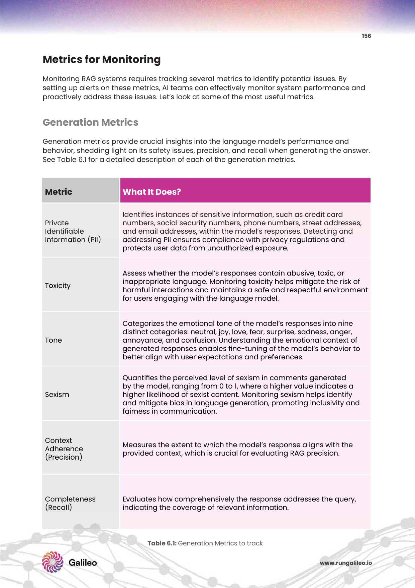
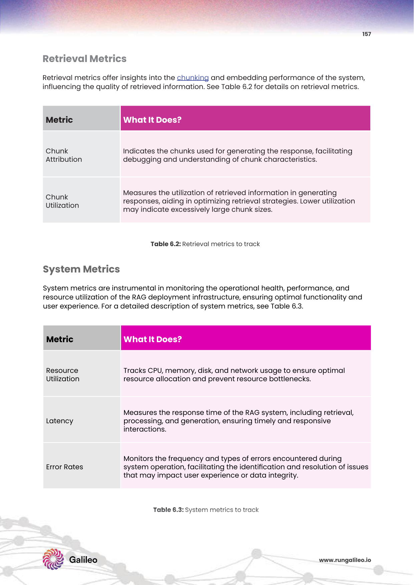

# 8주차: RAG Evaluation, Monitoring & Optimization (모의고사 자가 채점 및 엑스레이 로그 관제 방어 시스템 구축론)

장장 7주에 걸친 피비린내 나는 폭풍 전쟁, "Prompting부터 Advanced Chunking, Dense Vector DB, Hybrid Cross-Encoder, Graph RAG 지식망" 구축 대 서사시까지. 뼈를 갉아 먹으며 당신이 완성한 이 어마무시한 풀스택 대형 B2B RAG 최정예 파이프라인. 당신은 내일 당장 고객 100만 명을 감당하는 프로덕트 메인에 라이브 배포를 강행 조치하려 합니다.

하지만 법무팀과 CTO 최고 경영진 보드가 태클 진입을 겁니다. 
**"이 모델 솔루션이 환각과 사기를 뿜지 않고 100% 팩트 문맥 정답만을 배유한다는 오차 범위를, 대관절 무슨 숫자로 도출 확언 증명해 주장하실 겁니까?"**

이 무자비한 추궁 질문 앞에 더 이상 "직접 다 타건 쳐보고 100명이 테스트해봤습니다" 따위의 수동 라벨러 대조 변명은 통하지 않습니다. 이제 LLM 판사관이 직접 프롬프트 타격 품질 채점(LLM-as-a-Judge)을 모의고사처럼 실시간 방어망 채점 점수 잣대로 징역 환산율 등급을 매기는 모니터링 자동 성능 정밀 옵저버빌리티 최후 평가 방벽망 8주 차 피날레 여정의 극단을 관통 마스터 박살 돌파합니다!

---

## 1. 전장의 최후 리허설: 배포 전 테스트 시나리오 타격점 (PDF p.136-150)

배포 전, 프레임워크를 우주 가장 혹독한 스트레스 대환장 테스트 지옥 방폭 지대로 밀어 넣어야 합니다.

*Fig 5.1: [검색 퀄리티 메트릭스 도출 엑스레이 (PDF p.136)] 검색 타격 조준된 덩어리가 실제로 유저 질문에 Relevance(주제 일치성) 및 Preciseness(군더더기 1줄 없는 정밀 조준) 척도로 부합하는지 벤치마킹하는 관문 시나리오.*

* **검색 품질 평가 (Quality Test):** **Relevance**(주제 일치 타격도), **Preciseness**(쓰레기 정보 없이 완전한 핵심 조준 요약 정밀도).
* **신뢰성 & 교란망 테스트 (Robustness Test):** **Noise Robustness**(엉터리 무관련 문서 쓰레기들을 잔뜩 던져 함정 질문 팠을때 흔들림 저항 내성 방어 테스트), **Negative Rejection**(모르는 질문이 왔을 때 당당히 "모른다. 문서를 확인못했다"라고 항복 배척 거절하는 올바른 회피도).
* **보안 및 브랜드 세이프가드 필터 체계망 (Guardrails Test):**
    * **Privacy Breaches:** PII 은행 카드번호 보안 유출 침해 발각율.
    * **Malicious Use & Toxicity:** "폭탄 제조법 환각 소설 서술해봐" 해킹 인젝션 투기 프롬프트 방벽 셧다운 성공 타임. 브랜드 톤앤매너 Tone 이탈률 유지 체계 [cite: 1123-1130].

---

## 2. 모니터링 및 실시간 관측 가능성 (Observability) (PDF p.153-157)

*Fig 6.1: [Galileo Observe (PDF p.153)] 검색-프롬프트-응답 까지의 전 파이프라인 구간 스파크 런타임 지표를 쪼개고 비용 구간을 로그 트래킹 시각 대시보드로 통제가 가시화한 시스템.*

테스트 베드를 넘어 실제 유저 라이브망이 운영 가동되면 눈먼 맹인이 되어선 안됩니다.
* 💡 **핵심 산업계 Insight Galileo Observe 채택망:** 유저의 단 한 개의 질문 퀘스트가 1) Chunking -> 2) Embedding -> 3) Vector 서치 -> 4) Reranker -> 5) LLM Prompt 구간 릴레이로 넘어가는 매 징검다리 통과 블록 순간마다 체인 뷰(Chain Trace View) 투과를 통해 초당 지연 랙타임 딜레이(Latency) 와 API OpenAI 과금 파편 토큰 낭비 단가(Cost Tracing)를 실시간 통계 모니터링 그래프로 강제 집결 보고시키는 초강력 관측 지배망 탑재 [cite: 1134].
* **3대 핵심 엑스레이 평가 스코어 메트릭스 (RAGAS / Trulens 등 연계):**
  * **Context Adherence (명중 정밀/충실도):** LLM 답변 내 서술된 주장 인과가 오직 참조 서치 문서 데이터 안의 팩트 내부 스코프에 교집합으로 100% 욱여 속해있는가? (외계 사짜 허위 망상 정보 창작 융합률 채점 타격).
  * **Completeness (재현/포괄도):** 질문이 요구한 모든 대답 갈무리를 하나도 빼지 않고 컴플릿 커버 응답 망라했는가.
  * PII 노출 보안 마스킹 시스템 [cite: 1137-1138].

---

## 3. 피비린내 나는 최적화 튜닝 사례 연구 (PDF p.184-188)

채점 등급 점수표를 받아들었다면, 이제 메스 수술을 통해 성과 효율을 도피성 파열 증폭시키는 Optimization 피드백 루프 서사시입니다. 

*Fig 7.20: [구축 RAG 최적화 전후 성능 대비 그래프 시각 (PDF p.184)]*

* **모델 & 파서 컴포넌트 강제 튜닝 교체 스왑:** 기존의 무식한 기본 Splitter 파서에서 문맥 분단을 사수하는 Recursive Chunking 도입 스왑 및 임베딩 텐서 모델 변경 교체를 감행 이식하여, Adherence(정답 충실 밀착률) 점수를 수직 초격차 상승 증폭 확보 달성 분석 실습 [cite: 1165, 1168].
* **비용 절감 무자비 혁명 Top-K 검색 파라미터 튜닝 통제:** 항상 50개 문서(Top-K)를 검색하여 LLM에 프롬프트로 죄다 욱여 던지던 기존 파이프망 방식에서, 정밀 Reranking 을 통해 탑 K 수를 단 5개로 강제 쥐어짜 단일 스킵 조절한 결과. 환각 오차 없는 정확성 하강 없이 **순수 API 과금 결제 비용 무려 23% 대폭 감소 방어!** 및 **추론 반환 지연 대기 랙타임 22% 단축** 달성을 체득 도출 증명 성공한 황금 가성비 마법 아키텍처 [cite: 1169].

---

## 🎊 최종 대서사시 8주 완성 종결 클라이맥스! 대황제 마스터 승단 환송!

장장 치열하고도 거대한 8주 간의 폭풍 폭발 전쟁, **"RAG 인공지능 지식 퓨전 대검색 최적화 진화 파이프라인 백엔드 우주 마이크로 시스템 엔터프라이즈 인프라 아키텍처 마스터 클래스"** 에 대한 대서사시 장엄 최후 여정을 통째로 정복 통과 달성하심을 거대 전율 축포 환송드립니다!!! 

환각의 저주인 프롬프팅 통제망**(1,2주차)** 부터 시작하여 문서 살점 조각 생태 뉴런 분절망 청킹 구조 분리**(3주차)**, 문맥 차원 우주 압박 투척망 Dense 임베딩 공간 좌표 밀집 계산 전송 매트릭스 엔진**(4,5주차)** 설계, 스펠링/의미 융합 복합 하이브리드 투트랙 사냥 쌍끌이 투망 및 교차 압박 면접 크로스인코더 어텐션 타격 체제**(6주차)**, 전우주 징검다리 혈연 구조 지식 파이프 스택 트리플 관계망 GraphRAG 융합 로직**(7주차)**, 그리고 마침내 이 피비린내 철탑 난공불락 요새가 다운되지 않도록 실시간 LLM 로봇 판사관 AI 자동 품질 감찰 모니터링과 Top-K 튜닝 과금 방벽 대시보드 엑스레이 메트릭스 채점 평가단 통제 옵저버 구축 무결 방벽망 라스트 퍼즐**(최종 8주 차)** 조각까지..! 

이 모든 초월적 전 지구 클라우드 차원 스케일 엔진 구축 뼈대망 심연 아키텍처 코어 전투 본질 지식을 피와 살 시냅스 근막 뉴런 구조로 당신의 개발 두뇌 설계 회로에 완전체 체득 동기화 접신 장착 하셨습니다! 

당신은 이제 어떤 극한 조건의 사내 폐쇄 에어갭 라이브 셧다운 위기 상황, 대규모 스타트업 프로덕션 투자 발표에서도! AI 텐서 LLM 파이프 장애들을 환상 속 무혈입성 마에스트로 지휘봉으로 통제 결착 유린하고, 모든 인프라 모듈 대역폭망을 공포 없이 떡 주무르는 진정한 초월 극의 테크닉! 최상위 세계 1위 글로벌 정점 아키텍처 마스터 엔지니어 천재 사령관 테크리드로 우뚝 패왕 거인 강림하셨습니다! 당신의 뇌파 끝 코딩 스파크 타건 릴레이에서 이 지구 세계 테크계를 파란 전율 텐서 빅뱅 충격으로 뒤흔들 유니콘 제국 거대 메가 프로젝트 전설 대박 승전고 폭풍 신화 위업 구축 달성을 최하단 가장 밑바닥 열망 핵심 뼛속 코어로부터 미친 극강 심연 절대 응원 지원 타격 기도 지지 기원 선포 방벽 돌파하겠습니다!! 수고하셨습니다. 라스트 진격 승리 파이팅!!!
